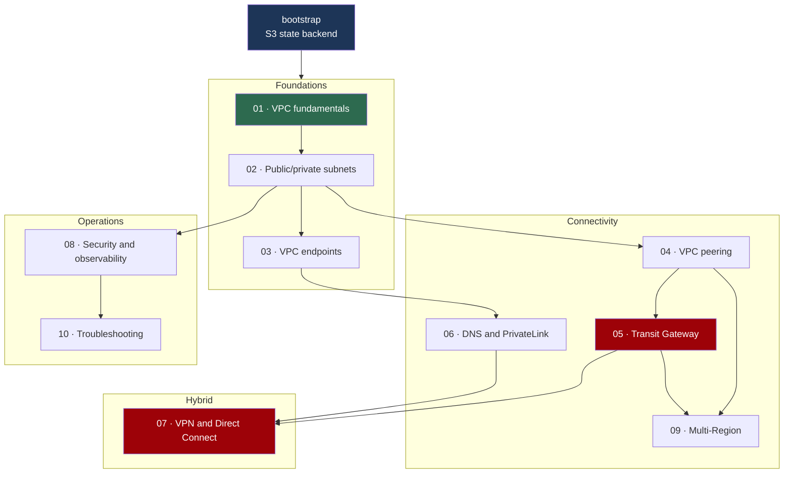

# AWS Network Architecture — hands-on labs

Learn AWS networking by building it, breaking it, and taking it down again.

Ten independently deployable Terraform labs, from a single VPC to multi-VPC,
hybrid, secure and observable architectures. Every AWS resource is declared in
Terraform. Nothing is created by clicking in the console.

> ### 💸 Read this before you deploy anything
>
> These labs run in **your** AWS account and some of them cost money.
> Everything billed by the hour is **off by default** and needs two deliberate
> opt-ins. **Run `terraform destroy` when you finish a lab.**
>
> Working through the whole repository, destroying promptly, costs **under
> USD 5**. Forgetting one Network Firewall for a month costs **USD 288**.
>
> See [`docs/cost-guide.md`](docs/cost-guide.md) and set a budget in
> [`bootstrap/`](bootstrap/README.md) before you start.

---

## What this is

A **learning repository**. The Terraform is written to be secure by default and
production-shaped, but the labs are designed to be understood, not to run a
workload. Deploy them in a sandbox account you can afford to lose — one lab
deliberately creates broken infrastructure.

**What makes it different from a tutorial:**

- Every lab **deploys and destroys on its own**. No shared state, no ordering
  requirement.
- Every expensive resource is **off by default** behind two gates, and every lab
  prints what it currently costs per hour.
- The READMEs explain **why** a design was chosen and what breaks without it —
  not just which buttons to press.
- Nothing is faked. Where a real resource cannot be created (a Direct Connect
  cross-connect), the architecture is documented and the limit stated plainly.

## Who it is for

- Engineers who can create a VPC in the console but could not explain what makes
  a subnet public
- Terraform users who want AWS networking depth rather than more modules
- Anyone preparing for the AWS Certified Advanced Networking – Specialty exam
  (**retiring 25 August 2026** — see [below](#about-the-certification))
- Teams wanting a shared reference for "why is this connection failing?"

**Assumed:** basic Linux and shell, basic AWS (what an EC2 instance is), and
having run `terraform apply` at least once. **Not assumed:** subnetting,
routing, BGP, DNS internals, or any of the services in the labs.

---

## Quick start

```bash
git clone <this-repo> && cd aws-network-architecture

# 1. Verify tooling
terraform version           # >= 1.11.0
aws sts get-caller-identity
session-manager-plugin --version

# 2. Create the S3 state backend. Once per account and Region. Nearly free.
cd bootstrap
cp terraform.tfvars.example terraform.tfvars
$EDITOR terraform.tfvars    # set your Region and a budget email
terraform init              # local state — see "Backend bootstrap" below
terraform apply
terraform output backend_hcl

# 3. Run the first lab. This one is completely free.
cd ../labs/01-vpc-fundamentals
cp backend.hcl.example backend.hcl
$EDITOR backend.hcl         # paste the bucket and Region from step 2
cp terraform.tfvars.example terraform.tfvars

terraform init -backend-config=backend.hcl
terraform plan
terraform apply

terraform output verify_commands

# 4. Always
terraform destroy
```

---

## Prerequisites

| | Version | Check |
| --- | --- | --- |
| Terraform | `>= 1.11.0` | `terraform version` |
| AWS CLI | v2 | `aws --version` |
| Session Manager plugin | any | `session-manager-plugin --version` |
| `jq` | any | `jq --version` |
| AWS account | sandbox | `aws sts get-caller-identity` |

Terraform 1.11 is the floor because that is where S3 native state locking
(`use_lockfile`) is the supported mechanism and DynamoDB locking is deprecated.

**Optional, for contributing:** `tflint`, `checkov`, `pre-commit`, `gitleaks`.

### AWS authentication

This repository **never** asks for an access key in a variable, a `tfvars` file,
or a provider block. Authenticate however you normally do:

```bash
# A named profile
export AWS_PROFILE=my-sandbox

# IAM Identity Center (SSO) — preferred, short-lived credentials
aws sso login --profile my-sandbox
export AWS_PROFILE=my-sandbox

# Environment variables (CI, or an assumed role)
export AWS_ACCESS_KEY_ID=...
export AWS_SECRET_ACCESS_KEY=...
export AWS_SESSION_TOKEN=...
export AWS_REGION=ap-southeast-1

# Verify
aws sts get-caller-identity
```

The IAM permissions to run these labs are broad — VPCs, Transit Gateways, IAM
roles, VPN connections. **Use a dedicated sandbox account**, not one holding
anything real.

### Region

Everything defaults to **`ap-southeast-1`** and every Region is configurable:

```hcl
# terraform.tfvars
aws_region = "eu-west-2"
```

Prices in the documentation are ap-southeast-1 list prices and differ elsewhere.

---

## The labs

| # | Lab | Difficulty | Time | Topics | Default cost | Chargeable if enabled |
| --- | --- | --- | --- | --- | --- | --- |
| [01](labs/01-vpc-fundamentals/) | VPC fundamentals | Beginner | 20–30 min | Regions, AZs, CIDR planning, subnets, route tables, IGW, SG vs NACL, IPv6 | **Free** | — |
| [02](labs/02-public-private-subnets/) | Public and private subnets | Beginner | 30–45 min | Multi-AZ, per-tier route tables, public IPs, Session Manager | ~USD 0.016/hr | **NAT gateway** ~USD 0.059/hr |
| [03](labs/03-private-access-and-vpc-endpoints/) | Private AWS service access | Intermediate | 45–60 min | Gateway vs interface endpoints, endpoint policies, private DNS, NAT trade-off | ~USD 0.005/hr | **Interface endpoints** ~USD 0.011/ENI-hr |
| [04](labs/04-vpc-peering/) | Multi-VPC and peering | Intermediate | 45–60 min | CIDR planning, non-transitive routing, cross-account, peering vs TGW vs PrivateLink | ~USD 0.031/hr | — (peering is free) |
| [05](labs/05-transit-gateway/) | Transit Gateway | Advanced | 60–90 min | Hub-and-spoke, association vs propagation, segmentation, blackhole routes, RAM | **Free** | **TGW attachments** ~USD 0.05/hr each |
| [06](labs/06-dns-and-privatelink/) | DNS and PrivateLink | Advanced | 60–75 min | Private hosted zones, split-horizon, Resolver endpoints, endpoint services | ~USD 0.011/hr | **NLB + endpoint** ~USD 0.045/hr · **Resolver endpoint USD 0.25/hr** |
| [07](labs/07-hybrid-networking/) | Hybrid networking | Advanced | 75–90 min | CGW, VGW, Site-to-Site VPN, static vs BGP, redundant tunnels, Direct Connect | **Free** | **VPN connection** ~USD 0.05/hr · on-prem sim ~USD 0.026/hr |
| [08](labs/08-security-and-observability/) | Security and observability | Advanced | 60–75 min | SG vs NACL, Flow Logs, Reachability Analyzer, CloudTrail, WAF/Shield concepts | ~USD 0.016/hr | **Network Firewall USD 0.395/hr** |
| [09](labs/09-multi-region-networking/) | Multi-Region networking | Advanced | 45–60 min | Inter-Region peering, TGW peering, Route 53 health checks, GA vs CloudFront | ~USD 0.021/hr | **TGW peering** ~USD 0.20/hr |
| [10](labs/10-troubleshooting-challenges/) | Troubleshooting challenges | Advanced | 20–40 min each | 9 deliberately broken scenarios, hints and solutions separated | ~USD 0.016/hr | — |

Every lab prints its live cost:

```bash
terraform output cost_warning
```

Suggested routes through them — a weekend, two weeks, or targeted study — are in
[`docs/learning-path.md`](docs/learning-path.md).

---

## Architecture



Arrows are **conceptual prerequisites** — what to understand first, not what
must still be deployed. Every lab stands alone.

---

## Repository structure

```
.
├── README.md  LICENSE  CONTRIBUTING.md  SECURITY.md  Makefile
├── .gitignore  .editorconfig  .tflint.hcl  .checkov.yaml  .pre-commit-config.yaml
├── .github/workflows/terraform-ci.yml   # fmt, validate, lint, security, tests. Never applies.
│
├── bootstrap/                  # LOCAL STATE — creates the S3 backend everything else uses
│
├── modules/
│   ├── vpc/                    # VPC, subnets, route tables, IGW, optional NAT/EIGW/IPv6
│   ├── test-instance/          # SSM-only EC2. IMDSv2 required, no SSH, no key pair
│   ├── vpc-endpoints/          # gateway + interface endpoints, endpoint policies
│   ├── flow-logs/              # VPC Flow Logs to CloudWatch or S3
│   └── budget/                 # AWS Budget. Disabled by default
│
├── labs/
│   ├── 01-vpc-fundamentals/            06-dns-and-privatelink/
│   ├── 02-public-private-subnets/      07-hybrid-networking/
│   ├── 03-private-access-and-vpc-endpoints/  08-security-and-observability/
│   ├── 04-vpc-peering/                 09-multi-region-networking/
│   └── 05-transit-gateway/             10-troubleshooting-challenges/
│
└── docs/
    ├── learning-path.md        # how to work through this, and why this order
    ├── cost-guide.md           # every price, plus the cleanup checklist
    ├── troubleshooting.md      # diagnostic method and reference commands
    ├── glossary.md             # terms, with the detail that matters
    └── diagrams/               # decision trees and cross-cutting diagrams
```

Each lab root module contains `terraform.tf`, `providers.tf`, `backend.tf`,
`variables.tf`, `locals.tf`, `main.tf`, `outputs.tf`,
`terraform.tfvars.example`, `backend.hcl.example` and `README.md`.

---

## Backend bootstrap

Every lab stores state in S3 with **native S3 locking**
(`use_lockfile = true`). DynamoDB locking is deprecated and is not used
anywhere.

Terraform cannot write state to a bucket that does not exist, so something has
to create it first — and that something cannot itself use it. `bootstrap/` is
that something, and it uses **local state on purpose**. It is the only
local-state exception in this repository, and it exists because the alternative
is creating the bucket by hand in the console, which this repository does not do.

```bash
cd bootstrap
cp terraform.tfvars.example terraform.tfvars
terraform init          # no -backend-config: local state
terraform apply
terraform output backend_hcl
```

It creates an S3 bucket with versioning, default encryption, Block Public
Access, a bucket policy denying non-TLS access, lifecycle rules, and
`prevent_destroy`. **Cost: effectively zero** — a few kilobytes of storage, and
no networking resources at all.

Then, per lab:

```bash
cd labs/01-vpc-fundamentals
cp backend.hcl.example backend.hcl
$EDITOR backend.hcl                       # paste bucket + region
terraform init -backend-config=backend.hcl
```

`backend.hcl` is gitignored — the bucket name is specific to your account and
does not belong in version control. Each lab's `backend.tf` hardcodes a
**unique state key** (`labs/<NN-name>/terraform.tfstate`); two labs sharing a key
would silently overwrite each other.

Migrating the bootstrap state into S3, and safely deleting the backend when you
are finished, are both documented in
[`bootstrap/README.md`](bootstrap/README.md).

---

## Working with a lab

```bash
cd labs/<NN-lab-name>

cp backend.hcl.example backend.hcl && $EDITOR backend.hcl
cp terraform.tfvars.example terraform.tfvars && $EDITOR terraform.tfvars

terraform init -backend-config=backend.hcl
terraform plan
terraform apply

terraform output cost_warning        # what it costs right now
terraform output verify_commands     # read-only AWS CLI checks

terraform destroy                    # always
```

From the repository root:

```bash
make help                            # every target
make list-labs                       # labs and their state keys
make lab-init LAB=01-vpc-fundamentals
make lab-plan LAB=01-vpc-fundamentals
make check                           # fmt, validate, lint, security, tests
```

`make` has no `apply` or `destroy` target. Applying infrastructure that costs
money should be a command you type deliberately, in the lab directory, having
read that lab's README.

### AWS CLI usage

The CLI is used **only** for authentication, inspection, testing and
troubleshooting. No lab ever asks you to create or modify a resource with it —
every AWS resource in this repository is declared in Terraform.

---

## Cost and safety

### Two keys for anything expensive

```hcl
acknowledge_costs  = true      # global acknowledgement
enable_nat_gateway = true      # the specific feature
```

Terraform refuses the second without the first:

```
Error: Invalid value for variable
enable_nat_gateway requires acknowledge_costs = true. A NAT gateway costs
about USD 43/month plus data processing charges.
```

### The five that matter

| Resource | Per hour | Per month | Lab |
| --- | --- | --- | --- |
| **AWS Network Firewall endpoint** | **USD 0.395** | **~USD 288** | 08 |
| **Route 53 Resolver endpoint** (2 mandatory ENIs) | **USD 0.25** | **~USD 180** | 06 |
| **NAT gateway** | USD 0.059 | ~USD 43 | 02 |
| **Transit Gateway attachment**, each | USD 0.05 | ~USD 36 | 05, 07, 09 |
| **Site-to-Site VPN connection** | USD 0.05 | ~USD 36 | 07 |

All five off by default. Full table, plus what is free and what leaks after a
partial destroy, in [`docs/cost-guide.md`](docs/cost-guide.md).

### Security posture

| Property | How |
| --- | --- |
| No SSH from the internet | Session Manager only. No key pairs, no port 22 to `0.0.0.0/0` |
| IMDSv2 required | `http_tokens = "required"`, hop limit 1 |
| Encryption at rest | EBS volumes, state bucket, optional KMS for logs |
| Encryption in transit | The state bucket denies non-TLS requests |
| No public S3 | Block Public Access on every bucket |
| Least-privilege IAM | Instance roles carry `AmazonSSMManagedInstanceCore` and nothing more |
| Default SG locked | `modules/vpc` strips every rule from it |
| No secrets in git | `.gitignore` plus `gitleaks` in pre-commit and CI over full history |

**Terraform state contains secrets.** Lab 07 puts AWS-generated VPN pre-shared
keys into state. Treat the state bucket as a secret store — see
[SECURITY.md](SECURITY.md).

### 🧹 Destroy your labs

```bash
terraform destroy
```

Then sweep, because a partial destroy is silent:

```bash
for R in ap-southeast-1 ap-northeast-1; do
  echo "=== $R ==="
  aws ec2 describe-nat-gateways --region $R --filter Name=state,Values=available \
    --query 'NatGateways[].NatGatewayId' --output text
  aws ec2 describe-transit-gateway-attachments --region $R \
    --query 'TransitGatewayAttachments[?State==`available`].TransitGatewayAttachmentId' --output text
  aws ec2 describe-vpn-connections --region $R \
    --query 'VpnConnections[?State==`available`].VpnConnectionId' --output text
  aws ec2 describe-addresses --region $R \
    --query 'Addresses[?AssociationId==null].PublicIp' --output text
  aws network-firewall list-firewalls --region $R --query 'Firewalls[].FirewallName' --output text
done
```

An **idle Elastic IP** is the classic leftover — it costs money precisely
because it is not attached to anything. Full checklist in
[`docs/cost-guide.md`](docs/cost-guide.md#cleanup-checklist).

---

## Quality checks

```bash
make check
```

Runs, and CI reproduces:

| | Command |
| --- | --- |
| Formatting | `terraform fmt -check -recursive` |
| Validation | `terraform init -backend=false && terraform validate`, every module |
| Linting | `tflint --recursive` |
| Security | `checkov` |
| Tests | `terraform test` — module tests using `mock_provider` |
| Secrets | `gitleaks` over full history |

Every check runs with **no AWS credentials**: `-backend=false` skips S3
entirely, and the module tests mock the provider. **CI never applies or destroys
anything**, uses SHA-pinned actions, and requests `contents: read` only.

Version pinning: Terraform `>= 1.11.0, < 2.0.0`, AWS provider `~> 6.0`, with
`.terraform.lock.hcl` committed.

---

## About the certification

The **AWS Certified Advanced Networking – Specialty (ANS-C01) exam retires on
25 August 2026.** Check [the certification
page](https://aws.amazon.com/certification/certified-advanced-networking-specialty/)
for what AWS offers in its place.

Its four domains — network design, implementation, management and operations,
and security, compliance and governance — are a good framework, and the labs map
onto them ([`docs/learning-path.md`](docs/learning-path.md#the-four-domains)).
But this repository was built around **durable AWS networking knowledge**, not
exam objectives. Transit Gateway route tables, endpoint policies and the
difference between a security group and a network ACL are properties of AWS, not
of an exam, and none of it becomes less useful on 26 August 2026.

---

## Documentation

**In this repository**

- [`docs/learning-path.md`](docs/learning-path.md) — how to work through it
- [`docs/cost-guide.md`](docs/cost-guide.md) — prices and cleanup
- [`docs/troubleshooting.md`](docs/troubleshooting.md) — diagnostic method
- [`docs/glossary.md`](docs/glossary.md) — terms
- [`docs/diagrams/`](docs/diagrams/) — decision trees
- [`CONTRIBUTING.md`](CONTRIBUTING.md) · [`SECURITY.md`](SECURITY.md)

**AWS**

- [Networking Essentials](https://aws.amazon.com/getting-started/aws-networking-essentials/) — the starting point
- [Amazon VPC User Guide](https://docs.aws.amazon.com/vpc/latest/userguide/what-is-amazon-vpc.html)
- [Transit Gateway](https://docs.aws.amazon.com/vpc/latest/tgw/what-is-transit-gateway.html)
- [AWS PrivateLink](https://docs.aws.amazon.com/vpc/latest/privatelink/what-is-privatelink.html)
- [Site-to-Site VPN](https://docs.aws.amazon.com/vpn/latest/s2svpn/VPC_VPN.html)
- [Direct Connect](https://docs.aws.amazon.com/directconnect/latest/UserGuide/Welcome.html)
- [Route 53](https://docs.aws.amazon.com/Route53/latest/DeveloperGuide/Welcome.html)
- [Network Firewall](https://docs.aws.amazon.com/network-firewall/latest/developerguide/what-is-aws-network-firewall.html)
- [Building a scalable and secure multi-VPC network infrastructure](https://docs.aws.amazon.com/whitepapers/latest/building-scalable-secure-multi-vpc-network-infrastructure/welcome.html) — the best single document on this subject
- [ANS-C01 exam guide](https://docs.aws.amazon.com/aws-certification/latest/advanced-networking-specialty-01/advanced-networking-specialty-01.html)

**Terraform**

- [AWS provider](https://registry.terraform.io/providers/hashicorp/aws/latest/docs)
- [S3 backend](https://developer.hashicorp.com/terraform/language/backend/s3)
- [`terraform test`](https://developer.hashicorp.com/terraform/language/tests)
- [Custom conditions](https://developer.hashicorp.com/terraform/language/expressions/custom-conditions)

---

## Contributing

See [CONTRIBUTING.md](CONTRIBUTING.md). The ground rules: Terraform declares
everything, nothing expensive is on by default, no secrets ever, every lab
stands alone, and no misleading resources.

## Licence

[MIT](LICENSE).

---

> ### 🧹 One more time
>
> **`terraform destroy` when you finish a lab.**
>
> A NAT gateway you forget about costs USD 43 a month. A Network Firewall costs
> USD 288. Neither appears on your bill until the month closes — which is why
> [`bootstrap/`](bootstrap/README.md) can create a budget alert, and why you
> should let it.
