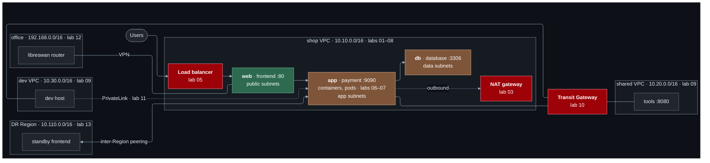

# AWS Network Architecture — hands-on labs

Learn AWS networking by building it, breaking it, and taking it down again.

Fourteen Terraform labs that build **one project** — the network of a small
online shop — from a single server to load balancers, containers, Kubernetes,
multiple VPCs, a VPN and a second Region. Each lab is the previous lab's
network, improved. Every AWS resource is declared in Terraform. Nothing is
created by clicking in the console.

Labs 01–07 follow
[Every Networking Concept Explained In 20 Minutes](https://www.youtube.com/watch?v=xj_GjnD4uyI)
chapter by chapter; [`docs/concept-map.md`](docs/concept-map.md) shows where
each concept is built.

> ### 💸 Read this before you deploy anything
>
> These labs run in **your** AWS account and some of them cost money.
> Everything billed by the hour is **off by default** and needs two deliberate
> opt-ins. The labs share one deployment, so costs **accumulate**: turn each
> opt-in off when you move on, and **run `terraform destroy` when you stop.**
>
> Working through the whole repository, destroying promptly, costs **under
> USD 5**. Forgetting one Network Firewall for a month costs **USD 288**.
>
> See [`docs/cost-guide.md`](docs/cost-guide.md) and set a budget in
> [`bootstrap/`](bootstrap/README.md) before you start.

---

## What this is

A **learning repository**. The Terraform is written to be secure by default and
production-shaped, but the labs are designed to be understood, not to run a
workload. Deploy them in a sandbox account you can afford to lose — one lab
deliberately creates broken infrastructure.

**What makes it different from a tutorial:**

- **One project, built up in stages.** Each lab upgrades the deployment the
  previous one left, so `terraform plan` shows exactly what the new idea
  changes — and you end with a network you watched grow.
- It starts from first principles — addresses, names, ports — and follows a
  [20-minute video](https://www.youtube.com/watch?v=xj_GjnD4uyI) for the
  first seven labs, building each concept instead of only describing it.
- Every expensive resource is **off by default** behind two gates.
- The READMEs explain **why** a design was chosen and what breaks without it —
  not just which buttons to press.
- Nothing is faked. Where a real resource cannot be created (a Direct Connect
  cross-connect), the architecture is documented and the limit stated plainly.

## Who it is for

- Anyone who watched a networking overview and wants to build what it described
- Engineers who can create a VPC in the console but could not explain what makes
  a subnet public
- Terraform users who want AWS networking depth rather than more modules
- Anyone preparing for the AWS Certified Advanced Networking – Specialty exam
  (**retiring 25 August 2026** — see [below](#about-the-certification))
- Teams wanting a shared reference for "why is this connection failing?"

**Assumed:** basic Linux and shell, basic AWS (what an EC2 instance is), and
having run `terraform apply` at least once. **Not assumed:** subnetting,
routing, BGP, DNS internals, or any of the services in the labs.

---

## Quick start

```bash
git clone <this-repo> && cd aws-network-architecture

# 1. Verify tooling
terraform version           # >= 1.11.0
aws sts get-caller-identity
session-manager-plugin --version

# 2. Create the S3 state backend. Once per account and Region. Nearly free.
cd bootstrap
cp terraform.tfvars.example terraform.tfvars
$EDITOR terraform.tfvars    # set your Region and a budget email
terraform init              # local state — see "Backend bootstrap" below
terraform apply
terraform output backend_hcl

# 3. Run the first lab. About one cent an hour.
cd ../labs/01-single-server
cp backend.hcl.example backend.hcl
$EDITOR backend.hcl         # paste the bucket and Region from step 2
cp terraform.tfvars.example terraform.tfvars

terraform init -backend-config=backend.hcl
terraform plan
terraform apply

curl -s "$(terraform output -raw frontend_url)"
terraform output verify_compute

# 4. Carry on to lab 02 WITHOUT destroying -- it upgrades this deployment.
cd ../02-network-segmentation
cp ../01-single-server/{backend.hcl,terraform.tfvars} .
terraform init -backend-config=backend.hcl
terraform plan              # the plan is the lesson
terraform apply

# 5. When you stop for the day, from the lab you applied last
terraform destroy
```

---

## Prerequisites

| | Version | Check |
| --- | --- | --- |
| Terraform | `>= 1.11.0` | `terraform version` |
| AWS CLI | v2 | `aws --version` |
| Session Manager plugin | any | `session-manager-plugin --version` |
| `jq` | any | `jq --version` |
| AWS account | sandbox | `aws sts get-caller-identity` |

Terraform 1.11 is the floor because that is where S3 native state locking
(`use_lockfile`) is the supported mechanism and DynamoDB locking is deprecated.

**Optional, for contributing:** `tflint`, `checkov`, `pre-commit`, `gitleaks`.

### AWS authentication

This repository **never** asks for an access key in a variable, a `tfvars` file,
or a provider block. Authenticate however you normally do:

```bash
# A named profile
export AWS_PROFILE=my-sandbox

# IAM Identity Center (SSO) — preferred, short-lived credentials
aws sso login --profile my-sandbox
export AWS_PROFILE=my-sandbox

# Environment variables (CI, or an assumed role)
export AWS_ACCESS_KEY_ID=...
export AWS_SECRET_ACCESS_KEY=...
export AWS_SESSION_TOKEN=...
export AWS_REGION=ap-southeast-1

# Verify
aws sts get-caller-identity
```

The IAM permissions to run these labs are broad — VPCs, Transit Gateways, IAM
roles, VPN connections. **Use a dedicated sandbox account**, not one holding
anything real.

### Region

Everything defaults to **`ap-southeast-1`** and every Region is configurable:

```hcl
# terraform.tfvars
aws_region = "eu-west-2"
```

Prices in the documentation are ap-southeast-1 list prices and differ elsewhere.

---

## The labs

One project, fourteen stages. "Default cost" is what the lab adds with every
opt-in off; it accumulates as you go, to about USD 0.07/hour by lab 14.

| # | Lab | Level | Time | What the shop's network gains | Default cost | Opt-in |
| --- | --- | --- | --- | --- | --- | --- |
| [01](labs/01-single-server/) | A single server | Beginner | 30 min | IP addresses, DNS, ports, one public subnet, security group, host firewall | ~USD 0.01/hr | — |
| [02](labs/02-network-segmentation/) | Network segmentation | Beginner | 45 min | Web / app / data tiers, two AZs, chained security groups, network ACL | +USD 0.011/hr | — |
| [03](labs/03-nat-and-outbound/) | NAT and outbound access | Beginner | 30–45 min | Source NAT, default routes, IPv6 and egress-only gateways | — | **NAT gateway** USD 0.059/hr |
| [04](labs/04-private-aws-access/) | Private AWS access | Intermediate | 45 min | Gateway and interface endpoints, endpoint policies | Free | **Interface endpoints** USD 0.033/hr |
| [05](labs/05-load-balancing/) | Load balancing | Intermediate | 45 min | ALB, health checks, host- and path-based routing | — | **ALB** USD 0.035/hr |
| [06](labs/06-container-networking/) | Container networking | Intermediate | 60 min | Docker bridge, port mapping, ECS `awsvpc`, service discovery | +USD 0.016/hr | **ECS** USD 0.024/hr |
| [07](labs/07-kubernetes-networking/) | Kubernetes networking | Advanced | 60–90 min | Pod IPs, Services, Ingress on EKS | — | **EKS** ~USD 0.25/hr |
| [08](labs/08-security-and-observability/) | Security and observability | Advanced | 60 min | Flow logs, Reachability Analyzer, CloudTrail, inspection routing | cents | **Network Firewall USD 0.395/hr** |
| [09](labs/09-vpc-peering/) | More VPCs and peering | Intermediate | 45 min | Shared and dev VPCs, peering, non-transitivity | +USD 0.021/hr | — (peering is free) |
| [10](labs/10-transit-gateway/) | Transit Gateway | Advanced | 60 min | Hub-and-spoke replaces peering; segmentation by route table | — | **TGW attachments** USD 0.15/hr |
| [11](labs/11-dns-and-privatelink/) | DNS and PrivateLink | Advanced | 60 min | Private hosted zone, split horizon, endpoint service | cents | **PrivateLink** USD 0.036/hr · **Resolver endpoint USD 0.25/hr** |
| [12](labs/12-hybrid-networking/) | Hybrid networking | Advanced | 75 min | Site-to-Site VPN to a simulated office, route propagation | Free | **VPN + office** USD 0.076/hr |
| [13](labs/13-multi-region/) | Multi-Region | Advanced | 45–60 min | DR Region, inter-Region peering, DNS failover | +USD 0.01/hr | **TGW peering** USD 0.10/hr |
| [14](labs/14-troubleshooting-challenges/) | Troubleshooting | Advanced | 20–40 min each | Six injected faults, hints and solutions separated | — | — |

How the labs fit together — the shared state, moving from one to the next,
keeping the bill small — is in
[`docs/working-with-the-labs.md`](docs/working-with-the-labs.md). Suggested
routes through them are in [`docs/learning-path.md`](docs/learning-path.md).

---

## Architecture

Where the project ends up. Everything in red is opt-in.



Each lab's README has the detailed diagram for its stage. Every address
range is in [`docs/address-plan.md`](docs/address-plan.md).

---

## Repository structure

```
.
├── README.md  LICENSE  CONTRIBUTING.md  SECURITY.md  Makefile
├── .gitignore  .editorconfig  .tflint.hcl  .checkov.yaml  .pre-commit-config.yaml
├── .github/workflows/terraform-ci.yml   # fmt, validate, lint, security, tests. Never applies.
│
├── bootstrap/                  # LOCAL STATE — creates the S3 backend everything else uses
│
├── modules/
│   ├── vpc/                    # VPC, subnets, route tables, IGW, optional NAT/EIGW/IPv6
│   ├── test-instance/          # SSM-only EC2. IMDSv2 required, no SSH, no key pair
│   ├── demo-service/           # the stand-in applications: a port, and who called it
│   ├── vpc-endpoints/          # gateway + interface endpoints, endpoint policies
│   ├── flow-logs/              # VPC Flow Logs to CloudWatch or S3
│   └── budget/                 # AWS Budget. Disabled by default
│
├── labs/                       # ONE project, ONE state, fourteen stages
│   ├── 01-single-server/               08-security-and-observability/
│   ├── 02-network-segmentation/        09-vpc-peering/
│   ├── 03-nat-and-outbound/            10-transit-gateway/
│   ├── 04-private-aws-access/          11-dns-and-privatelink/
│   ├── 05-load-balancing/              12-hybrid-networking/
│   ├── 06-container-networking/        13-multi-region/
│   └── 07-kubernetes-networking/       14-troubleshooting-challenges/
│
└── docs/
    ├── working-with-the-labs.md  # the shared state; moving between labs; destroying
    ├── learning-path.md        # routes through the labs, and why this order
    ├── concept-map.md          # the video's concepts, and where each is built
    ├── address-plan.md         # every range and port in the project
    ├── cost-guide.md           # every price, plus the cleanup checklist
    ├── troubleshooting.md      # diagnostic method and reference commands
    ├── glossary.md             # terms, with the detail that matters
    └── diagrams/               # decision trees and cross-cutting diagrams
```

Each lab folder is the whole project at that stage: the files from the
previous lab, plus one or two new ones named for what they add
(`nat.tf`, `load-balancing.tf`, `transit-gateway.tf`…). Each of those files
holds its own variables, resources and outputs. Every lab also has
`tests/plan.tftest.hcl`, which plans it against a mocked provider.

---

## Backend bootstrap

Every lab stores state in S3 with **native S3 locking**
(`use_lockfile = true`). DynamoDB locking is deprecated and is not used
anywhere.

Terraform cannot write state to a bucket that does not exist, so something has
to create it first — and that something cannot itself use it. `bootstrap/` is
that something, and it uses **local state on purpose**. It is the only
local-state exception in this repository, and it exists because the alternative
is creating the bucket by hand in the console, which this repository does not do.

```bash
cd bootstrap
cp terraform.tfvars.example terraform.tfvars
terraform init          # no -backend-config: local state
terraform apply
terraform output backend_hcl
```

It creates an S3 bucket with versioning, default encryption, Block Public
Access, a bucket policy denying non-TLS access, lifecycle rules, and
`prevent_destroy`. **Cost: effectively zero** — a few kilobytes of storage, and
no networking resources at all.

Then, once — every lab uses the same `backend.hcl` and the same state key,
`shop/terraform.tfstate`:

```bash
cd labs/01-single-server
cp backend.hcl.example backend.hcl
$EDITOR backend.hcl                       # paste bucket + region
terraform init -backend-config=backend.hcl
```

`backend.hcl` is gitignored — the bucket name is specific to your account and
does not belong in version control. Each lab's `backend.tf` hardcodes a
**unique state key** (`labs/<NN-name>/terraform.tfstate`); two labs sharing a key
would silently overwrite each other.

Migrating the bootstrap state into S3, and safely deleting the backend when you
are finished, are both documented in
[`bootstrap/README.md`](bootstrap/README.md).

---

## Working with a lab

```bash
cd labs/<NN-lab-name>

# backend.hcl and terraform.tfvars carry forward from the previous lab
cp ../<previous-lab>/{backend.hcl,terraform.tfvars} .
diff terraform.tfvars terraform.tfvars.example   # what this lab adds

terraform init -backend-config=backend.hcl
terraform plan                       # what this lab changes
terraform apply

terraform output                     # every verify_* output is a set of checks
```

From the repository root:

```bash
make help                            # every target
make list-labs                       # the labs, in order
make lab-diff FROM=04-private-aws-access TO=05-load-balancing
make lab-init LAB=05-load-balancing
make lab-plan LAB=05-load-balancing
make check                           # fmt, validate, lint, security, tests
```

`make` has no `apply` or `destroy` target. Applying infrastructure that costs
money should be a command you type deliberately, in the lab directory, having
read that lab's README.

### AWS CLI usage

The CLI is used **only** for authentication, inspection, testing and
troubleshooting. No lab ever asks you to create or modify a resource with it —
every AWS resource in this repository is declared in Terraform.

---

## Cost and safety

### Two keys for anything expensive

```hcl
acknowledge_costs  = true      # global acknowledgement
enable_nat_gateway = true      # the specific feature
```

Terraform refuses the second without the first:

```
Error: Invalid value for variable
enable_nat_gateway requires acknowledge_costs = true. A NAT gateway costs
about USD 43/month plus data processing charges.
```

### The six that matter

| Resource | Per hour | Per month | Lab |
| --- | --- | --- | --- |
| **AWS Network Firewall endpoint** | **USD 0.395** | **~USD 288** | 08 |
| **Route 53 Resolver endpoint** (2 mandatory ENIs) | **USD 0.25** | **~USD 180** | 11 |
| **EKS cluster** (control plane; nodes extra) | **USD 0.10** | **~USD 73** | 07 |
| **NAT gateway** | USD 0.059 | ~USD 43 | 03 |
| **Transit Gateway attachment**, each | USD 0.05 | ~USD 36 | 10, 13 |
| **Site-to-Site VPN connection** | USD 0.05 | ~USD 36 | 12 |

All six off by default. Full table, plus what is free and what leaks after a
partial destroy, in [`docs/cost-guide.md`](docs/cost-guide.md).

### Security posture

| Property | How |
| --- | --- |
| No SSH from the internet | Session Manager only. No key pairs, no port 22 to `0.0.0.0/0` |
| IMDSv2 required | `http_tokens = "required"`, hop limit 1 |
| Encryption at rest | EBS volumes, state bucket, optional KMS for logs |
| Encryption in transit | The state bucket denies non-TLS requests |
| No public S3 | Block Public Access on every bucket |
| Least-privilege IAM | Instance roles carry `AmazonSSMManagedInstanceCore` and nothing more |
| Default SG locked | `modules/vpc` strips every rule from it |
| No secrets in git | `.gitignore` plus `gitleaks` in pre-commit and CI over full history |

**Terraform state contains secrets.** Lab 07 puts AWS-generated VPN pre-shared
keys into state. Treat the state bucket as a secret store — see
[SECURITY.md](SECURITY.md).

### 🧹 Destroy when you stop

From the lab folder you applied last — it is the one whose configuration
matches the state:

```bash
terraform destroy
```

Then sweep, because a partial destroy is silent:

```bash
for R in ap-southeast-1 ap-northeast-1; do
  echo "=== $R ==="
  aws ec2 describe-nat-gateways --region $R --filter Name=state,Values=available \
    --query 'NatGateways[].NatGatewayId' --output text
  aws ec2 describe-transit-gateway-attachments --region $R \
    --query 'TransitGatewayAttachments[?State==`available`].TransitGatewayAttachmentId' --output text
  aws ec2 describe-vpn-connections --region $R \
    --query 'VpnConnections[?State==`available`].VpnConnectionId' --output text
  aws ec2 describe-addresses --region $R \
    --query 'Addresses[?AssociationId==null].PublicIp' --output text
  aws network-firewall list-firewalls --region $R --query 'Firewalls[].FirewallName' --output text
done
```

An **idle Elastic IP** is the classic leftover — it costs money precisely
because it is not attached to anything. Full checklist in
[`docs/cost-guide.md`](docs/cost-guide.md#cleanup-checklist).

---

## Quality checks

```bash
make check
```

Runs, and CI reproduces:

| | Command |
| --- | --- |
| Formatting | `terraform fmt -check -recursive` |
| Validation | `terraform init -backend=false && terraform validate`, every module |
| Linting | `tflint --recursive` |
| Security | `checkov` |
| Tests | `terraform test` — every module and every lab planned against `mock_provider`, with defaults and with every opt-in on |
| Secrets | `gitleaks` over full history |

Every check runs with **no AWS credentials**: `-backend=false` skips S3
entirely, and the tests mock the provider. A mocked plan proves a
configuration is coherent, not that AWS accepts it. **CI never applies or destroys
anything**, uses SHA-pinned actions, and requests `contents: read` only.

Version pinning: Terraform `>= 1.11.0, < 2.0.0`, AWS provider `~> 6.0`, with
`.terraform.lock.hcl` committed.

---

## About the certification

The **AWS Certified Advanced Networking – Specialty (ANS-C01) exam retires on
25 August 2026.** Check [the certification
page](https://aws.amazon.com/certification/certified-advanced-networking-specialty/)
for what AWS offers in its place.

Its four domains — network design, implementation, management and operations,
and security, compliance and governance — are a good framework, and the labs map
onto them ([`docs/learning-path.md`](docs/learning-path.md#the-four-domains)).
But this repository was built around **durable AWS networking knowledge**, not
exam objectives. Transit Gateway route tables, endpoint policies and the
difference between a security group and a network ACL are properties of AWS, not
of an exam, and none of it becomes less useful on 26 August 2026.

---

## Documentation

**In this repository**

- [`docs/working-with-the-labs.md`](docs/working-with-the-labs.md) — one project, one state: how the labs fit together
- [`docs/learning-path.md`](docs/learning-path.md) — routes through the labs
- [`docs/concept-map.md`](docs/concept-map.md) — the video's concepts, and where each is built
- [`docs/address-plan.md`](docs/address-plan.md) — every range and port
- [`docs/cost-guide.md`](docs/cost-guide.md) — prices and cleanup
- [`docs/troubleshooting.md`](docs/troubleshooting.md) — diagnostic method
- [`docs/glossary.md`](docs/glossary.md) — terms
- [`docs/diagrams/`](docs/diagrams/) — decision trees
- [`CONTRIBUTING.md`](CONTRIBUTING.md) · [`SECURITY.md`](SECURITY.md)

**AWS**

- [Networking Essentials](https://aws.amazon.com/getting-started/aws-networking-essentials/) — the starting point
- [Amazon VPC User Guide](https://docs.aws.amazon.com/vpc/latest/userguide/what-is-amazon-vpc.html)
- [Transit Gateway](https://docs.aws.amazon.com/vpc/latest/tgw/what-is-transit-gateway.html)
- [AWS PrivateLink](https://docs.aws.amazon.com/vpc/latest/privatelink/what-is-privatelink.html)
- [Site-to-Site VPN](https://docs.aws.amazon.com/vpn/latest/s2svpn/VPC_VPN.html)
- [Direct Connect](https://docs.aws.amazon.com/directconnect/latest/UserGuide/Welcome.html)
- [Route 53](https://docs.aws.amazon.com/Route53/latest/DeveloperGuide/Welcome.html)
- [Network Firewall](https://docs.aws.amazon.com/network-firewall/latest/developerguide/what-is-aws-network-firewall.html)
- [Building a scalable and secure multi-VPC network infrastructure](https://docs.aws.amazon.com/whitepapers/latest/building-scalable-secure-multi-vpc-network-infrastructure/welcome.html) — the best single document on this subject
- [ANS-C01 exam guide](https://docs.aws.amazon.com/aws-certification/latest/advanced-networking-specialty-01/advanced-networking-specialty-01.html)

**Terraform**

- [AWS provider](https://registry.terraform.io/providers/hashicorp/aws/latest/docs)
- [S3 backend](https://developer.hashicorp.com/terraform/language/backend/s3)
- [`terraform test`](https://developer.hashicorp.com/terraform/language/tests)
- [Custom conditions](https://developer.hashicorp.com/terraform/language/expressions/custom-conditions)

---

## Contributing

See [CONTRIBUTING.md](CONTRIBUTING.md). The ground rules: Terraform declares
everything, nothing expensive is on by default, no secrets ever, every lab is
a stage of the one project, and no misleading resources.

## Licence

[MIT](LICENSE).

---

> ### 🧹 One more time
>
> **`terraform destroy` when you finish a lab.**
>
> A NAT gateway you forget about costs USD 43 a month. A Network Firewall costs
> USD 288. Neither appears on your bill until the month closes — which is why
> [`bootstrap/`](bootstrap/README.md) can create a budget alert, and why you
> should let it.
