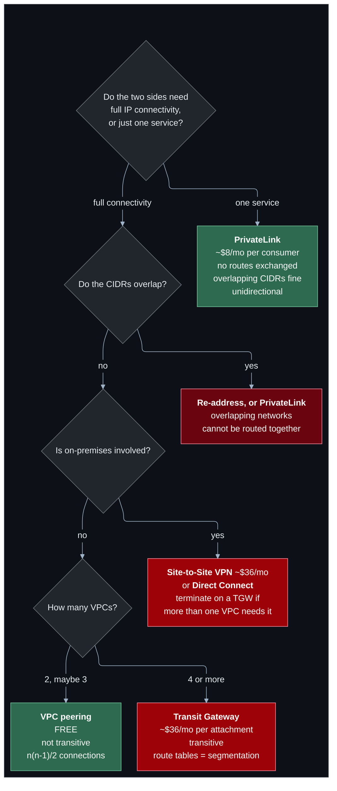
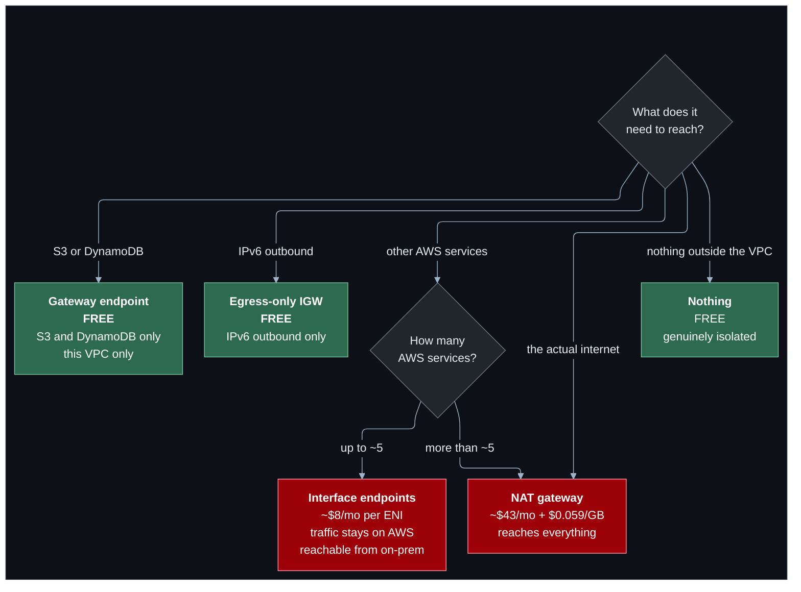
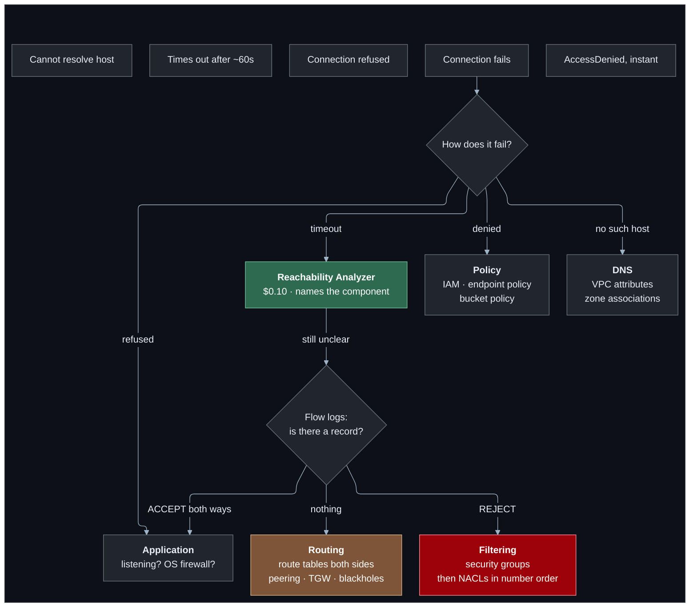
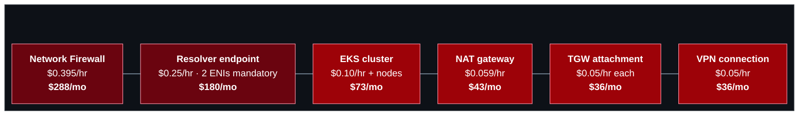

# Diagrams

Every lab's architecture diagram lives in that lab's `README.md`, next to the
explanation it belongs with. This page collects the cross-cutting ones and
explains the conventions.

All diagrams in this repository are **Mermaid**, rendered inline by GitHub. No
image files, no external tooling, and a diff on a diagram is readable.

---

## Conventions

| Colour | Meaning |
| --- | --- |
| 🟢 Green (`#2d6a4f`) | Free resource, or the route that makes something work |
| 🟤 Brown (`#7f5539`) | Private or isolated — no path out |
| 🔵 Blue (`#1d3557`) | Gateway (internet gateway, Transit Gateway) |
| 🔴 Red (`#9d0208`) | **Billed by the hour** |
| 🔴 Dark red (`#6a040f`) | Billed by the hour, and expensively |

Solid arrows are traffic paths. Dotted arrows are relationships, or paths that
do **not** work.

Each palette colour is a `classDef` (`free`, `private`, `gateway`, `billed`,
`costly`) with a lighter border, so it stays legible on the dark canvas.

### Layout and theme

Every diagram starts with the same front matter and sits on its own dark
canvas, so it looks identical in GitHub's light and dark modes:

- `layout: elk` with `curve: rounded` draws connections as vertical and
  horizontal segments with rounded corners. Renderers without ELK fall back to
  the default layout.
- `theme: base` plus the `themeVariables` block sets light text and lines.
- Everything is wrapped in `subgraph CANVAS[" "]`, filled `#0d1117`. Top-level
  boxes (a VPC, a Region) use class `vpc` (`#161b22`); nested ones (an
  Availability Zone, a subnet) use class `az` (`#1c2128`, dashed).
- **Diagrams with subgraphs flow left to right** (`flowchart LR`). Titles sit on
  a box's top edge, so lines must enter through the sides or they run through
  the title. Decision trees have no titled boxes and stay top-down.
- Put long explanations in a node, not on an edge label. Labels wider than the
  gap between two boxes overlap them.

---

## The whole repository

One project, fourteen stages. Each lab changes the network the previous one
built, so the order is a straight line.

```mermaid
---
config:
  layout: elk
  theme: base
  themeVariables:
    lineColor: "#9fb3c8"
    textColor: "#e6edf3"
    primaryColor: "#21262d"
    primaryTextColor: "#e6edf3"
    primaryBorderColor: "#6e7681"
    edgeLabelBackground: "#0d1117"
    clusterBkg: "#161b22"
    clusterBorder: "#6e7681"
    titleColor: "#e6edf3"
  flowchart:
    curve: rounded
    wrappingWidth: 420
---
flowchart LR
    subgraph CANVAS[" "]
        subgraph FOUND["One network · the video's story"]
            L01["01 · Single server<br/><i>IP, DNS, ports</i>"]
            L02["02 · Segmentation<br/><i>subnets, firewalls</i>"]
            L03["03 · NAT"]
            L04["04 · VPC endpoints"]
        end
        subgraph APPS["Running applications on it"]
            L05["05 · Load balancing"]
            L06["06 · Containers"]
            L07["07 · Kubernetes<br/><b>~$0.25/hr</b>"]
        end
        subgraph OPS["Operating it"]
            L08["08 · Security and observability"]
            L14["14 · Troubleshooting"]
        end
        subgraph MANY["More than one network"]
            L09["09 · VPC peering"]
            L10["10 · Transit Gateway<br/><b>~$0.15/hr</b>"]
            L11["11 · DNS and PrivateLink"]
            L12["12 · Hybrid VPN<br/><b>~$0.08/hr</b>"]
            L13["13 · Multi-Region"]
        end
    end

    L01 --> L02 --> L03 --> L04 --> L05 --> L06 --> L07 --> L08
    L08 --> L09 --> L10 --> L11 --> L12 --> L13 --> L14

    classDef canvas fill:#0d1117,stroke:#30363d,color:#e6edf3
    classDef vpc fill:#161b22,stroke:#8b949e,color:#e6edf3
    classDef free fill:#2d6a4f,stroke:#74c69d,color:#fff
    classDef billed fill:#9d0208,stroke:#ff8fa3,color:#fff

    class CANVAS canvas
    class FOUND,APPS,OPS,MANY vpc
    class L07,L10,L12 billed
    class L01 free
```



Red marks labs whose opt-ins have a meaningful hourly charge. The architecture
the project ends up with is drawn in the root [`README.md`](../../README.md#architecture).

---

## Deciding how to connect two networks



The first question is the one people skip. A great many "we need to peer these
VPCs" requests are really "team X needs to call team Y's API", and PrivateLink
solves that without merging two address spaces forever.

---

## Giving a private subnet outbound access



Gateway endpoints are free and strictly better than routing S3 or DynamoDB
traffic through a NAT gateway. There is no configuration in which you should not
have them.

---

## Diagnosing a failed connection



**A timeout means nothing answered. A refusal means something did.** That
distinction, made before reading any configuration, saves more time than any
tool.

Full method in [`../troubleshooting.md`](../troubleshooting.md).

---

## The six expensive resources



All six are off by default and need both a feature flag and
`acknowledge_costs = true`. Prices are ap-southeast-1; see
[`../cost-guide.md`](../cost-guide.md).

---

## Adding a diagram

Put it in the lab README next to the explanation. Mermaid, copying the front
matter and `classDef` lines from an existing diagram, and it must show the
**mechanism** — the route, the ENI, the rule — rather than boxes labelled with
service names. A diagram that does not say anything the prose does not is not
worth the lines.

Check it renders by previewing the Markdown; GitHub renders ```` ```mermaid ````
fences natively.
