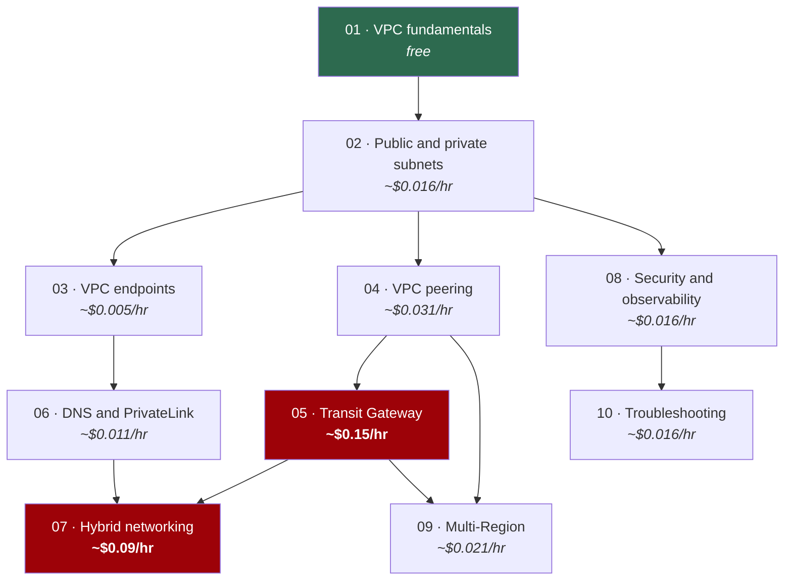

# Learning path

How to work through this repository, and why the labs are in this order.

---

## Before you start

```bash
# 1. Verify your tooling
terraform version          # >= 1.11.0
aws sts get-caller-identity
session-manager-plugin --version

# 2. Create the state backend. Once per account and Region.
cd bootstrap
cp terraform.tfvars.example terraform.tfvars
terraform init && terraform apply
terraform output backend_hcl
```

**Set a budget while you are there.** In `bootstrap/terraform.tfvars`:

```hcl
enable_budget              = true
budget_limit_usd           = 20
budget_notification_emails = ["you@example.com"]
```

Budgets are free and the forecast alert fires within hours of a mistake rather
than at the end of the month.

---

## The four domains

The AWS Certified Advanced Networking – Specialty exam (ANS-C01) organises the
subject into four domains. That exam **retires on 25 August 2026**, but the
division is a good one and the labs map onto it:

| Domain | What it covers | Labs |
| --- | --- | --- |
| **Network design** | Address planning, topology selection, hybrid and multi-Region architecture | 01, 04, 05, 07, 09 |
| **Network implementation** | Building VPCs, connectivity, DNS, private service access | 01, 02, 03, 05, 06, 07 |
| **Management and operations** | Monitoring, troubleshooting, automation | 08, 10 |
| **Security, compliance and governance** | Filtering, inspection, encryption, least privilege | 01, 03, 08 |

The labs are ordered by dependency, not by domain, because you cannot design a
network you have not built.

---

## Dependency map

Every lab deploys and destroys independently. The arrows are **conceptual
prerequisites** — what you should understand before starting, not what must
still be running.



Red is where the hourly charges are meaningful. Green is free.

---

## Three routes through

### A weekend (about 8 hours, under USD 2)

The core of AWS networking, skipping the expensive opt-ins.

| | Lab | Time | Notes |
| --- | --- | --- | --- |
| 1 | 01 — VPC fundamentals | 30 min | Free. Do the IPv6 exercise. |
| 2 | 02 — Public and private subnets | 45 min | Enable the NAT gateway for 30 minutes, then turn it off. |
| 3 | 03 — VPC endpoints | 60 min | Do the free S3 half first. |
| 4 | 04 — VPC peering | 60 min | The non-transitivity demonstration is the point. |
| 5 | 08 — Security and observability | 75 min | Flow logs and Reachability Analyzer. |
| 6 | 06 — DNS and PrivateLink | 75 min | Skip the Resolver endpoints. |
| 7 | 10 — Troubleshooting | 90 min | Three or four challenges. |

Destroy each lab before starting the next.

### Two weeks, thoroughly (about 25 hours, under USD 15)

Every lab, every exercise, with the expensive ones enabled briefly.

- **Week 1:** labs 01–05. Enable the Transit Gateway for one session in lab 05
  (about USD 0.15/hour) and do all six exercises in one sitting.
- **Week 2:** labs 06–10. Enable PrivateLink in lab 06, the simulated
  on-premises VPN in lab 07, Network Firewall in lab 08 for thirty minutes, and
  work every challenge in lab 10.

Budget roughly:

| | Enabled for | Cost |
| --- | --- | --- |
| Lab 05 Transit Gateway | 3 hours | ~USD 0.45 |
| Lab 06 PrivateLink | 2 hours | ~USD 0.09 |
| Lab 06 Resolver endpoint | 30 min | ~USD 0.13 |
| Lab 07 VPN + on-premises | 3 hours | ~USD 0.27 |
| Lab 08 Network Firewall | 30 min | ~USD 0.20 |
| Lab 09 TGW peering | 1 hour | ~USD 0.20 |
| Everything else, ~20 hours | | ~USD 0.40 |

**Total: under USD 2 of chargeable resources**, assuming you destroy promptly.
The USD 15 figure is headroom for leaving something running overnight, which
you will do at least once.

### Targeted study

| If you need to understand… | Do these |
| --- | --- |
| Why my private subnet cannot reach the internet | 01, 02 |
| Whether to use NAT or endpoints | 03 |
| Connecting several VPCs | 04, 05 |
| Why DNS resolves differently inside the VPC | 06 |
| Connecting a data centre to AWS | 07 |
| Why this connection is failing | 08, 10 |
| Running in more than one Region | 09 |
| Security groups versus network ACLs | 01, 08 |

---

## What each lab is actually for

**01 — VPC fundamentals.** One idea: a subnet is public because of a route, not
because of its name. Everything else follows. Free, so there is no reason not to
do the IPv6 exercise while you are there.

**02 — Public and private subnets.** Two instances, identical except for their
subnet. Watch one register with Systems Manager and the other fail, then fix it
three ways at three prices. This is where NAT gateway cost stops being an
abstraction.

**03 — Private AWS service access.** A VPC with **no internet gateway at all**,
whose instances still read S3 and get a Session Manager shell. Separates
"reaching AWS services" from "having internet access" — conflating those two is
why so many VPCs have a NAT gateway they do not need.

**04 — VPC peering.** Three VPCs. B is peered with A, C is peered with A, and B
cannot reach C. That single property is the argument for Transit Gateway, and
the comparison table at the end of this lab is worth memorising.

**05 — Transit Gateway.** Hub-and-spoke with real segmentation. The association
versus propagation distinction causes more confusion than anything else in AWS
networking, and this lab is built around making it concrete. The most expensive
lab here — work it in one sitting.

**06 — DNS and PrivateLink.** These are one lab because in practice a
PrivateLink problem is a DNS problem. Split-horizon DNS, a real endpoint service
behind an NLB, and the demonstration that PrivateLink works with **overlapping
CIDRs** — which decides a lot of real architecture arguments.

**07 — Hybrid networking.** A genuine IPsec tunnel to a "data centre" that is a
second VPC running libreswan, configured from the pre-shared keys AWS generated.
The tunnels really come up. Direct Connect is documented honestly: the free DX
gateway is created, and the parts that need a physical cross-connect are
explained rather than faked.

**08 — Security and observability.** One question: was it blocked, or did it
never arrive? Flow logs answer it; Reachability Analyzer names the component. Do
this before lab 10.

**09 — Multi-Region.** The interesting number is 70 milliseconds. Also: what
stops working across a Region boundary, and why a Transit Gateway peering
attachment does not propagate routes.

**10 — Troubleshooting.** Nine deliberately broken scenarios. Hints and
solutions are in separate files so you can genuinely attempt each one. This is
the lab that turns knowledge into competence.

---

## The one habit that matters

**Destroy every lab when you finish with it.**

```bash
terraform destroy
```

Then sweep, because a partial destroy is silent:

```bash
for R in ap-southeast-1 ap-northeast-1; do
  echo "=== $R ==="
  aws ec2 describe-nat-gateways --region $R --filter Name=state,Values=available \
    --query 'NatGateways[].NatGatewayId' --output text
  aws ec2 describe-transit-gateway-attachments --region $R \
    --query 'TransitGatewayAttachments[?State==`available`].TransitGatewayAttachmentId' --output text
  aws ec2 describe-vpn-connections --region $R \
    --query 'VpnConnections[?State==`available`].VpnConnectionId' --output text
  aws ec2 describe-addresses --region $R \
    --query 'Addresses[?AssociationId==null].PublicIp' --output text
  aws network-firewall list-firewalls --region $R --query 'Firewalls[].FirewallName' --output text
done
```

Full checklist in [`cost-guide.md`](cost-guide.md).

---

## After the labs

**Read.** The [Building a scalable and secure multi-VPC network
infrastructure](https://docs.aws.amazon.com/whitepapers/latest/building-scalable-secure-multi-vpc-network-infrastructure/welcome.html)
whitepaper is the single best document on this subject and makes far more sense
once you have built the components.

**Build something you designed.** Take a requirement — "three environments, one
shared services VPC, on-premises connectivity, no internet egress from
production" — and build it from these modules. That is a different skill from
following a lab.

**Break things deliberately.** Lab 10's method generalises: take a working
design, remove one thing, and predict the symptom before you observe it.

### On the certification

The **AWS Certified Advanced Networking – Specialty (ANS-C01) exam retires on
25 August 2026.** Check [the certification
page](https://aws.amazon.com/certification/certified-advanced-networking-specialty/)
for what AWS offers in its place.

This repository was built around durable knowledge rather than exam objectives,
and none of it becomes less useful on 26 August 2026. Transit Gateway route
tables, endpoint policies and the difference between a security group and a
network ACL are properties of AWS, not of an exam.

If you are sitting it before it retires, the gap between these labs and the exam
is mostly:

- Direct Connect specifics — LOA-CFA, LAG, MACsec, hosted versus dedicated
- Load balancer internals — ALB, NLB and GWLB behaviour in depth
- CloudFront and edge networking at length
- Specific service quotas and limits
- AWS Cloud WAN, which post-dates most of the exam material

---

## Reference

- [`cost-guide.md`](cost-guide.md) — what everything costs, and the cleanup checklist
- [`troubleshooting.md`](troubleshooting.md) — general diagnostic method
- [`glossary.md`](glossary.md) — terms, defined
- [`diagrams/`](diagrams/) — the architecture diagrams, collected
