# Learning path

How to work through this repository, and why the labs are in this order.

---

## Before you start

```bash
# 1. Verify your tooling
terraform version          # >= 1.11.0
aws sts get-caller-identity
session-manager-plugin --version

# 2. Create the state backend. Once per account and Region.
cd bootstrap
cp terraform.tfvars.example terraform.tfvars
terraform init && terraform apply
terraform output backend_hcl
```

**Set a budget while you are there.** In `bootstrap/terraform.tfvars`:

```hcl
enable_budget              = true
budget_limit_usd           = 20
budget_notification_emails = ["you@example.com"]
```

Budgets are free and the forecast alert fires within hours of a mistake rather
than at the end of the month.

---

## One project, fourteen stages

The labs build **one thing**: the network of a small online shop. Lab 01 is a
single server; lab 13 is three tiers behind a load balancer, containers,
Kubernetes, three VPCs on a Transit Gateway, an office on a VPN and a second
Region. Each lab folder is the whole project at that stage, and applying it
upgrades what the previous lab built.

Read [`working-with-the-labs.md`](working-with-the-labs.md) before lab 02. It
explains the shared state, how to move from one lab to the next, and how to
keep the bill small when everything accumulates.

Labs 01–07 follow
[Every Networking Concept Explained In 20 Minutes](https://www.youtube.com/watch?v=xj_GjnD4uyI)
chapter by chapter. [`concept-map.md`](concept-map.md) shows where each
concept from the video is built.

---

## The order, and why

```mermaid
---
config:
  layout: elk
  theme: base
  themeVariables:
    lineColor: "#9fb3c8"
    textColor: "#e6edf3"
    primaryColor: "#21262d"
    primaryTextColor: "#e6edf3"
    primaryBorderColor: "#6e7681"
    edgeLabelBackground: "#0d1117"
    clusterBkg: "#161b22"
    clusterBorder: "#6e7681"
    titleColor: "#e6edf3"
  flowchart:
    curve: rounded
    wrappingWidth: 420
---
flowchart LR
    subgraph CANVAS[" "]
        subgraph FOUND["One network · the video's story"]
            L01["01 · Single server<br/><i>IP, DNS, ports</i>"]
            L02["02 · Segmentation<br/><i>subnets, firewalls</i>"]
            L03["03 · NAT"]
            L04["04 · VPC endpoints"]
        end
        subgraph APPS["Running applications on it"]
            L05["05 · Load balancing"]
            L06["06 · Containers"]
            L07["07 · Kubernetes<br/><b>~$0.25/hr</b>"]
        end
        subgraph OPS["Operating it"]
            L08["08 · Security and observability"]
            L14["14 · Troubleshooting"]
        end
        subgraph MANY["More than one network"]
            L09["09 · VPC peering"]
            L10["10 · Transit Gateway<br/><b>~$0.15/hr</b>"]
            L11["11 · DNS and PrivateLink"]
            L12["12 · Hybrid VPN<br/><b>~$0.08/hr</b>"]
            L13["13 · Multi-Region"]
        end
    end

    L01 --> L02 --> L03 --> L04 --> L05 --> L06 --> L07 --> L08
    L08 --> L09 --> L10 --> L11 --> L12 --> L13 --> L14

    classDef canvas fill:#0d1117,stroke:#30363d,color:#e6edf3
    classDef vpc fill:#161b22,stroke:#8b949e,color:#e6edf3
    classDef free fill:#2d6a4f,stroke:#74c69d,color:#fff
    classDef billed fill:#9d0208,stroke:#ff8fa3,color:#fff

    class CANVAS canvas
    class FOUND,APPS,OPS,MANY vpc
    class L07,L10,L12 billed
    class L01 free
```



Red marks the labs whose opt-ins have a meaningful hourly charge. The order is
a straight line because each lab changes the same project — but see "Starting
in the middle" in [`working-with-the-labs.md`](working-with-the-labs.md).

---

## Three routes through

### A weekend (about 8 hours, under USD 2)

The video's story, hands-on, with the expensive opt-ins skipped.

| | Lab | Time | Notes |
| --- | --- | --- | --- |
| 1 | 01 — Single server | 30 min | Do the third-application exercise. |
| 2 | 02 — Segmentation | 45 min | The stateless-filtering exercise is the one to remember. |
| 3 | 03 — NAT | 45 min | Enable the NAT gateway for 30 minutes, then turn it off. |
| 4 | 04 — VPC endpoints | 45 min | The free S3 half first. |
| 5 | 05 — Load balancing | 45 min | About four cents an hour. |
| 6 | 06 — Containers | 60 min | Part 1 (Docker) needs no opt-in. |
| 7 | 08 — Security and observability | 60 min | Flow logs and one fault. Skip lab 07 on this route; read its README. |

Destroy at the end, not between labs.

### Two weeks, thoroughly (about 25 hours, under USD 15)

Every lab and exercise, each expensive opt-in on for one sitting.

- **Week 1:** labs 01–08. EKS (lab 07) and Network Firewall (lab 08) are the
  two to switch on, use and switch off in the same hour.
- **Week 2:** labs 09–14. Transit Gateway on for labs 10–13 while you are
  working, off overnight.

| Opt-in | On for | Cost |
| --- | --- | --- |
| Lab 03 NAT gateway | 3 hours | ~USD 0.18 |
| Lab 05 load balancer | 6 hours | ~USD 0.21 |
| Lab 06 ECS | 2 hours | ~USD 0.05 |
| Lab 07 EKS (+ NAT) | 2 hours | ~USD 0.60 |
| Lab 08 Network Firewall | 30 min | ~USD 0.20 |
| Lab 10 Transit Gateway | 6 hours | ~USD 0.90 |
| Lab 11 PrivateLink | 2 hours | ~USD 0.07 |
| Lab 11 Resolver endpoint | 30 min | ~USD 0.13 |
| Lab 12 VPN + office | 3 hours | ~USD 0.23 |
| Lab 13 TGW peering | 1 hour | ~USD 0.10 |
| Instances, ~25 hours | | ~USD 1.75 |

**Total: under USD 5 of chargeable resources** if you turn things off
promptly. The USD 15 figure is headroom for leaving something on overnight,
which you will do at least once.

### Targeted study

| If you need to understand… | Do these |
| --- | --- |
| The basics the video covers | 01, 02, 03 |
| Why my private subnet cannot reach the internet | 02, 03 |
| Whether to use NAT or endpoints | 04 |
| Host- and path-based routing | 05, 07 |
| How container and pod addresses relate to the VPC | 06, 07 |
| Why this connection is failing | 08, 14 |
| Connecting several VPCs | 09, 10 |
| Why DNS resolves differently inside the VPC | 11 |
| Exposing one service without a network connection | 11 |
| Connecting a data centre to AWS | 12 |
| Running in more than one Region | 13 |
| Security groups versus network ACLs | 02, 08 |

You can apply any lab to an empty state; it builds everything up to that
stage.

---

## What each lab is actually for

**01 — A single server.** One address, two applications, told apart by port.
And one idea that everything else rests on: a subnet is public because of a
route, not because of its name.

**02 — Network segmentation.** The server becomes three tiers. One `curl`
returns three nested answers, and each control you remove breaks exactly one
of them. The network ACL exercise — a reply dropped by a stateless filter —
is the most common real-world mistake in this repository.

**03 — NAT.** Two private hosts and one public address between them. Run
`curl checkip` on both. This is also where NAT gateway cost stops being an
abstraction.

**04 — Private AWS access.** A host with no internet access reads S3. It
separates "reaching AWS services" from "having internet access" — conflating
the two is why so many VPCs have a NAT gateway they do not need.

**05 — Load balancing.** The shop gets a name that survives replacing a
server, and routing decisions made by reading the request. Everything
Kubernetes calls Ingress, done by hand first.

**06 — Container networking.** The same application twice: behind Docker's
bridge and port mapping, where the VPC never sees a container address, and on
ECS, where each task is a VPC host. The contrast is the lesson.

**07 — Kubernetes networking.** Pod IPs, Services and Ingress, each mapped to
something you already built. The most expensive lab per hour; do it in one
sitting.

**08 — Security and observability.** One question: was it blocked, or did it
never arrive? Flow logs answer it; Reachability Analyzer names the component.
Do not skip this before lab 14.

**09 — VPC peering.** Three VPCs. Shop and dev are both peered with shared and
cannot reach each other. That single property is the argument for the next
lab.

**10 — Transit Gateway.** The peering connections are deleted and replaced
with a hub. Association versus propagation causes more confusion than
anything else in AWS networking, and this lab is built around making it
concrete.

**11 — DNS and PrivateLink.** Names instead of copied addresses, and the
demonstration that a name resolving says nothing about whether you can
connect. Then PrivateLink: dev gets one port of one service, and no network.

**12 — Hybrid networking.** A genuine IPsec tunnel to an "office" that is a
VPC running libreswan, configured from the pre-shared keys AWS generated. The
tunnels really come up. Direct Connect is documented honestly: the free
gateway is created, and the parts that need a physical circuit are explained
rather than faked.

**13 — Multi-Region.** The interesting number is 70 milliseconds. Also: what
stops working across a Region boundary, and why connecting two Regions does
not move a single user between them.

**14 — Troubleshooting.** Six faults injected into the network you built.
Hints and solutions are in separate files so you can genuinely attempt each
one. This is the lab that turns knowledge into competence.

---

## The one habit that matters

**Turn opt-ins off when you finish a lab, and destroy when you stop for the day.**

```bash
terraform destroy          # from the lab folder you applied last
```

Then sweep, because a partial destroy is silent:

```bash
for R in ap-southeast-1 ap-northeast-1; do
  echo "=== $R ==="
  aws ec2 describe-nat-gateways --region $R --filter Name=state,Values=available \
    --query 'NatGateways[].NatGatewayId' --output text
  aws ec2 describe-transit-gateway-attachments --region $R \
    --query 'TransitGatewayAttachments[?State==`available`].TransitGatewayAttachmentId' --output text
  aws ec2 describe-vpn-connections --region $R \
    --query 'VpnConnections[?State==`available`].VpnConnectionId' --output text
  aws ec2 describe-addresses --region $R \
    --query 'Addresses[?AssociationId==null].PublicIp' --output text
  aws network-firewall list-firewalls --region $R --query 'Firewalls[].FirewallName' --output text
done
```

Full checklist in [`cost-guide.md`](cost-guide.md).

---

## After the labs

**Read.** The [Building a scalable and secure multi-VPC network
infrastructure](https://docs.aws.amazon.com/whitepapers/latest/building-scalable-secure-multi-vpc-network-infrastructure/welcome.html)
whitepaper is the single best document on this subject and makes far more sense
once you have built the components.

**Build something you designed.** Take a requirement — "three environments, one
shared services VPC, on-premises connectivity, no internet egress from
production" — and build it from these modules. That is a different skill from
following a lab.

**Break things deliberately.** Lab 14's method generalises: take a working
design, remove one thing, and predict the symptom before you observe it.

### On the certification

The **AWS Certified Advanced Networking – Specialty (ANS-C01) exam retires on
25 August 2026.** Check [the certification
page](https://aws.amazon.com/certification/certified-advanced-networking-specialty/)
for what AWS offers in its place.

This repository was built around durable knowledge rather than exam objectives,
and none of it becomes less useful on 26 August 2026. Transit Gateway route
tables, endpoint policies and the difference between a security group and a
network ACL are properties of AWS, not of an exam.

If you are sitting it before it retires, the gap between these labs and the exam
is mostly:

- Direct Connect specifics — LOA-CFA, LAG, MACsec, hosted versus dedicated
- Load balancer internals — GWLB, and ALB and NLB behaviour in more depth
  than labs 05 and 11 go
- CloudFront and edge networking at length
- Specific service quotas and limits
- AWS Cloud WAN, which post-dates most of the exam material

---

## Reference

- [`working-with-the-labs.md`](working-with-the-labs.md) — the shared state, moving between labs, destroying
- [`concept-map.md`](concept-map.md) — the video's concepts, and where each is built
- [`address-plan.md`](address-plan.md) — every range and port in the project
- [`cost-guide.md`](cost-guide.md) — what everything costs, and the cleanup checklist
- [`troubleshooting.md`](troubleshooting.md) — general diagnostic method
- [`glossary.md`](glossary.md) — terms, defined
- [`diagrams/`](diagrams/) — the architecture diagrams, collected
