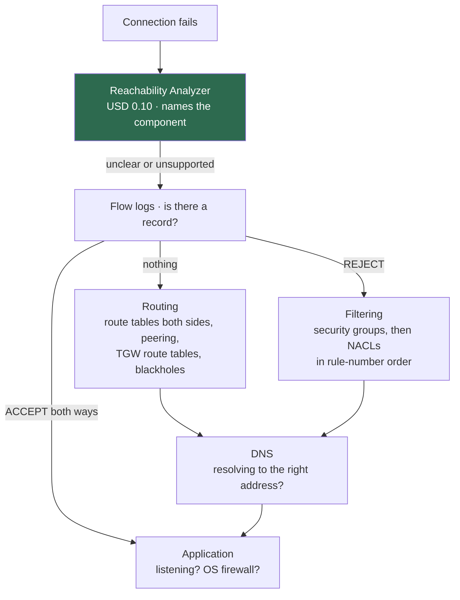

# Troubleshooting AWS networking

A method, then the specific faults. [Lab 10](../labs/10-troubleshooting-challenges/README.md)
is the hands-on version of this document.

---

## The one question

**Was the packet blocked, or did it never arrive?**

Everything else follows. The two have completely different causes and completely
different fixes, and from the client they look identical — a timeout.

| Evidence | Conclusion | Where to look |
| --- | --- | --- |
| Flow log `REJECT` | Filtered. **It arrived.** | Security groups, then network ACLs |
| Flow log `ACCEPT` out, nothing back | Stateless filter dropping the reply | NACL inbound ephemeral rules |
| **No flow log record at all** | Never arrived | **Routing** |
| Flow log `ACCEPT` both directions | The network delivered it | The application, or an OS firewall |

---

## The order to work in



**Start with Reachability Analyzer.** Ten cents, no packet sent, and it names
the blocking component — a security group ID, an ACL rule number, a missing
route. After ten minutes of manual investigation it is obviously worth it.

```bash
PATH_ID=$(aws ec2 create-network-insights-path --region "$REGION" \
  --source eni-aaa --destination eni-bbb --protocol tcp --destination-port 443 \
  --query 'NetworkInsightsPath.NetworkInsightsPathId' --output text)

ANALYSIS=$(aws ec2 start-network-insights-analysis --region "$REGION" \
  --network-insights-path-id "$PATH_ID" \
  --query 'NetworkInsightsAnalysis.NetworkInsightsAnalysisId' --output text)

sleep 30
aws ec2 describe-network-insights-analyses --region "$REGION" \
  --network-insights-analysis-ids "$ANALYSIS" \
  --query 'NetworkInsightsAnalyses[0].{Found:NetworkPathFound,Explanations:Explanations}' \
  --output json
```

**What it does not know:** whether the service is listening, whether an OS
firewall is blocking, anything about DNS, or whether a Transit Gateway route is
a blackhole. `NetworkPathFound: true` means "nothing in the AWS network
configuration stops this", which is a narrower claim than "it works".

---

## Timing is a diagnostic

Before reading any configuration, notice how the failure fails.

| Behaviour | Almost certainly |
| --- | --- |
| Times out after ~60–130 s | **Routing.** Nothing answered. Packets went nowhere. |
| Fails immediately, `Connection refused` | Reached the host; nothing listening on that port |
| `AccessDenied` in milliseconds | A policy — IAM, an endpoint policy, a bucket policy |
| `Could not resolve host` | DNS, before any packet was sent |
| Works then hangs mid-transfer | MTU. See below. |
| Intermittent, roughly half of attempts | Asymmetric routing, or divergent per-AZ route tables |

A timeout means nothing answered. A refusal means something did. That single
distinction saves more time than any tool.

---

## Routing

```bash
# Which route table does this subnet actually use?
aws ec2 describe-route-tables --region "$REGION" \
  --filters Name=association.subnet-id,Values=subnet-xxx \
  --query 'RouteTables[0].{Id:RouteTableId,Routes:Routes[].{Dest:DestinationCidrBlock,PrefixList:DestinationPrefixListId,GW:GatewayId,NAT:NatGatewayId,Peering:VpcPeeringConnectionId,TGW:TransitGatewayId,ENI:NetworkInterfaceId,State:State}}' \
  --output json
```

If that returns nothing, the subnet has **no explicit association** and is
falling back to the VPC's main route table — which is a fault in itself:

```bash
aws ec2 describe-route-tables --region "$REGION" \
  --filters Name=vpc-id,Values=vpc-xxx Name=association.main,Values=true \
  --query 'RouteTables[0].Routes'
```

### What to check, in order

1. **Is there a route matching the destination?** AWS uses longest-prefix match.
   `10.0.0.0/16 → local` beats `0.0.0.0/0 → igw` for `10.0.0.5`.
2. **Is the route `active` or `blackhole`?** A blackhole route means the target
   no longer exists. It is not an error and it silently drops traffic.
3. **Is there a route on the RETURN path?** Half of all peering and Transit
   Gateway faults are one-sided.
4. **The `local` route cannot be removed.** If the destination is inside your
   VPC CIDR, no other route will ever be used for it.

### Route targets

| Target in the table | Means |
| --- | --- |
| `local` | Inside the VPC. Cannot be overridden. |
| `igw-` | Internet gateway. Needs a public IP on the instance to work. |
| `nat-` | NAT gateway. Outbound only. |
| `eigw-` | Egress-only internet gateway. IPv6 outbound only. |
| `pcx-` | Peering. **Not transitive.** |
| `tgw-` | Transit Gateway. Its own route tables then apply. |
| `vgw-` | Virtual private gateway — VPN or Direct Connect. |
| `pl-` | A managed prefix list, usually a gateway endpoint. |
| `vpce-` | A Gateway Load Balancer or firewall endpoint. |
| `eni-` | An instance acting as a router. Check `source_dest_check`. |
| `State: blackhole` | **The target is gone.** Traffic is dropped silently. |

---

## Filtering

### Security groups

Stateful, on an ENI, allow-only, all rules evaluated.

```bash
aws ec2 describe-security-group-rules --region "$REGION" \
  --filters Name=group-id,Values=sg-xxx \
  --query 'SecurityGroupRules[].{Egress:IsEgress,Proto:IpProtocol,From:FromPort,To:ToPort,CIDR:CidrIpv4,SourceSG:ReferencedGroupInfo.GroupId,PrefixList:PrefixListId,Desc:Description}' \
  --output table
```

- **No deny rules exist.** Anything not permitted is dropped.
- **Stateful:** an allowed inbound connection's reply goes out regardless of
  egress rules.
- **Group references name an identity, not an address.** Check the group ID
  against the one you expected — a rule referencing the *wrong* group looks
  entirely correct in a listing. A self-reference is legitimate (cluster
  members) which is what makes the mistake hard to see.

### Network ACLs

Stateless, on a subnet, allow **and** deny, **first match wins in rule-number
order**.

```bash
aws ec2 describe-network-acls --region "$REGION" \
  --filters Name=association.subnet-id,Values=subnet-xxx \
  --query 'NetworkAcls[0].Entries[].{Num:RuleNumber,Egress:Egress,Action:RuleAction,Proto:Protocol,CIDR:CidrBlock,Ports:PortRange}' \
  --output table
```

**Read it top to bottom in number order, like a routing table.** A deny at 90
makes an allow at 100 unreachable for the same traffic, and nothing warns you.

**The ephemeral-port trap.** Because ACLs are stateless, the reply to an
outbound connection is evaluated on its own. It arrives from outside your CIDR,
addressed to a port in 1024–65535. Without an inbound allow for that range,
every outbound connection hangs — while every rule you look at says the traffic
is permitted.

Ranges: Linux 32768–60999, Windows 49152–65535, ELB 1024–65535. Allow
1024–65535 and stop worrying.

Rule 32767 (`deny all`) is added automatically and cannot be removed.

---

## DNS

```bash
# On the instance
cat /etc/resolv.conf              # should be the VPC base address plus two
dig +short <name>
dig +short <name> @169.254.169.253   # the VPC resolver, bypassing local config
```

```bash
# VPC DNS attributes -- both must be true for most things to work
for a in enableDnsSupport enableDnsHostnames; do
  aws ec2 describe-vpc-attribute --region "$REGION" --vpc-id vpc-xxx --attribute $a
done

# Which private zones can this VPC see?
aws route53 list-hosted-zones-by-vpc --vpc-id vpc-xxx --vpc-region "$REGION"
```

### The four ways DNS breaks in a VPC

| Symptom | Cause |
| --- | --- |
| Nothing resolves at all | `enableDnsSupport = false` |
| Private zone names do not resolve | The zone is not associated with this VPC |
| Interface endpoint private DNS does nothing | `enableDnsHostnames = false` |
| A **public** name resolves to the wrong address | A private hosted zone is shadowing it |

The fourth is the nasty one. Someone created a private zone for a domain they do
not fully control, and now that domain resolves differently for the whole VPC.

**Private hosted zones are authoritative.** Route 53 does not fall through to
the public answer for a name it cannot find in the private zone. Create a
private zone for `example.com` containing only an apex record, and
`www.example.com` becomes `NXDOMAIN` inside the VPC even though it resolves
publicly.

---

## Endpoints

### Gateway endpoints (S3, DynamoDB)

A **route**, not a device. No ENI, no security group, no address.

```bash
aws ec2 describe-vpc-endpoints --region "$REGION" \
  --filters Name=vpc-id,Values=vpc-xxx Name=vpc-endpoint-type,Values=Gateway \
  --query 'VpcEndpoints[].{Service:ServiceName,State:State,RouteTables:RouteTableIds,Policy:PolicyDocument}' \
  --output json
```

- **Is it associated with the route table the traffic's subnet uses?** An
  endpoint associated with the wrong table is `available` and has no effect.
- **Does the endpoint policy allow the bucket?** A policy allowing only bucket X
  denies bucket Y **by omission** — there is no `Deny` statement to find.
- It works by routing, not DNS. `dig s3.<region>.amazonaws.com` correctly
  returns a **public** address.
- Not usable from a peered VPC, over VPN, or over Direct Connect.

### Interface endpoints

An ENI with a private address from your CIDR.

```bash
aws ec2 describe-vpc-endpoints --region "$REGION" \
  --filters Name=vpc-id,Values=vpc-xxx Name=vpc-endpoint-type,Values=Interface \
  --query 'VpcEndpoints[].{Service:ServiceName,State:State,PrivateDNS:PrivateDnsEnabled,Subnets:SubnetIds,SGs:Groups[].GroupId}' \
  --output json
```

- Security group must allow **TCP 443** from the client's subnet.
- `private_dns_enabled` needs both VPC DNS attributes on.
- The endpoint must exist in a subnet the client can route to.
- Session Manager needs **all three** of `ssm`, `ssmmessages`, `ec2messages`.
  Missing `ec2messages` gives a session that connects and immediately drops.

---

## Transit Gateway

```bash
# Which route table does this attachment consult when SENDING?
aws ec2 get-transit-gateway-route-table-associations --region "$REGION" \
  --transit-gateway-route-table-id tgw-rtb-xxx

# What does that table know about?
aws ec2 search-transit-gateway-routes --region "$REGION" \
  --transit-gateway-route-table-id tgw-rtb-xxx \
  --filters Name=state,Values=active,blackhole \
  --query 'Routes[].{CIDR:DestinationCidrBlock,Type:Type,State:State}' --output table
```

- **Association** = which table this attachment consults when sending. Exactly
  one per attachment.
- **Propagation** = which tables learn this attachment's CIDR. Any number.
- Associated but not propagated: you can send, nobody can reply.
- Propagated but not associated: others reach you, you cannot initiate.
- **Neither produces an error.** Both produce one-way connectivity.
- A **static** route always beats a **propagated** one for the same prefix.
- A **peering** attachment does **not** propagate. Static routes only, both sides.
- Check the attachment **subnet's** NACL if the attachment shares a subnet with
  workloads. Give attachments a dedicated `/28`.

---

## Session Manager

`TargetNotConnected` means the SSM agent never established its outbound
connection. Work down:

```bash
# 1. Running?
aws ec2 describe-instances --region "$REGION" --instance-ids i-xxx \
  --query 'Reservations[0].Instances[0].State.Name'

# 2. Instance profile attached?
aws ec2 describe-instances --region "$REGION" --instance-ids i-xxx \
  --query 'Reservations[0].Instances[0].IamInstanceProfile'

# 3. A route out?   <-- usually here
SUBNET=$(aws ec2 describe-instances --region "$REGION" --instance-ids i-xxx \
  --query 'Reservations[0].Instances[0].SubnetId' --output text)
aws ec2 describe-route-tables --region "$REGION" \
  --filters Name=association.subnet-id,Values=$SUBNET \
  --query 'RouteTables[0].Routes'

# 4. Outbound 443 allowed?
aws ec2 describe-security-groups --region "$REGION" --group-ids sg-xxx \
  --query 'SecurityGroups[0].IpPermissionsEgress'
```

Step 3 is nearly always the answer. The three fixes: a public IP in a public
subnet, a NAT gateway, or the three SSM interface endpoints.

Registration takes 1–3 minutes after launch.

---

## VPN

```bash
aws ec2 describe-vpn-connections --region "$REGION" --vpn-connection-ids vpn-xxx \
  --query 'VpnConnections[0].VgwTelemetry[].{Outside:OutsideIpAddress,Status:Status,Message:StatusMessage,Routes:AcceptedRouteCount}' \
  --output table
```

| Message | Cause |
| --- | --- |
| `IPSEC IS DOWN`, no IKE traffic seen | Wrong customer gateway IP, or UDP 500/4500 blocked |
| `NO_PROPOSAL_CHOSEN` | Encryption, integrity or DH group mismatch |
| `AUTHENTICATION_FAILED` | Wrong pre-shared key, or wrong local identity |
| Phase 1 up, phase 2 never | Traffic selector mismatch — subnets versus static routes |
| `IPSEC IS UP`, no traffic | Route propagation off, missing static route, `source_dest_check` on, or `ip_forward` off |
| `AcceptedRouteCount: 0` with BGP | The far side is advertising nothing |

**Tunnel UP but no traffic** is the common one, and on an EC2-based router it is
almost always `source_dest_check` still enabled or `net.ipv4.ip_forward = 0`.

---

## MTU

Symptom: small requests work, large ones hang. `ping` succeeds, `curl` of a big
file stalls partway. SSH connects and then freezes on a verbose command.

| Path | MTU |
| --- | --- |
| Within a VPC | 9001 (jumbo) |
| Through an internet gateway | 1500 |
| Over VPN | ~1436 after IPsec overhead |
| Over Direct Connect | 1500, or 9001 if configured |
| Through a Transit Gateway | 8500 |
| Through a peering connection | 9001 same-Region, **1500 inter-Region** |

Path MTU discovery relies on ICMP type 3 code 4 (`fragmentation needed`).
**Block ICMP entirely and PMTUD breaks**, which is why "we blocked all ICMP for
security" produces mysterious large-transfer hangs weeks later.

```bash
# Find the working MTU: -M do sets don't-fragment
ping -M do -s 1472 <destination>    # 1472 + 28 = 1500
ping -M do -s 8972 <destination>    # 8972 + 28 = 9000
```

Allow ICMP type 3 code 4 in security groups and network ACLs. It is not
optional.

---

## Flow logs

```bash
aws ec2 describe-flow-logs --region "$REGION" \
  --query 'FlowLogs[].{Id:FlowLogId,Resource:ResourceId,Status:FlowLogStatus,Delivery:DeliverLogsStatus,Error:DeliverLogsErrorMessage}' \
  --output table

aws logs tail /aws/vpc-flow-logs/<name> --follow --region "$REGION"
```

**Nothing appearing?** Check, in order: the aggregation interval has not elapsed
(up to 10 minutes at the default 600 s); the flow log is on the right resource;
`traffic_type` is not filtering out what you want; `DeliverLogsStatus` is not an
error.

**Use a custom format.** The default version 2 fields omit `pkt-srcaddr` and
`pkt-dstaddr`, which hold the **original** addresses before NAT rewrote them.
Without them, every outbound flow behind a NAT gateway appears to originate from
the NAT gateway.

Useful Logs Insights queries:

```
fields @timestamp, srcAddr, dstAddr, srcPort, dstPort, protocol, action
| filter action = "REJECT"
| sort @timestamp desc | limit 50
```

```
stats sum(bytes) as total by srcAddr, dstAddr
| sort total desc | limit 20
```

---

## Terraform and backend problems

| Error | Cause | Fix |
| --- | --- | --- |
| `S3 bucket does not exist` | `bootstrap/` not applied, or wrong bucket in `backend.hcl` | `terraform -chdir=bootstrap output` |
| `Error acquiring the state lock` | Another run, or one that died | Confirm nobody else is running, then `terraform force-unlock <ID>` |
| `AccessDenied` on `s3:PutObject` | `deny_unencrypted_uploads = true` and `encrypt` missing | Confirm `encrypt = true` in `backend.hcl` |
| `VpcLimitExceeded` | 5 VPCs per Region by default | Destroy a finished lab, or request a quota increase |
| `prevent_destroy` on the state bucket | Working as designed | See `bootstrap/README.md` |
| `InvalidParameterValue` on an instance | Architecture and instance type mismatch | `t4g.*` needs `arm64` |
| Plan wants to replace every subnet | A CIDR or `subnet_newbits` changed | Subnet CIDRs are immutable — expected |

---

## Reference commands

```bash
# Everything in a VPC, at a glance
VPC=vpc-xxx; REGION=ap-southeast-1
aws ec2 describe-subnets --region $REGION --filters Name=vpc-id,Values=$VPC \
  --query 'Subnets[].{Name:Tags[?Key==`Name`]|[0].Value,CIDR:CidrBlock,AZ:AvailabilityZone,Free:AvailableIpAddressCount}' --output table
aws ec2 describe-route-tables --region $REGION --filters Name=vpc-id,Values=$VPC \
  --query 'RouteTables[].{Name:Tags[?Key==`Name`]|[0].Value,Main:Associations[0].Main,Routes:Routes[].DestinationCidrBlock}' --output json
aws ec2 describe-security-groups --region $REGION --filters Name=vpc-id,Values=$VPC \
  --query 'SecurityGroups[].{Name:GroupName,Id:GroupId,In:length(IpPermissions),Out:length(IpPermissionsEgress)}' --output table
aws ec2 describe-network-acls --region $REGION --filters Name=vpc-id,Values=$VPC \
  --query 'NetworkAcls[].{Id:NetworkAclId,Default:IsDefault,Subnets:Associations[].SubnetId}' --output json
aws ec2 describe-vpc-endpoints --region $REGION --filters Name=vpc-id,Values=$VPC \
  --query 'VpcEndpoints[].{Service:ServiceName,Type:VpcEndpointType,State:State}' --output table

# On the instance
ip route ; ip addr
ss -tlnp                       # what is listening
sudo tcpdump -ni any host <peer> -c 20
curl -sS -m 5 -v telnet://<host>:<port>
dig +short <name>
```

---

## Further reading

- [Troubleshoot VPC connectivity](https://docs.aws.amazon.com/vpc/latest/userguide/vpc-troubleshooting.html) — AWS
- [Reachability Analyzer explanation codes](https://docs.aws.amazon.com/vpc/latest/reachability/explanation-codes.html) — AWS
- [Flow log record fields](https://docs.aws.amazon.com/vpc/latest/userguide/flow-logs.html#flow-logs-fields) — AWS
- [Network ACL rule evaluation](https://docs.aws.amazon.com/vpc/latest/userguide/vpc-network-acls.html#nacl-rules) — AWS
- [Session Manager troubleshooting](https://docs.aws.amazon.com/systems-manager/latest/userguide/troubleshooting-remote-connections-managed-instances.html) — AWS
- [Network MTU](https://docs.aws.amazon.com/AWSEC2/latest/UserGuide/network_mtu.html) — AWS
- [Site-to-Site VPN troubleshooting](https://docs.aws.amazon.com/vpn/latest/s2svpn/Troubleshooting.html) — AWS
