# Lab 01 — A single server

**Difficulty:** Beginner · **Time:** 30 min · **Cost:** about USD 0.01/hour (one `t4g.nano` and its public IPv4 address)

The shop starts as small as a website can be: one server on the internet,
running two applications. Everything later in the repository is an answer to a
problem this setup has.

**Video:** sections 2 (IP and DNS) and 3 (ports) of
[Every Networking Concept Explained In 20 Minutes](https://www.youtube.com/watch?v=xj_GjnD4uyI).

---

## Learning objectives

By the end of this lab you will be able to:

1. Explain what an IP address is for, and why this server has two of them.
2. Explain what DNS adds, and resolve a name to an address by hand.
3. Explain how two applications share one IP address, and list the ports a
   host is listening on.
4. **Point at the single route that makes a subnet public.**
5. Describe the two firewalls a packet passes on its way to the application —
   the security group and the host firewall — and say which one dropped it.

## Concepts covered

IP addresses · public versus private addresses · the internet gateway's 1:1
address translation · DNS and name resolution · A records · client–server
communication · ports and listening sockets · well-known and custom ports ·
VPC and subnet CIDR sizing · AWS's five reserved addresses · route tables ·
security groups (stateful) · host firewalls (nftables)

---

## Architecture

```mermaid
---
config:
  layout: elk
  theme: base
  themeVariables:
    lineColor: "#9fb3c8"
    textColor: "#e6edf3"
    primaryColor: "#21262d"
    primaryTextColor: "#e6edf3"
    primaryBorderColor: "#6e7681"
    edgeLabelBackground: "#0d1117"
    clusterBkg: "#161b22"
    clusterBorder: "#6e7681"
    titleColor: "#e6edf3"
  flowchart:
    curve: rounded
    wrappingWidth: 420
---
flowchart LR
    subgraph CANVAS[" "]
        CLIENT(["Your browser"])
        DNS["<b>DNS</b><br/>name → 203.0.113.10"]
        IGW["<b>Internet gateway</b><br/>public ↔ private address"]

        subgraph VPC["VPC · 10.10.0.0/16"]
            RT["<b>Public route table</b><br/>10.10.0.0/16 → local<br/><b>0.0.0.0/0 → igw</b>"]

            subgraph SUB["public-a · 10.10.0.0/24"]
                SG["<b>Security group</b><br/>allow tcp 80, 9090"]
                subgraph HOST["server · 10.10.0.x"]
                    FW["<b>Host firewall</b><br/>nftables: allow 80, 9090"]
                    FE["<b>frontend</b><br/>listening on :80"]
                    PAY["<b>payment</b><br/>listening on :9090"]
                end
            end
        end
    end

    CLIENT -.->|"1 · what address?"| DNS
    CLIENT -->|"2 · to public IP, port 80"| IGW
    IGW --> RT --> SG --> FW
    FW -->|":80"| FE
    FW -->|":9090"| PAY
    FE -->|"127.0.0.1:9090"| PAY

    classDef canvas fill:#0d1117,stroke:#30363d,color:#e6edf3
    classDef vpc fill:#161b22,stroke:#8b949e,color:#e6edf3
    classDef az fill:#1c2128,stroke:#6e7681,color:#c9d1d9,stroke-dasharray:6 4
    classDef free fill:#2d6a4f,stroke:#74c69d,color:#fff
    classDef private fill:#7f5539,stroke:#ddb892,color:#fff
    classDef gateway fill:#1d3557,stroke:#a8dadc,color:#fff
    classDef billed fill:#9d0208,stroke:#ff8fa3,color:#fff
    classDef costly fill:#6a040f,stroke:#ff8fa3,color:#fff

    class CANVAS canvas
    class VPC vpc
    class SUB,HOST az
    class RT,FE,PAY free
    class IGW gateway
```



One address, two applications. The only thing that tells a request for the
frontend from a request for the payment service is the destination port.

## Traffic flow

**`curl http://<server public IP>/`**

1. Your machine needs an address. Given a name it asks DNS; given an IP it
   skips that step. Either way the packet leaves addressed to the server's
   **public** IP, destination port 80.
2. The internet delivers it to AWS, and AWS to the **internet gateway**. The
   gateway rewrites the destination from the public address to the server's
   **private** address, `10.10.0.x`. The server never sees its public address —
   run `ip addr` on it and it is not there.
3. The **security group** on the server's network interface checks source
   address and destination port against its rules. TCP 80 from
   `allowed_client_cidr` matches.
4. The packet reaches the host. The **host firewall** (nftables) checks it
   again, independently. TCP 80 is allowed.
5. The kernel hands it to whichever process is **listening on port 80** — the
   frontend. A packet for port 9090 on the same address would go to the
   payment service; a packet for port 8080 would be refused, because nothing
   is listening there.
6. The frontend calls the payment service on `127.0.0.1:9090` and embeds the
   answer in its own.
7. The reply goes back out. The security group is **stateful**, so it needs no
   outbound rule for a reply; the internet gateway rewrites the source back to
   the public address.

---

## Resources created

| Resource | Count | Cost |
| --- | --- | --- |
| VPC, subnet, route table, internet gateway | 1 each | Free |
| EC2 instance (`t4g.nano`) | 1 | ~USD 0.0053/hour |
| Public IPv4 address | 1 | USD 0.005/hour |
| Security group | 1 | Free |
| Route 53 A record | 1 if `public_zone_name` is set | Free (the hosted zone is not) |

**About USD 0.01/hour — 25 cents a day.**

## Prerequisites

- Terraform `>= 1.11.0` and AWS credentials for a sandbox account
  (`aws sts get-caller-identity`).
- The state bucket from [`bootstrap/`](../../bootstrap/README.md).
- The [Session Manager plugin](https://docs.aws.amazon.com/systems-manager/latest/userguide/session-manager-working-with-install-plugin.html)
  for the AWS CLI, to open a shell on a host.

How the labs fit together, and what "one project, one state" means in
practice, is in [`docs/working-with-the-labs.md`](../../docs/working-with-the-labs.md).

## Deploy

```bash
cd labs/01-single-server

cp backend.hcl.example backend.hcl
$EDITOR backend.hcl                    # bucket from: terraform -chdir=../../bootstrap output

cp terraform.tfvars.example terraform.tfvars
$EDITOR terraform.tfvars

terraform init -backend-config=backend.hcl
terraform plan
terraform apply
```

Apply takes about a minute. Give the server another minute to start its
services.

---

## Verification

`terraform output verify_compute` and `terraform output verify_network` print
these with your values filled in.

### 1. Two applications, one address

```bash
curl -s "$(terraform output -raw frontend_url)"
curl -s "$(terraform output -raw payment_url)"
```

Expected — the frontend's answer contains the payment service's:

```json
{"service": "frontend", "port": 80, "host": "ip-10-10-0-57...", "client_seen": "198.51.100.23", "path": "/",
 "upstream": {"service": "payment", "port": 9090, "client_seen": "127.0.0.1", "path": "/"}}
```

`client_seen` is the address the server saw the request come from: yours for
the frontend, loopback for the payment service's inner call.

### 2. Public address outside, private address inside

```bash
terraform output server_public_ip server_private_ip
```

Then open a shell (`terraform output -raw ssm_server`, then run it) and:

```bash
ip -4 addr show            # only 10.10.0.x -- the public address is not on the host
curl -s https://checkip.amazonaws.com   # ...yet the internet sees the public one
```

### 3. What is listening

```bash
sudo ss -ltnp
```

Expected: `python3` on `0.0.0.0:80` and on `0.0.0.0:9090`. A port with no
listener answers with *connection refused*; a port blocked by a firewall
answers with nothing at all. Try both from your machine:

```bash
curl -v --max-time 5 http://<public ip>:22/      # timeout: the security group drops it
```

### 4. The name

AWS gives every public address a DNS name. Resolve it:

```bash
aws ec2 describe-instances --instance-ids "$(terraform output -raw server_instance_id)" \
  --query 'Reservations[0].Instances[0].PublicDnsName' --output text
dig +short <that name>
```

With `public_zone_name` set, `terraform output shop_hostname` is your own name
for the same address.

### 5. The route that makes the subnet public

```bash
aws ec2 describe-route-tables --route-table-ids "$(terraform output -raw public_route_table_id)" \
  --query 'RouteTables[0].Routes' --output table
```

Two routes: `10.10.0.0/16 → local` and `0.0.0.0/0 → igw-…`. The second is the
entire meaning of "public subnet".

---

## Hands-on exercises

### 1. A third application

On the server, start another copy of the stand-in on a new port:

```bash
sudo python3 /opt/shop/app.py inventory 7000 &
curl -s http://127.0.0.1:7000/        # works: same host
```

From your machine, `curl --max-time 5 http://<public ip>:7000/` times out. Two
firewalls are in the way. Open them one at a time and retest after each, so
you see that **both** have to agree:

1. Security group — add an ingress rule to `compute.tf` and apply.
2. Host firewall — `sudo nft add rule inet shop input tcp dport 7000 accept`.

### 2. Which firewall dropped it?

Set `allowed_client_cidr = "192.0.2.1/32"` and apply. The shop stops answering.
On the server, `sudo nft list ruleset` still allows port 80 — the packet never
reached the host. Restore the value.

### 3. Two services, one port

Try `sudo python3 /opt/shop/app.py clash 80`. It fails with *Address already in
use*: a port on an address belongs to one process at a time.

### 4. Subnet arithmetic

`10.10.0.0/24` holds 256 addresses. AWS reserves five: the network address,
`.1` (VPC router), `.2` (DNS resolver), `.3` (reserved) and the broadcast
address. Check that `AvailableIpAddressCount` is 251 minus your one instance:

```bash
aws ec2 describe-subnets --filters Name=tag:Project,Values=shop \
  --query 'Subnets[].{CIDR:CidrBlock,Free:AvailableIpAddressCount}' --output table
```

---

## Troubleshooting exercises

### A. Make the subnet private without renaming it

Comment out `aws_route.public_default_ipv4` in `modules/vpc/main.tf` and run
`terraform plan`: one route destroyed, no subnet changed. Apply it and the
shop is unreachable, the server loses Session Manager, and the subnet is still
called `public-a`. Restore the route.

### B. Timeout or refusal?

Stop the frontend: `sudo systemctl stop shop-frontend`. From your machine the
shop now answers *connection refused* immediately — the packet arrived and
nothing was listening. Compare with the timeout in exercise 2, where the
packet never arrived. **A timeout means nothing answered. A refusal means
something did.** Start the service again.

---

## What this setup gets wrong

- The payment service is on the internet. Nothing but the frontend should
  reach it.
- One server holds everything, so one compromise exposes everything.
- If the server is replaced, its address changes.

Lab 02 fixes the first two.

## Cleanup

Moving on to the next lab? **Do not destroy** -- the next lab builds on this
one. Turn off any opt-in you no longer need (set its `enable_*` flag to `false`
and `terraform apply`) so it stops billing.

Finished for now? Destroy from **this** folder -- the folder you applied last:

```bash
terraform destroy
```

Then confirm nothing is left:

```bash
aws resourcegroupstaggingapi get-resources --tag-filters Key=Project,Values=shop \
  --query 'ResourceTagMappingList[].ResourceARN' --output text
```

Empty output means clean.

---

## Further reading

- [How Amazon VPC works](https://docs.aws.amazon.com/vpc/latest/userguide/how-it-works.html) — AWS
- [Subnet CIDR blocks and reserved addresses](https://docs.aws.amazon.com/vpc/latest/userguide/subnet-sizing.html) — AWS
- [Internet gateways](https://docs.aws.amazon.com/vpc/latest/userguide/VPC_Internet_Gateway.html) — AWS
- [Security groups](https://docs.aws.amazon.com/vpc/latest/userguide/vpc-security-groups.html) — AWS
- [EC2 instance IP addressing](https://docs.aws.amazon.com/AWSEC2/latest/UserGuide/using-instance-addressing.html) — AWS
- [What is DNS?](https://docs.aws.amazon.com/Route53/latest/DeveloperGuide/welcome-dns-service.html) — AWS

**Next:** [Lab 02](../02-network-segmentation/README.md)
