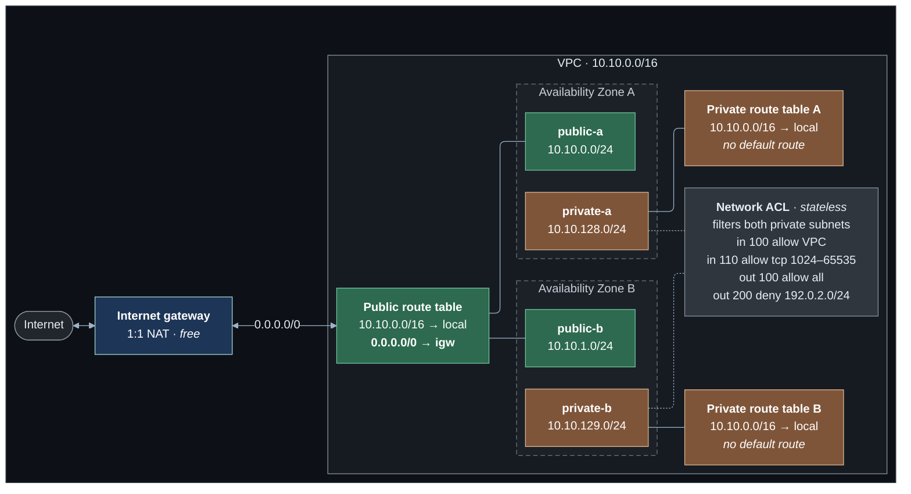

# Lab 01 — VPC fundamentals

**Difficulty:** Beginner · **Time:** 20–30 min · **Cost:** Free — no chargeable resources

The smallest complete VPC: an address range, subnets across two Availability
Zones, route tables, an internet gateway, and both of AWS's packet filtering
mechanisms.

---

## Learning objectives

By the end of this lab you will be able to:

1. Explain the relationship between a Region, an Availability Zone, a VPC and a
   subnet, and say why a subnet cannot span zones.
2. Carve a VPC CIDR into subnets and calculate how many usable addresses each
   one has.
3. **Point at the single route that makes a subnet public**, and explain why
   the subnet's name is irrelevant.
4. Describe the difference between a security group and a network ACL precisely
   enough to pick the right one for a given requirement.
5. Explain why a stateless filter needs ephemeral-port rules and a stateful one
   does not.
6. Describe what changes when IPv6 is enabled.

## Concepts covered

Regions and Availability Zones · IPv4 CIDR planning · VPC and subnet sizing ·
AWS's five reserved addresses per subnet · route tables and route evaluation ·
internet gateways · the main route table · public versus private IP addressing ·
security groups (stateful) · network ACLs (stateless) · security group
referencing · optional IPv6 and egress-only internet gateways

---

## Architecture



The bolded route is the entire difference between the green tables and the brown
ones. Delete it and `public-a` becomes a private subnet, still called `public-a`.

## Traffic flow

**A packet leaving an instance in `public-a` for 1.1.1.1**

1. The instance's security group is checked for an **outbound** rule. Security
   groups are stateful, so the reply will be allowed back automatically.
2. The packet reaches the VPC router, which consults `public-a`'s route table.
   `1.1.1.1` does not match `10.10.0.0/16 → local`, so the `0.0.0.0/0` route
   sends it to the internet gateway.
3. The subnet's network ACL is checked for a matching **outbound** rule.
4. The internet gateway performs 1:1 NAT between the instance's private address
   and its public address, then forwards the packet.
5. The reply arrives, the ACL is checked for a matching **inbound** rule — which
   must exist independently, because ACLs are stateless — and the security group
   allows it through as established traffic.

**The same packet from `private-a`**

Step 2 finds no matching route. `10.10.0.0/16 → local` is the only entry, and
`1.1.1.1` is not in it. The packet is dropped by the VPC router. No security
group, no ACL, and no gateway is ever consulted.

This is the distinction the lab exists to teach: **a routing failure and a
filtering failure look identical from the client, and are diagnosed completely
differently.** Lab 08 shows how flow logs tell them apart.

---

## Resources created

| Resource | Count | Cost |
| --- | --- | --- |
| VPC | 1 | Free |
| Subnets | 4 (2 public, 2 private) | Free |
| Internet gateway | 1 | Free |
| Route tables | 3 + main | Free |
| Route table associations | 4 | Free |
| Security groups | 2 (+ default, stripped) | Free |
| Network ACL + rules | 1 + 4 | Free |
| Egress-only internet gateway | 1 if `enable_ipv6` | Free |

**Total cost: USD 0.00.** No NAT gateway, no EC2 instance, no Elastic IP, no
endpoint. Nothing here is billed by the hour or by the gigabyte.

---

## Prerequisites

- Terraform `>= 1.11.0`
- AWS credentials for a sandbox account: `aws sts get-caller-identity`
- The backend bucket from [`bootstrap/`](../../bootstrap/README.md)

Default VPC quota is 5 per Region. If `terraform apply` returns
`VpcLimitExceeded`, destroy a lab you have finished with.

---

## Deploy

```bash
cd labs/01-vpc-fundamentals

cp backend.hcl.example backend.hcl
$EDITOR backend.hcl                    # bucket from: terraform -chdir=../../bootstrap output

cp terraform.tfvars.example terraform.tfvars
$EDITOR terraform.tfvars               # region, CIDR, az_count

terraform init -backend-config=backend.hcl
terraform plan
terraform apply
```

Apply takes about 30 seconds. Nothing here is slow to create.

---

## Verification

Every command below is **read-only**. Print the full set with
`terraform output verify_commands`.

### 1. The subnets exist, in different zones, with the addresses you planned

```bash
aws ec2 describe-subnets \
  --filters Name=vpc-id,Values=$(terraform output -raw vpc_id) \
  --region $(terraform output -raw aws_region 2>/dev/null || echo ap-southeast-1) \
  --query 'Subnets[].{Name:Tags[?Key==`Name`]|[0].Value,CIDR:CidrBlock,AZ:AvailabilityZone,Free:AvailableIpAddressCount}' \
  --output table
```

Expected:

```
-------------------------------------------------------------------------
|                            DescribeSubnets                            |
+-----------------+-------------------+-------------------+-------------+
|       AZ        |       CIDR        |       Name        |    Free     |
+-----------------+-------------------+-------------------+-------------+
|  ap-southeast-1a|  10.10.0.0/24     |  awsnet-lab01-... |  251        |
|  ap-southeast-1b|  10.10.1.0/24     |  awsnet-lab01-... |  251        |
|  ap-southeast-1a|  10.10.128.0/24   |  awsnet-lab01-... |  251        |
|  ap-southeast-1b|  10.10.129.0/24   |  awsnet-lab01-... |  251        |
+-----------------+-------------------+-------------------+-------------+
```

**251, not 256.** AWS reserves five addresses in every subnet: the network
address, `.1` for the VPC router, `.2` for the Amazon-provided DNS resolver,
`.3` for future use, and the broadcast address. `terraform output
usable_addresses_per_subnet` does this arithmetic for you.

### 2. The route that makes a subnet public

```bash
aws ec2 describe-route-tables \
  --route-table-ids $(terraform output -raw public_route_table_id) \
  --query 'RouteTables[0].Routes' --output table
```

Expected — two routes:

```
------------------------------------------------------
|                 DescribeRouteTables                |
+---------------------+-------------+----------------+
| DestinationCidrBlock|  GatewayId  |     State      |
+---------------------+-------------+----------------+
|  10.10.0.0/16       |  local      |  active        |
|  0.0.0.0/0          |  igw-0abc.. |  active        |
+---------------------+-------------+----------------+
```

Now the same for a private table:

```bash
aws ec2 describe-route-tables \
  --route-table-ids $(terraform output -json private_route_table_ids | jq -r '.["0"]') \
  --query 'RouteTables[0].Routes' --output table
```

Only the `local` route. **That one missing line is the whole difference.**

The `local` route cannot be removed or overridden — it is what makes every
subnet in a VPC reachable from every other subnet by default, and it always
wins over a less specific route because AWS routing is longest-prefix-match.

### 3. Network ACL rules, in evaluation order

```bash
aws ec2 describe-network-acls \
  --network-acl-ids $(terraform output -raw private_network_acl_id) \
  --query 'NetworkAcls[0].Entries[].{Num:RuleNumber,Egress:Egress,Proto:Protocol,Action:RuleAction,CIDR:CidrBlock,Ports:PortRange}' \
  --output table
```

Note rule `32767`, `deny all`, which AWS adds to every ACL and which cannot be
removed. It is the implicit final rule: anything not matched by a lower-numbered
rule is dropped.

### 4. Security group referencing

```bash
aws ec2 describe-security-groups \
  --group-ids $(terraform output -raw app_security_group_id) \
  --query 'SecurityGroups[0].IpPermissions' --output json
```

The source is `UserIdGroupPairs`, not `IpRanges` — the rule names the *web*
security group rather than an address range. Every instance in the web group is
permitted, no matter what address it has, now or later.

---

## Hands-on exercises

### 1. Turn a public subnet private without renaming it

```bash
aws ec2 describe-route-tables --route-table-ids $(terraform output -raw public_route_table_id) \
  --query 'RouteTables[0].Routes[?DestinationCidrBlock==`0.0.0.0/0`]'
```

In `modules/vpc/main.tf`, find `aws_route.public_default_ipv4` and comment it
out. Run `terraform plan`. One route is destroyed; no subnet changes. The subnet
called `public-a` is now, functionally, a private subnet.

Restore the route before continuing.

### 2. Change the subnet size and read the plan

Set `subnet_newbits = 4` in `terraform.tfvars` and run `terraform plan`. You get
`/20` subnets — 4,091 usable addresses each — and Terraform proposes to
**replace** all four subnets. A subnet CIDR is immutable; changing it means
destroying and recreating, which in a real environment means every instance in
it. This is why address planning has to happen before the first apply.

### 3. Watch a CIDR collision get caught

Set:

```hcl
public_subnet_cidrs  = ["10.10.0.0/23", "10.10.2.0/24"]
private_subnet_cidrs = ["10.10.1.0/24", "10.10.129.0/24"]
```

`terraform plan` fails with an overlap error naming both subnets. `10.10.0.0/23`
covers `10.10.0.0`–`10.10.1.255`, which swallows `10.10.1.0/24`. AWS would have
rejected this too, but with a less helpful message and only after a round trip.

### 4. Enable IPv6 and compare

Set `enable_ipv6 = true` and apply. Then:

```bash
terraform output vpc_ipv6_cidr_block
terraform output public_subnets
```

Observe that:

- You did not choose the range. Amazon assigns the `/56`.
- Every subnet gets a `/64` — that is a hard AWS requirement, and a `/64`
  holds more addresses than the entire IPv4 internet.
- There is no NAT gateway option. The private subnets route `::/0` to an
  **egress-only internet gateway**, which allows outbound connections and blocks
  unsolicited inbound ones — the same behaviour as NAT, for free.
- Every IPv6 address is globally routable. "Private" is now purely a property of
  routing and firewalls, with no address-range component at all.

### 5. Compute the address plan yourself

Before running `terraform output usable_addresses_per_subnet`, work out on paper
how many usable addresses a `/26` has. Then set `subnet_newbits = 10` and check.

---

## Troubleshooting exercises

### A. A subnet with no route table association

In `modules/vpc/main.tf`, comment out `aws_route_table_association.public` and
apply. The subnets still exist and still have addresses, but they now fall back
to the VPC's **main** route table.

```bash
aws ec2 describe-route-tables \
  --filters Name=vpc-id,Values=$(terraform output -raw vpc_id) Name=association.main,Values=true \
  --query 'RouteTables[0].Routes'
```

The main table has only the `local` route, because `modules/vpc` deliberately
keeps it empty. So the "public" subnets have silently lost internet access — and
nothing errored. This is why the module manages the main route table: an empty
one fails closed and loudly, a populated one fails open and silently.

Restore the association.

### B. Stateless filtering bites

Delete the ephemeral-port rule:

```bash
terraform state list | grep private_inbound_ephemeral
```

Comment out `aws_network_acl_rule.private_inbound_ephemeral` in `main.tf` and
apply. Nothing appears broken — no instance exists to notice.

Reason it through: an instance in a private subnet makes an outbound TCP
connection. Rule 100 (outbound, allow all) lets the SYN out. The SYN-ACK comes
back addressed to a source port in the ephemeral range. Inbound rule 100 allows
the VPC CIDR only, and the reply comes from outside it. There is no other
inbound allow, so rule 32767 (`deny all`) drops it.

The connection hangs and times out. The application reports "connection timed
out", which is exactly what a routing problem looks like. **This is the single
most common network ACL mistake.**

A security group in the same position would have worked, because it is stateful
and tracks the connection.

### C. Rule ordering

Change `aws_network_acl_rule.private_outbound_deny_example` from `rule_number =
200` to `rule_number = 50` and apply. Nothing errors. But the ACL now denies
outbound TCP to `192.0.2.0/24` before rule 100 can allow it, because evaluation
stops at the first match.

Now change it to `rule_number = 50` with `cidr_block = "0.0.0.0/0"`. The subnet
has no outbound TCP at all, and there is still no error — only silence. Network
ACLs never tell you they are dropping traffic. Flow logs do (lab 08).

Restore `rule_number = 200`.

---

## Cleanup

```bash
terraform destroy
```

Takes about 30 seconds. Nothing in this lab bills by the hour, so an incomplete
destroy costs nothing — but a stranded VPC still counts against the 5-per-Region
quota.

Confirm:

```bash
aws ec2 describe-vpcs --filters Name=tag:Lab,Values=01-vpc-fundamentals \
  --query 'Vpcs[].VpcId' --output text
```

Empty output means clean.

---

## Further reading

- [How Amazon VPC works](https://docs.aws.amazon.com/vpc/latest/userguide/how-it-works.html) — AWS
- [VPC CIDR blocks](https://docs.aws.amazon.com/vpc/latest/userguide/vpc-cidr-blocks.html) — AWS
- [Subnets for your VPC](https://docs.aws.amazon.com/vpc/latest/userguide/configure-subnets.html) — AWS
- [Route tables](https://docs.aws.amazon.com/vpc/latest/userguide/VPC_Route_Tables.html) — AWS
- [Compare security groups and network ACLs](https://docs.aws.amazon.com/vpc/latest/userguide/infrastructure-security.html) — AWS
- [Ephemeral ports](https://docs.aws.amazon.com/vpc/latest/userguide/custom-network-acl.html#nacl-ephemeral-ports) — AWS
- [IPv6 on Amazon VPC](https://docs.aws.amazon.com/vpc/latest/userguide/vpc-migrate-ipv6.html) — AWS
- [Regions and Availability Zones](https://docs.aws.amazon.com/AWSEC2/latest/UserGuide/using-regions-availability-zones.html) — AWS
- [`cidrsubnet()`](https://developer.hashicorp.com/terraform/language/functions/cidrsubnet) — HashiCorp

**Next:** [Lab 02 — Public and private subnets](../02-public-private-subnets/README.md)
