# Lab 02 — Network segmentation

**Difficulty:** Beginner · **Time:** 45 min · **Cost:** about USD 0.021/hour (three `t4g.nano`, one public IPv4 address)

The single server is split into three, one per tier, each in its own subnet.
Only the web tier can be reached from the internet, only the web tier can
reach the payment service, and only the payment service can reach the database.

**Video:** section 4 (security and segmentation).

**What changes from lab 01:** `network.tf` grows from one subnet to six;
`compute.tf` replaces the server with `web`, `app` and `db`; `nacl.tf` is new.

---

## Learning objectives

1. Carve a VPC range into subnets by tier and Availability Zone, leaving room
   to grow.
2. Explain why a subnet lives in one Availability Zone and what that means
   for a tier.
3. Say precisely what makes the app and data subnets private.
4. Chain security groups so each tier accepts traffic only from the tier in
   front of it — by **group**, not by address.
5. Explain why a network ACL needs a rule for the reply and a security group
   does not.
6. Place each control: host firewall, security group, network ACL.

## Concepts covered

Network segmentation · tiers and secure zones · subnets and address ranges ·
Availability Zones · routing between subnets (the `local` route) · private
subnets · security group referencing · network ACLs (stateless, ordered) ·
ephemeral ports · IP- and port-based filtering · layered security ·
`moved` blocks

---

## Architecture

```mermaid
---
config:
  layout: elk
  theme: base
  themeVariables:
    lineColor: "#9fb3c8"
    textColor: "#e6edf3"
    primaryColor: "#21262d"
    primaryTextColor: "#e6edf3"
    primaryBorderColor: "#6e7681"
    edgeLabelBackground: "#0d1117"
    clusterBkg: "#161b22"
    clusterBorder: "#6e7681"
    titleColor: "#e6edf3"
  flowchart:
    curve: rounded
    wrappingWidth: 420
---
flowchart LR
    subgraph CANVAS[" "]
        INET(["Internet"])
        IGW["<b>Internet gateway</b>"]

        subgraph VPC["VPC · 10.10.0.0/16"]
            subgraph PUB["public subnets · 10.10.0.0/24, 10.10.1.0/24"]
                WEB["<b>web</b> · frontend :80<br/>SG: 80 from internet<br/>+ host firewall"]
            end
            subgraph APPS["app subnets · 10.10.10.0/24, 10.10.11.0/24"]
                APP["<b>app</b> · payment :9090<br/>SG: 9090 from <i>web's group</i>"]
            end
            subgraph DATA["data subnets · 10.10.20.0/24, 10.10.21.0/24"]
                NACL["<b>Network ACL</b><br/>in: 3306 from app subnets<br/>out: 1024–65535 to VPC"]
                DB["<b>db</b> · database :3306<br/>SG: 3306 from <i>app's group</i>"]
            end
        end
    end

    INET <--> IGW
    IGW -->|":80"| WEB
    WEB -->|":9090"| APP
    APP -->|":3306"| NACL --> DB
    WEB -.->|"blocked"| DB

    classDef canvas fill:#0d1117,stroke:#30363d,color:#e6edf3
    classDef vpc fill:#161b22,stroke:#8b949e,color:#e6edf3
    classDef az fill:#1c2128,stroke:#6e7681,color:#c9d1d9,stroke-dasharray:6 4
    classDef free fill:#2d6a4f,stroke:#74c69d,color:#fff
    classDef private fill:#7f5539,stroke:#ddb892,color:#fff
    classDef gateway fill:#1d3557,stroke:#a8dadc,color:#fff
    classDef billed fill:#9d0208,stroke:#ff8fa3,color:#fff
    classDef costly fill:#6a040f,stroke:#ff8fa3,color:#fff

    class CANVAS canvas
    class VPC vpc
    class PUB,APPS,DATA az
    class WEB free
    class APP,DB private
    class IGW gateway
```



The dotted line is the point of the lab: the web server has a route to the
database — every subnet in a VPC can route to every other — and is still
refused.

## Traffic flow

**One request, three hops.** `curl http://<web public IP>/`

1. Internet → internet gateway → `web`, as in lab 01. The web security group
   allows TCP 80 from `allowed_client_cidr`.
2. The frontend calls the payment service at `10.10.10.x:9090`. The VPC router
   looks up the destination in `public-a`'s route table. It matches
   `10.10.0.0/16 → local`, so the packet is delivered inside the VPC. **No
   gateway is involved in subnet-to-subnet traffic.**
3. The app security group has one rule for port 9090, and its source is the
   *web security group*. The packet came from an interface in that group, so
   it is allowed.
4. The payment service calls the database at `10.10.20.x:3306`. On the way
   into the data subnet the **network ACL** is evaluated first: inbound rule
   100 allows TCP 3306 from the app subnet. Then the db security group allows
   it, because the source is in the app group.
5. The database replies **to the ephemeral port the app host connected from**.
   The security group lets the reply out automatically — it remembers the
   connection. The network ACL does not: outbound rule 100 has to allow TCP
   1024–65535 back to the VPC, or the reply is dropped.

**The web server tries the database directly.** Routing delivers the packet
(`local` route). The network ACL drops it — the source is not an app subnet.
Remove that rule and the db security group would drop it instead. Two
independent controls, either sufficient.

---

## Resources created

| Resource | Count | Cost |
| --- | --- | --- |
| Subnets | 6 (2 public, 2 app, 2 data) | Free |
| Route tables | 1 public + 2 private (one per zone) | Free |
| EC2 instances (`t4g.nano`) | 3 | ~USD 0.016/hour |
| Public IPv4 address | 1 (web only) | USD 0.005/hour |
| Security groups | 3 | Free |
| Network ACL + rules | 1 + 7 | Free |

## Prerequisites

- Terraform `>= 1.11.0` and AWS credentials for a sandbox account
  (`aws sts get-caller-identity`).
- The state bucket from [`bootstrap/`](../../bootstrap/README.md).
- Lab 01 applied, or at least read: this lab changes what it built. See [`../01-single-server/`](../01-single-server/README.md).
- The [Session Manager plugin](https://docs.aws.amazon.com/systems-manager/latest/userguide/session-manager-working-with-install-plugin.html)
  for the AWS CLI, to open a shell on a host.

How the labs fit together, and what "one project, one state" means in
practice, is in [`docs/working-with-the-labs.md`](../../docs/working-with-the-labs.md).

## Deploy

Every lab uses the same state, so this lab **upgrades** what the previous one
built. Carry your settings forward and add the new ones:

```bash
cd labs/02-network-segmentation

cp ../01-single-server/backend.hcl .
cp ../01-single-server/terraform.tfvars .
diff terraform.tfvars terraform.tfvars.example   # what this lab adds; copy across what you want

terraform init -backend-config=backend.hcl
terraform plan                                   # read it: this is the lab
terraform apply
```

To see exactly what changed in the code: `make lab-diff FROM=01-single-server TO=02-network-segmentation`
from the repository root.

Read the plan before applying. The lab 01 server is **moved**, not destroyed:
`compute.tf` contains `moved` blocks that rename `module.server` to
`module.web`, so its security group and IAM role survive. The instance itself
is replaced, because its startup script changed.

---

## Verification

`terraform output verify_compute` prints these with your addresses.

### 1. The whole chain, from the internet

```bash
curl -s "$(terraform output -raw frontend_url)"
```

Expected — three nested answers, one per tier:

```json
{"service": "frontend", "client_seen": "198.51.100.23",
 "upstream": {"service": "payment", "client_seen": "10.10.0.57",
              "upstream": {"service": "database", "port": 3306, "client_seen": "10.10.10.14"}}}
```

Each `client_seen` is the private address of the tier in front. An
`upstream_error` instead means that hop is broken — and tells you which.

### 2. The payment service is no longer on the internet

```bash
curl -s --max-time 5 "http://$(terraform output -raw web_public_ip):9090/" || echo "timed out, as intended"
```

It has no public address to connect to, and no rule that would allow it.

### 3. From the web server: one tier in, not two

Open a shell with `terraform output -raw ssm_web`, then:

```bash
curl -s http://<app private ip>:9090/                      # allowed
curl -s --max-time 5 http://<db private ip>:3306/ || echo blocked   # dropped
```

`terraform output private_ips` lists the addresses.

### 4. Rules that name groups, not addresses

```bash
terraform output -json verify_compute | jq -r .security_group_rules | sh
```

The `SourceGroup` column is filled in for the app and db rules and `Cidr` is
empty. Replace the web server and its address changes; the rule still matches.

### 5. The network ACL, in evaluation order

```bash
eval "$(terraform output -raw verify_nacl)"
```

Rule `32767 deny` closes every list. It cannot be removed: anything no
lower-numbered rule matched is dropped.

---

## Hands-on exercises

### 1. Stateless filtering bites

In `nacl.tf`, comment out `aws_network_acl_rule.data_out_ephemeral` and apply.
`curl` the shop: the payment service now reports an `upstream_error` — a
timeout. The request **reached** the database; the reply was dropped on the way
out of the subnet. Nothing in the security groups changed. Restore the rule.

This is the single most common network ACL mistake.

### 2. Rule order

Add an inbound rule numbered **90** that denies TCP 3306 from `10.10.0.0/16`.
The allow at 100 still exists and no longer matters: evaluation stops at the
first match. Remove it.

### 3. Why the private hosts have no shell

`aws ssm describe-instance-information` lists only the web server. The app and
db hosts are healthy but cannot reach Systems Manager: their route tables have
no path out of the VPC.

```bash
terraform output -json verify_network | jq -r .private_route_tables | sh
```

Only `local`. That is the definition of private — and the problem lab 03
solves.

### 4. Size a tier

The plan reserves `/24` numbers 0–9 for public, 10–19 for app, 20–29 for
data. Add a third Availability Zone on paper: which subnets do you add, and
which existing ones change? (None: that is what the gaps are for.)

---

## Troubleshooting exercises

### A. Wrong source group

Change the db rule's `referenced_security_group_id` from `module.app` to
`module.web` and apply. The chain breaks at the last hop, and the web server
can suddenly reach the database directly. A rule that is merely *wrong* allows
something as well as denying something. Restore it.

### B. The host firewall you cannot install

`enable_host_firewall` only affects the web server. Try
`sudo dnf install -y nftables` in your head on the app host: it has no route
to a package repository. Layered security includes the unglamorous question of
how a locked-down host gets its updates.

---

## Cleanup

Moving on to the next lab? **Do not destroy** -- the next lab builds on this
one. Turn off any opt-in you no longer need (set its `enable_*` flag to `false`
and `terraform apply`) so it stops billing.

Finished for now? Destroy from **this** folder -- the folder you applied last:

```bash
terraform destroy
```

Then confirm nothing is left:

```bash
aws resourcegroupstaggingapi get-resources --tag-filters Key=Project,Values=shop \
  --query 'ResourceTagMappingList[].ResourceARN' --output text
```

Empty output means clean.

---

## Further reading

- [Subnets for your VPC](https://docs.aws.amazon.com/vpc/latest/userguide/configure-subnets.html) — AWS
- [Route tables](https://docs.aws.amazon.com/vpc/latest/userguide/VPC_Route_Tables.html) — AWS
- [Compare security groups and network ACLs](https://docs.aws.amazon.com/vpc/latest/userguide/infrastructure-security.html) — AWS
- [Security group referencing](https://docs.aws.amazon.com/vpc/latest/userguide/security-group-rules.html) — AWS
- [Ephemeral ports](https://docs.aws.amazon.com/vpc/latest/userguide/custom-network-acl.html#nacl-ephemeral-ports) — AWS
- [Regions and Availability Zones](https://docs.aws.amazon.com/AWSEC2/latest/UserGuide/using-regions-availability-zones.html) — AWS
- [`moved` blocks](https://developer.hashicorp.com/terraform/language/moved) — HashiCorp

**Next:** [Lab 03](../03-nat-and-outbound/README.md)
