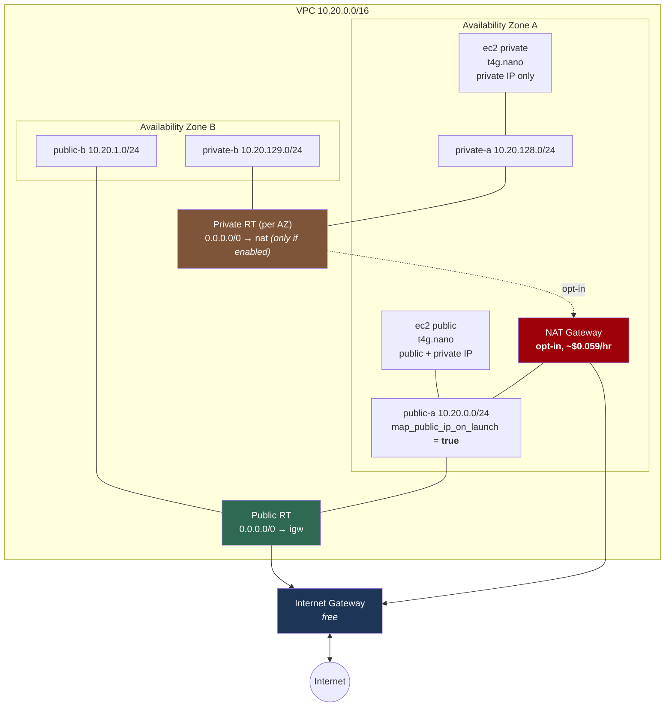

# Lab 02 — Public and private subnets

**Difficulty:** Beginner · **Time:** 30–45 min
**Cost:** ~USD 0.016/hour with test instances · **+USD 0.059/hour per NAT gateway (opt-in)**

Two instances, identical in every way except which subnet they are in. Watch one
register with Systems Manager and the other fail, then fix it three different
ways at three different prices.

---

## Learning objectives

1. Prove that a subnet is public because of **routing**, using a live instance.
2. Explain what `map_public_ip_on_launch` does and what it costs.
3. Give a private subnet outbound internet access with a NAT gateway, and say
   what that costs per hour and per gigabyte.
4. Explain why an egress-only internet gateway is not "IPv6 NAT" and why it is
   free.
5. Choose between `single` and `per_az` NAT, and quantify the trade-off.
6. Diagnose `TargetNotConnected` from Session Manager as a **routing** problem.

## Concepts covered

Multi-AZ subnet layout · separate route tables per tier · internet gateway 1:1
NAT · public IPv4 address charges · NAT gateway placement and cost · NAT
high-availability trade-offs · cross-AZ data transfer · egress-only internet
gateways · Session Manager as a routing test · security group statefulness

---

## Architecture



Red means billed by the hour.

## Traffic flow

**Public instance → `checkip.amazonaws.com`**

Route table sends `0.0.0.0/0` to the internet gateway. The IGW performs 1:1 NAT
between the instance's private address (`10.20.0.x`) and its public address. The
remote server sees the instance's own public IP.

**Private instance → `checkip.amazonaws.com`, NAT disabled**

The private route table holds only `10.20.0.0/16 → local`. No route matches. The
VPC router drops the packet. Nothing is logged as rejected, because nothing was
filtered — the packet had nowhere to go.

**Private instance → `checkip.amazonaws.com`, NAT enabled**

Route table sends `0.0.0.0/0` to the NAT gateway in `public-a`. The NAT gateway
rewrites the source to its own Elastic IP and forwards to the IGW. The remote
server sees the **NAT gateway's** address, not the instance's. Return traffic
comes back to the NAT gateway, which maps it to the original instance from its
connection table.

That last point matters twice over: it is why NAT is outbound-only (there is no
entry in the table for an unsolicited inbound packet), and it is why flow logs
need the `pkt-srcaddr` field to show you who actually sent the traffic.

**Private instance → public instance's private IP**

Matches `10.20.0.0/16 → local`. Never touches a gateway, works regardless of NAT,
crosses no AZ boundary if both are in zone A. This is the route you cannot delete.

---

## Resources created

| Resource | Count | Cost |
| --- | --- | --- |
| VPC, subnets, route tables, IGW | 1 / 4 / 3 / 1 | Free |
| EC2 `t4g.nano` | 2 | ~USD 0.0053/hr each |
| Public IPv4 address | 1 | ~USD 0.005/hr |
| 8 GB gp3 root volume | 2 | ~USD 0.77/month each |
| IAM role + instance profile | 2 | Free |
| **NAT gateway (opt-in)** | 0 or 1 or `az_count` | **~USD 0.059/hr each + ~USD 0.059/GB** |
| **Elastic IP (with NAT)** | matches NAT count | Included in NAT charge |
| Egress-only IGW (opt-in) | 0 or 1 | Free |

**Default configuration: ~USD 0.016/hour (~USD 0.40/day).**
**With one NAT gateway: ~USD 0.075/hour (~USD 1.80/day, ~USD 55/month).**

---

## Prerequisites

- [Lab 01](../01-vpc-fundamentals/README.md) understood
- The backend bucket from [`bootstrap/`](../../bootstrap/README.md)
- AWS CLI v2 with the [Session Manager plugin](https://docs.aws.amazon.com/systems-manager/latest/userguide/session-manager-working-with-install-plugin.html)

Verify the plugin:

```bash
session-manager-plugin --version
```

---

## Deploy

```bash
cd labs/02-public-private-subnets

cp backend.hcl.example backend.hcl && $EDITOR backend.hcl
cp terraform.tfvars.example terraform.tfvars && $EDITOR terraform.tfvars

terraform init -backend-config=backend.hcl
terraform plan
terraform apply
```

Apply takes 2–3 minutes. Terraform prints a **warning** from the
`private_instance_can_reach_ssm` check — that is expected and is the lab.

---

## Verification

### 1. Only one instance registered with Systems Manager

Wait two minutes after apply, then:

```bash
aws ssm describe-instance-information \
  --region $(terraform output -raw aws_region) \
  --query 'InstanceInformationList[].{Id:InstanceId,Ping:PingStatus,IP:IPAddress}' \
  --output table
```

Expected — **one** row, the public instance:

```
--------------------------------------------------
|           DescribeInstanceInformation          |
+---------------+-------------+------------------+
|      Id       |    Ping     |       IP         |
+---------------+-------------+------------------+
| i-0abc...     |  Online     |  10.20.0.147     |
+---------------+-------------+------------------+
```

Compare with what Terraform created:

```bash
terraform output public_instance_id
terraform output private_instance_id
```

The private instance is running and healthy. It simply has no path to the
Systems Manager service.

### 2. Open a shell on the public instance

```bash
terraform output -json session_manager_commands | jq -r .public
# aws ssm start-session --target i-0abc... --region ap-southeast-1
```

Run it. Inside the session:

```bash
TOKEN=$(curl -sX PUT "http://169.254.169.254/latest/api/token" \
  -H "X-aws-ec2-metadata-token-ttl-seconds: 300")
curl -sH "X-aws-ec2-metadata-token: $TOKEN" http://169.254.169.254/latest/meta-data/local-ipv4;  echo
curl -sH "X-aws-ec2-metadata-token: $TOKEN" http://169.254.169.254/latest/meta-data/public-ipv4; echo

curl -s https://checkip.amazonaws.com
```

The `PUT` for a token is IMDSv2. Without it the `GET` returns `401` — that is
the module's `http_tokens = "required"` setting doing its job.

`checkip.amazonaws.com` returns the same address as `public-ipv4`, because the
internet gateway does 1:1 NAT.

### 3. Try the private instance and read the failure

```bash
terraform output -json session_manager_commands | jq -r .private
```

```
An error occurred (TargetNotConnected) when calling the StartSession operation:
i-0def... is not connected.
```

`TargetNotConnected` means the SSM agent never established its outbound
connection. Confirm the cause is routing:

```bash
aws ec2 describe-route-tables \
  --route-table-ids $(terraform output -json private_route_table_ids | jq -r '.["0"]') \
  --region $(terraform output -raw aws_region) \
  --query 'RouteTables[0].Routes' --output table
```

One route: `10.20.0.0/16 → local`. Nothing else. **The instance is not
misconfigured; its subnet has nowhere to send the packet.**

### 4. Prove intra-VPC routing works anyway

From the public instance's session:

```bash
ping -c 3 <private_instance_private_ip>
```

Get the address with `terraform output -raw private_instance_private_ip`. This
works with no gateway involved at all, because of the `local` route.

---

## Hands-on exercises

### 1. Fix it with a NAT gateway, then count the cost

```hcl
# terraform.tfvars
acknowledge_costs  = true
enable_nat_gateway = true
nat_gateway_mode   = "single"
```

```bash
terraform apply     # ~2 minutes; NAT gateways are slow to create
terraform output cost_warning
```

Wait 60–90 seconds, then re-run the `describe-instance-information` command.
**Both** instances now appear. Open a session on the private one:

```bash
curl -s https://checkip.amazonaws.com
terraform output nat_gateway_public_ips
```

The addresses match. Every private instance in the VPC now appears to the
internet as one address — that is what NAT means, and it is why an allowlist on
a partner's firewall lists your NAT gateway rather than your instances.

**Turn it back off when you are done.** `terraform output cost_warning` tells
you the running total.

### 2. Fix it for free with IPv6

Set `enable_nat_gateway = false` and:

```hcl
enable_ipv6                         = true
enable_egress_only_internet_gateway = true
```

Apply, then from the private instance:

```bash
curl -6 -s https://api64.ipify.org; echo     # works
curl -4 -s https://checkip.amazonaws.com     # still times out
```

IPv6 outbound works. IPv4 outbound does not. The egress-only internet gateway
costs **nothing**, and it gives you the property people usually want from NAT —
outbound yes, unsolicited inbound no — without the hourly charge.

It is not "IPv6 NAT". No address translation happens; the instance's own global
IPv6 address is on the wire. The gateway is a stateful filter that permits
return traffic for connections the instance initiated.

### 3. Cost the HA decision

Set `nat_gateway_mode = "per_az"` with `az_count = 2` and run `terraform plan`.
Two NAT gateways, two Elastic IPs. `terraform output cost_warning` after apply
shows roughly double.

Reason about what you bought:

| | `single` | `per_az` |
| --- | --- | --- |
| Monthly cost (2 AZs) | ~USD 43 | ~USD 86 |
| Zone A fails | Zone B loses outbound access | Zone B unaffected |
| Zone B → internet | Crosses AZ boundary, +USD 0.01/GB each way | Stays in zone |

At high traffic volumes the cross-AZ transfer charge alone can exceed the second
gateway's hourly cost. For a lab, `single` is always right.

### 4. Break "public" without touching the subnet

```bash
aws ec2 describe-subnets \
  --subnet-ids $(terraform output -json public_subnets | jq -r '.["public-a"].id') \
  --region $(terraform output -raw aws_region) \
  --query 'Subnets[0].MapPublicIpOnLaunch'
```

Set `map_public_ip_on_launch = false` for `public-a` in `locals.tf` and apply.
The **existing** instance keeps its address — the setting only applies at launch.
Taint it (`terraform apply -replace='module.public_instance[0].aws_instance.this'`)
and the replacement comes up with no public IP, and drops out of Session Manager.
The subnet is unchanged, the route table is unchanged, and the instance is now
unreachable.

Restore it before continuing.

---

## Troubleshooting exercises

### A. `TargetNotConnected` — build the checklist

The instance is fine; something in the path is not. Work through it in order:

```bash
INSTANCE=$(terraform output -raw private_instance_id)
REGION=$(terraform output -raw aws_region)

# 1. Is the instance running?
aws ec2 describe-instances --instance-ids $INSTANCE --region $REGION \
  --query 'Reservations[0].Instances[0].State.Name'

# 2. Does it have an instance profile with SSM permissions?
aws ec2 describe-instances --instance-ids $INSTANCE --region $REGION \
  --query 'Reservations[0].Instances[0].IamInstanceProfile'

# 3. Does its subnet have a route out?           <-- the failure is here
SUBNET=$(aws ec2 describe-instances --instance-ids $INSTANCE --region $REGION \
  --query 'Reservations[0].Instances[0].SubnetId' --output text)
RT=$(aws ec2 describe-route-tables --region $REGION \
  --filters Name=association.subnet-id,Values=$SUBNET \
  --query 'RouteTables[0].RouteTableId' --output text)
aws ec2 describe-route-tables --route-table-ids $RT --region $REGION \
  --query 'RouteTables[0].Routes'

# 4. Does the security group allow outbound 443?
aws ec2 describe-security-groups --region $REGION \
  --group-ids $(aws ec2 describe-instances --instance-ids $INSTANCE --region $REGION \
    --query 'Reservations[0].Instances[0].SecurityGroups[0].GroupId' --output text) \
  --query 'SecurityGroups[0].IpPermissionsEgress'
```

Steps 1, 2 and 4 pass. Step 3 is the answer. The three fixes are: a NAT gateway
(this lab), a public IP in a public subnet (the other instance), or interface
VPC endpoints ([lab 03](../03-private-access-and-vpc-endpoints/README.md)).

### B. NAT gateway in the wrong subnet

A NAT gateway placed in a **private** subnet is created successfully, reports
`Available`, and forwards traffic into a black hole — it needs its own route to
an internet gateway, and a private subnet does not have one.

`modules/vpc` makes this impossible: it only ever places NAT gateways in public
subnets, and its precondition refuses `nat_gateway_mode` without an internet
gateway. Try it:

```hcl
# In modules/vpc, temporarily set create_internet_gateway = false while NAT is on
```

`terraform plan` fails with an explanation rather than creating a USD 43/month
black hole.

### C. Asymmetric NAT costs

With `nat_gateway_mode = "single"`, look at which AZ holds the gateway:

```bash
aws ec2 describe-nat-gateways --region $(terraform output -raw aws_region) \
  --filter Name=vpc-id,Values=$(terraform output -raw vpc_id) \
  --query 'NatGateways[].{Id:NatGatewayId,Subnet:SubnetId}' --output table
```

Every byte from `private-b` crosses an AZ boundary to reach it, then crosses
back. That is USD 0.01/GB in each direction on top of the NAT processing charge.
Nothing warns you; it appears as "EC2-Other" on the bill.

---

## Cleanup

```bash
terraform destroy
```

NAT gateways take 1–2 minutes to delete. Then confirm nothing chargeable
survived:

```bash
REGION=$(terraform output -raw aws_region 2>/dev/null || echo ap-southeast-1)

# NAT gateways in 'deleted' state are fine; anything else is still billing.
aws ec2 describe-nat-gateways --region $REGION \
  --filter Name=tag:Lab,Values=02-public-private-subnets \
  --query 'NatGateways[?State!=`deleted`].[NatGatewayId,State]' --output text

# An unattached Elastic IP is billed at ~USD 0.005/hour.
aws ec2 describe-addresses --region $REGION \
  --query 'Addresses[?AssociationId==null].[PublicIp,AllocationId]' --output text

# Running instances.
aws ec2 describe-instances --region $REGION \
  --filters Name=tag:Lab,Values=02-public-private-subnets Name=instance-state-name,Values=running \
  --query 'Reservations[].Instances[].InstanceId' --output text
```

All three should print nothing. **An orphaned Elastic IP is the classic
leftover** — it costs money precisely because it is *not* attached to anything.

---

## Further reading

- [NAT gateways](https://docs.aws.amazon.com/vpc/latest/userguide/vpc-nat-gateway.html) — AWS
- [NAT gateway pricing](https://aws.amazon.com/vpc/pricing/) — AWS
- [Egress-only internet gateways](https://docs.aws.amazon.com/vpc/latest/userguide/egress-only-internet-gateway.html) — AWS
- [Public IPv4 address charges](https://aws.amazon.com/blogs/aws/new-aws-public-ipv4-address-charge-public-ip-insights/) — AWS
- [Session Manager troubleshooting](https://docs.aws.amazon.com/systems-manager/latest/userguide/troubleshooting-remote-connections-managed-instances.html) — AWS
- [Data transfer within an AWS Region](https://aws.amazon.com/ec2/pricing/on-demand/#Data_Transfer_within_the_same_AWS_Region) — AWS

**Next:** [Lab 03 — Private AWS service access and VPC endpoints](../03-private-access-and-vpc-endpoints/README.md)
