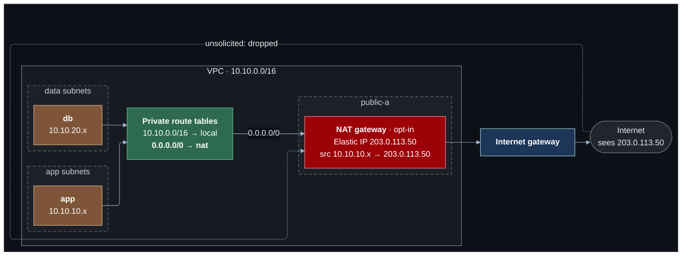

# Lab 03 — NAT and outbound access

**Difficulty:** Beginner · **Time:** 30–45 min · **Cost:** USD 0.021/hour by default; **+USD 0.059/hour with the NAT gateway** (opt-in)

The app and database hosts are unreachable from the internet, which is what
lab 02 wanted. They also cannot reach it — no operating system updates, no
external APIs, no Session Manager. This lab gives them a way out that is not a
way in.

**Video:** section 5 (NAT) and the NAT gateway part of section 6.

**What changes from lab 02:** `network.tf` passes three new arguments to the
VPC module; `nat.tf` holds the switches.

---

## Learning objectives

1. Explain why a host with only a private address cannot reach the internet
   even with a route to it.
2. Describe what a NAT device rewrites on the way out and on the way back,
   and what it has to remember in between.
3. Explain why NAT gives outbound access without inbound exposure.
4. Compare one NAT gateway with one per Availability Zone: cost, failure
   behaviour and cross-zone data charges.
5. Explain why IPv6 has no NAT, and what an egress-only internet gateway does
   instead.

## Concepts covered

Private addressing (RFC 1918) · public versus private reachability · NAT ·
source address translation · connection tracking and return traffic · port
address translation (many hosts, one address) · NAT gateway placement ·
Elastic IP addresses · default routes · single versus per-zone NAT · IPv6 ·
egress-only internet gateways

---

## Architecture



The route is what sends the traffic to the NAT gateway. The translation is
what lets the reply come back.

## Traffic flow

**The app host fetches an update: `10.10.10.14:51000 → 151.101.0.1:443`**

1. The app subnet's route table has no specific route for the destination, so
   `0.0.0.0/0 → nat-…` matches. The packet is delivered to the NAT gateway in
   `public-a`.
2. The NAT gateway rewrites the **source** to its own private address and
   picks a source port. It records the mapping: *this port ↔
   `10.10.10.14:51000`*.
3. The NAT gateway is in a public subnet, so its route table sends the packet
   to the internet gateway, which swaps the NAT gateway's private address for
   its Elastic IP. The internet sees a connection from that one public
   address.
4. The reply arrives addressed to the Elastic IP. Internet gateway → NAT
   gateway. The NAT gateway looks the port up in its table, rewrites the
   **destination** back to `10.10.10.14:51000`, and delivers it.

**Someone on the internet tries to connect to the app host.** There is nothing
to connect to: `10.10.10.14` is not routable on the internet. A packet sent to
the NAT gateway's Elastic IP matches no entry in its table and is dropped. NAT
is not a firewall, but for inbound connections it behaves like one.

**With IPv6.** Every IPv6 address is globally routable, so there is nothing to
translate. The private subnets route `::/0` to an **egress-only internet
gateway**, which keeps the same connection state and applies the same rule —
replies in, nothing unsolicited — without changing any address.

---

## Resources created

| Resource | When | Cost |
| --- | --- | --- |
| NAT gateway + Elastic IP | `enable_nat_gateway` | **~USD 0.059/hour each** + USD 0.059/GB |
| Default route in each private route table | with the NAT gateway | Free |
| IPv6 CIDRs on VPC and subnets | `enable_ipv6` | Free |
| Egress-only internet gateway | `enable_ipv6` | Free |

A NAT gateway left running for a month is USD 43. It is the most common
surprise on a learning account's bill.

## Prerequisites

- Terraform `>= 1.11.0` and AWS credentials for a sandbox account
  (`aws sts get-caller-identity`).
- The state bucket from [`bootstrap/`](../../bootstrap/README.md).
- Lab 02 applied, or at least read: this lab changes what it built. See [`../02-network-segmentation/`](../02-network-segmentation/README.md).
- The [Session Manager plugin](https://docs.aws.amazon.com/systems-manager/latest/userguide/session-manager-working-with-install-plugin.html)
  for the AWS CLI, to open a shell on a host.

How the labs fit together, and what "one project, one state" means in
practice, is in [`docs/working-with-the-labs.md`](../../docs/working-with-the-labs.md).

## Deploy

Every lab uses the same state, so this lab **upgrades** what the previous one
built. Carry your settings forward and add the new ones:

```bash
cd labs/03-nat-and-outbound

cp ../02-network-segmentation/backend.hcl .
cp ../02-network-segmentation/terraform.tfvars .
diff terraform.tfvars terraform.tfvars.example   # what this lab adds; copy across what you want

terraform init -backend-config=backend.hcl
terraform plan                                   # read it: this is the lab
terraform apply
```

To see exactly what changed in the code: `make lab-diff FROM=02-network-segmentation TO=03-nat-and-outbound`
from the repository root.

With the defaults nothing new is created: the plan shows no changes, and the
private hosts stay isolated. To run the lab, set in `terraform.tfvars`:

```hcl
acknowledge_costs  = true
enable_nat_gateway = true
```

---

## Verification

`terraform output verify_nat` prints these with your values.

### 1. Before: isolated

With the NAT gateway off:

```bash
aws ssm describe-instance-information \
  --query 'InstanceInformationList[].{Id:InstanceId,Ping:PingStatus,IP:IPAddress}' --output table
```

Only the web server is listed. The other two are running and unreachable.

### 2. After: all three hosts register

Enable the NAT gateway, apply, wait two minutes, and run it again. Three rows.
Nothing about the hosts changed — only a route.

### 3. Whose address does the internet see?

```bash
terraform output nat_gateway_public_ips
```

Open a shell on the app host (`terraform output -raw ssm_app`) and on the db
host (`ssm_db`), and in each:

```bash
curl -s https://checkip.amazonaws.com
```

Both print the **same** address, and it is the NAT gateway's. Now the web
server: it prints its own. Three hosts, two public identities.

### 4. The route that does it

```bash
terraform output -json verify_network | jq -r .private_route_tables | sh
```

Each private route table has gained `0.0.0.0/0 → nat-…`.

### 5. Outbound yes, inbound no

From your machine, `curl --max-time 5 http://<NAT public IP>/` times out. There
is no mapping for a connection nobody inside asked for.

---

## Hands-on exercises

### 1. One gateway or two

Set `nat_gateway_mode = "per_az"` and read the plan: a second gateway, a second
Elastic IP, and the zone-B route table now points at its own. Work out the
monthly cost of each mode, then what happens to the hosts in zone B under
`single` if zone A fails. Do not apply unless you want to pay for both.

### 2. NAT on the cheap: IPv6

Turn the NAT gateway off and set `enable_ipv6 = true`. Apply. The private
route tables gain `::/0 → eigw-…` at no charge. On the app host,
`curl -6 -s https://ipv6.icanhazip.com` prints the host's **own** IPv6 address —
no translation — while inbound connections to that address are still dropped.

### 3. The host firewall, finally

With outbound access the app host can install packages:

```bash
sudo dnf install -y nftables
```

Lab 02 could not do this. Write a ruleset that allows only TCP 9090 and
established traffic, load it, and confirm the shop still works.

### 4. What the database can now reach

The NAT route was added to every private route table, including the data
tier's. A database that can open connections to the whole internet is an
exfiltration path. Which of lab 02's controls would you tighten: the data
network ACL's outbound rules, or the db security group's egress? Try the ACL
(`data_out_https` in `nacl.tf`).

---

## Troubleshooting exercises

### A. NAT gateway in a private subnet

A NAT gateway placed in a subnet without an internet gateway route creates
successfully and forwards nothing. Reason through the path in the traffic-flow
section: at which step does the packet stop? (Step 3.)

### B. Session Manager says `TargetNotConnected`

Turn the NAT gateway off and try `ssm_app` again. The error says nothing about
networking. `describe-instance-information` shows the host missing, the route
table shows why. Remember this shape: **an agent that cannot phone home looks
like a host that does not exist.**

---

## Cleanup

Moving on to the next lab? **Do not destroy** -- the next lab builds on this
one. Turn off any opt-in you no longer need (set its `enable_*` flag to `false`
and `terraform apply`) so it stops billing.

Finished for now? Destroy from **this** folder -- the folder you applied last:

```bash
terraform destroy
```

Then confirm nothing is left:

```bash
aws resourcegroupstaggingapi get-resources --tag-filters Key=Project,Values=shop \
  --query 'ResourceTagMappingList[].ResourceARN' --output text
```

Empty output means clean.

**Turn the NAT gateway off before you walk away**, even if you keep the rest.

---

## Further reading

- [NAT gateways](https://docs.aws.amazon.com/vpc/latest/userguide/vpc-nat-gateway.html) — AWS
- [NAT gateway use cases](https://docs.aws.amazon.com/vpc/latest/userguide/nat-gateway-scenarios.html) — AWS
- [Egress-only internet gateways](https://docs.aws.amazon.com/vpc/latest/userguide/egress-only-internet-gateway.html) — AWS
- [IPv6 on Amazon VPC](https://docs.aws.amazon.com/vpc/latest/userguide/vpc-migrate-ipv6.html) — AWS
- [NAT gateway pricing](https://aws.amazon.com/vpc/pricing/) — AWS
- [RFC 1918: private address space](https://datatracker.ietf.org/doc/html/rfc1918) — IETF

**Next:** [Lab 04](../04-private-aws-access/README.md)
