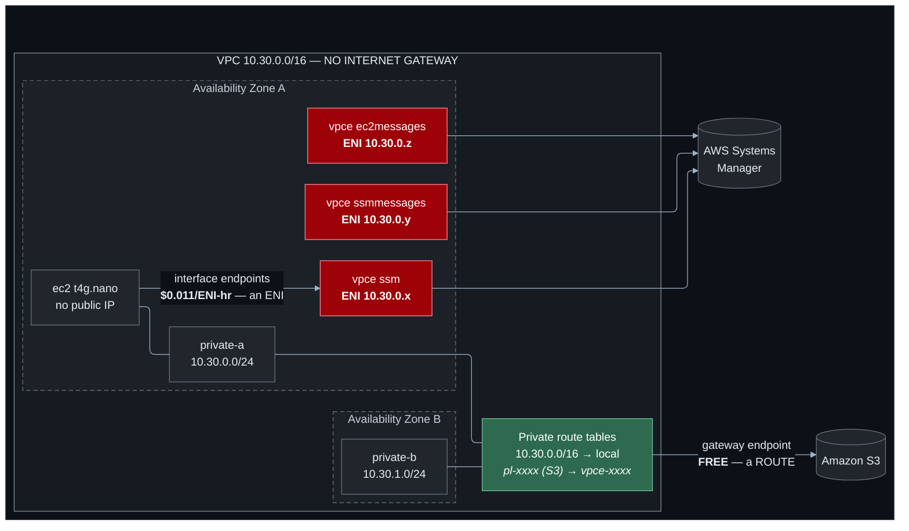

# Lab 03 — Private AWS service access and VPC endpoints

**Difficulty:** Intermediate · **Time:** 45–60 min
**Cost:** ~USD 0.005/hour by default (free endpoint + one nano) · **+~USD 0.033/hour with interface endpoints (opt-in)**

A VPC with **no internet gateway at all** — and an instance inside it that reads
and writes S3, and can be given a Session Manager shell. Reaching AWS services
and having internet access are different things.

---

## Learning objectives

1. Explain the difference between a gateway endpoint and an interface endpoint
   at the mechanism level: one is a **route**, the other is an **ENI**.
2. Say why a gateway endpoint cannot be used from on-premises and an interface
   endpoint can.
3. Do the NAT-gateway-versus-endpoint arithmetic and defend the answer.
4. Write an endpoint policy and explain why it grants nothing.
5. Describe what private DNS does and what breaks when the VPC's DNS attributes
   are off.
6. Diagnose an endpoint that "does not work" because of a missing route table
   association.

## Concepts covered

Gateway endpoints (S3, DynamoDB) · managed prefix lists · interface endpoints ·
AWS PrivateLink · endpoint policies versus IAM policies · private DNS · the
three Session Manager endpoints · NAT gateway versus endpoint cost modelling ·
DNS-based versus route-based service access

---

## Architecture



Green is free. Red is billed by the hour.

## Traffic flow

**Instance → S3, via the gateway endpoint**

1. The instance resolves `s3.ap-southeast-1.amazonaws.com`. It gets a **public**
   IP address. DNS is not involved in the endpoint at all.
2. The packet goes to the VPC router, which consults the subnet's route table.
   The destination matches the **managed prefix list** `pl-xxxx` for S3, whose
   target is the gateway endpoint.
3. The packet is delivered to S3 over the AWS network. It never reaches an
   internet gateway, because there is not one.
4. The endpoint policy is evaluated. The caller's IAM policy is evaluated. Both
   must allow the request.

The instance did nothing differently. Its SDK made an ordinary HTTPS call to a
public S3 endpoint address, and **routing** silently sent it somewhere else.

**Instance → Systems Manager, via an interface endpoint**

1. The instance resolves `ssm.ap-southeast-1.amazonaws.com`. Because private DNS
   is enabled, the VPC resolver answers with a **private** address —
   `10.30.0.x`, the endpoint's ENI.
2. The packet matches `10.30.0.0/16 → local`. It never leaves the VPC.
3. The endpoint's security group is evaluated on TCP 443.
4. PrivateLink forwards the request to the service.

Here the mechanism is **DNS**, not routing. That difference is why interface
endpoints work from a peered VPC or from on-premises (an ordinary private IP is
reachable by anything that can reach your VPC) and gateway endpoints do not (a
route table entry in your VPC means nothing to anyone else's).

---

## Resources created

| Resource | Count | Cost |
| --- | --- | --- |
| VPC + 2 private subnets + 2 route tables | | Free |
| **Internet gateway** | **0** | — |
| S3 gateway endpoint | 1 | **Free** |
| S3 bucket + one object | 1 | Fractions of a cent |
| EC2 `t4g.nano` | 1 | ~USD 0.0053/hr |
| IAM role + inline policy | 1 | Free |
| **Interface endpoints (opt-in)** | 0 or 3 ENIs | **~USD 0.011/ENI-hr ≈ USD 24/month for three** |
| Endpoint security group | 1 if enabled | Free |

**Default: ~USD 0.005/hour. With interface endpoints: ~USD 0.038/hour.**

### The arithmetic worth memorising

| Approach | Monthly | Per GB | Reaches |
| --- | --- | --- | --- |
| NAT gateway | ~USD 43 | ~USD 0.059 | Everything, including the real internet |
| S3 gateway endpoint | **USD 0** | **USD 0** | S3 only, from this VPC only |
| 3 interface endpoints | ~USD 24 | ~USD 0.01 | Those three services, from anywhere that reaches the VPC |

If a private subnet's only outbound need is S3, the gateway endpoint is free and
strictly better. Once you need more than about five interface endpoints, a NAT
gateway becomes cheaper — but it also puts your traffic on the public internet,
which may not be a trade you are allowed to make.

---

## Prerequisites

- [Lab 02](../02-public-private-subnets/README.md) completed
- Backend bucket from [`bootstrap/`](../../bootstrap/README.md)
- Session Manager plugin for the AWS CLI

---

## Deploy

Deploy the **free** configuration first:

```bash
cd labs/03-private-access-and-vpc-endpoints

cp backend.hcl.example backend.hcl && $EDITOR backend.hcl
cp terraform.tfvars.example terraform.tfvars

terraform init -backend-config=backend.hcl
terraform apply
```

Terraform warns that Session Manager will not reach the instance. Correct — the
interface endpoints are off. The S3 half of the lab works regardless and costs
nothing.

---

## Verification (free configuration)

### 1. Confirm there really is no internet gateway

```bash
aws ec2 describe-internet-gateways \
  --filters Name=attachment.vpc-id,Values=$(terraform output -raw vpc_id) \
  --region $(terraform output -raw aws_region) --output json
```

```json
{ "InternetGateways": [] }
```

`terraform output vpc_has_internet_gateway` says `false`.

### 2. The S3 route appears as a prefix list, not a CIDR

```bash
aws ec2 describe-route-tables \
  --route-table-ids $(terraform output -json route_table_ids | jq -r '.[0]') \
  --region $(terraform output -raw aws_region) \
  --query 'RouteTables[0].Routes[].{Dest:DestinationCidrBlock,PrefixList:DestinationPrefixListId,Target:GatewayId}' \
  --output table
```

```
-----------------------------------------------------------
|                   DescribeRouteTables                   |
+---------------+------------------+----------------------+
|     Dest      |   PrefixList     |       Target         |
+---------------+------------------+----------------------+
|  10.30.0.0/16 |  None            |  local               |
|  None         |  pl-6fa54006     |  vpce-0abc123...     |
+---------------+------------------+----------------------+
```

`pl-6fa54006` is an AWS-managed prefix list containing every S3 IP range in the
Region. AWS keeps it up to date; you never have to.

```bash
aws ec2 get-managed-prefix-list-entries \
  --prefix-list-id $(terraform output -raw s3_prefix_list_id) \
  --region $(terraform output -raw aws_region) --output table | head -20
```

### 3. Read the endpoint policy

```bash
terraform output -json verify_commands | jq -r .endpoint_policy | bash
```

One `Allow` statement, scoped to the lab bucket. Note `"Principal": "*"` — an
endpoint policy is not an identity policy, and the wildcard does not grant
anything to anyone. It says "requests that arrive through this endpoint may
target these resources", and the caller still needs IAM permission.

---

## Enabling the chargeable half

```hcl
# terraform.tfvars
acknowledge_costs          = true
enable_interface_endpoints = true
```

```bash
terraform apply     # ~3 minutes; interface endpoints are slow
terraform output cost_warning
```

Wait 90 seconds, then:

```bash
aws ssm describe-instance-information \
  --region $(terraform output -raw aws_region) \
  --query 'InstanceInformationList[].{Id:InstanceId,Ping:PingStatus}' --output table
```

The instance appears. **It has no internet access, no NAT gateway, and no public
IP.** All three interface endpoints are required — omit `ec2messages` and the
session connects and then immediately drops.

---

## In-session tests

```bash
terraform output -raw session_manager_command | bash
```

Print the whole test list with `terraform output in_session_tests`. Inside the
session:

```bash
# 1. Read through the gateway endpoint
aws s3 cp s3://<bucket>/hello.txt -
# Fetched through the S3 gateway endpoint. No internet gateway, no NAT gateway, no charge.

# 2. Write through it
echo hi | aws s3 cp - s3://<bucket>/from-instance.txt

# 3. Prove there is no internet
curl -s --max-time 5 https://checkip.amazonaws.com || echo "TIMED OUT -- correct"

# 4. S3 resolves to a PUBLIC address
dig +short s3.ap-southeast-1.amazonaws.com
# 52.219.x.x   <- public. Gateway endpoints work by ROUTING.

# 5. SSM resolves to a PRIVATE address
dig +short ssm.ap-southeast-1.amazonaws.com
# 10.30.0.x    <- your CIDR. Interface endpoints work by DNS.

# 6. The endpoint policy blocks a bucket it does not name
aws s3 ls s3://aws-ml-blog || echo "DENIED -- the endpoint policy did its job"
```

Steps 4 and 5 side by side are the single clearest demonstration of the
difference between the two endpoint types.

---

## Hands-on exercises

### 1. Break the gateway endpoint by removing its association

Edit `main.tf` and set `gateway_endpoint_route_table_ids = []`. Terraform's
precondition **refuses to plan**:

```
Interface endpoint 's3'... gateway_endpoint_route_table_ids is empty. A gateway
endpoint that is not associated with any route table has no effect at all.
```

Without that guard the endpoint would be created, report `available`, and do
nothing — because the route table would have no entry pointing at it, and S3
traffic would follow the default route (which here is no route at all). This is
the single most common gateway endpoint mistake.

### 2. Widen the policy and watch the block disappear

```hcl
restrict_s3_endpoint_to_lab_bucket = false
```

Apply, then re-run test 6 in the session. `aws s3 ls s3://aws-ml-blog` now
succeeds. You have just removed the control that stops someone in your VPC
copying data to a bucket you do not own.

Restore it.

### 3. Turn off private DNS and watch Session Manager die

In `modules/vpc-endpoints`, private DNS defaults to on. Set it off for one
endpoint:

```hcl
interface_endpoints = {
  ssm         = { private_dns_enabled = false }
  ssmmessages = {}
  ec2messages = {}
}
```

Apply, wait, and check `describe-instance-information`. The instance drops off.
From inside (if you still have a session), `dig ssm.ap-southeast-1.amazonaws.com`
now returns a **public** address again, which is unroutable from this VPC.

The endpoint still exists and is still billed. It just is not being used, because
nothing points at it. Its Regional DNS name from
`terraform output interface_endpoint_dns_entries` still works if you use it
explicitly with `--endpoint-url`.

### 4. Discover what your workload actually depends on

With `restrict_s3_endpoint_to_lab_bucket = true`, run this in the session:

```bash
sudo dnf check-update
```

It hangs and fails. Amazon Linux serves its package repositories from AWS-owned
S3 buckets, and the endpoint policy does not name them.

Find out which buckets:

```bash
cat /etc/yum.repos.d/amazonlinux.repo
sudo dnf repolist -v 2>&1 | grep -i baseurl
```

Then add the bucket ARNs you find to `additional_s3_endpoint_bucket_arns` in
`terraform.tfvars`, apply, and try again.

This exercise deliberately does not hand you the answer. Working out *which*
buckets a workload needs, from the workload rather than from documentation, is
exactly the investigation a restrictive endpoint policy forces on you in
production — and it is the reason many teams give up and use `"Resource": "*"`.

### 5. Model the break-even point

You need `ssm`, `ssmmessages`, `ec2messages`, `kms`, `logs`, `secretsmanager`,
`ecr.api`, `ecr.dkr` and `sts`, across two AZs for high availability.

- 9 endpoints × 2 AZs = 18 ENIs × USD 8.03 = **~USD 145/month**
- 2 NAT gateways (one per AZ) = **~USD 86/month** + data processing

The NAT gateways are cheaper. Whether they are *better* depends on whether your
security posture permits that traffic to traverse the public internet — which is
a compliance question, not a cost question. Real designs often use both: gateway
endpoints for S3 and DynamoDB (free, always worth it), interface endpoints for
the handful of services that must stay private, and a NAT gateway for everything
else.

---

## Troubleshooting exercises

### A. `TargetNotConnected` with all three endpoints present

Check the endpoint security group. Interface endpoints only accept TCP 443, and
the source must include the instance's subnet:

```bash
SG=$(aws ec2 describe-vpc-endpoints --region $(terraform output -raw aws_region) \
  --filters Name=vpc-id,Values=$(terraform output -raw vpc_id) \
            Name=vpc-endpoint-type,Values=Interface \
  --query 'VpcEndpoints[0].Groups[0].GroupId' --output text)
aws ec2 describe-security-groups --group-ids $SG \
  --region $(terraform output -raw aws_region) \
  --query 'SecurityGroups[0].IpPermissions'
```

Set `allowed_cidr_blocks = ["10.99.0.0/16"]` (a range the instance is not in)
and apply. The endpoints still exist and are still billed; the instance simply
cannot open a TCP connection to them, and Session Manager fails with the same
`TargetNotConnected` as a missing route.

### B. Private DNS silently does nothing

Set `enable_dns_hostnames = false` on the VPC module and apply. AWS rejects
creating an interface endpoint with private DNS in a VPC that has DNS hostnames
disabled — so here you get an error, which is the good outcome.

The bad outcome happens in the other order: create the endpoints first, then
disable the DNS attributes. The endpoints survive, keep billing, and stop being
used. Nothing reports an error.

### C. Which failure is it?

Given `aws s3 ls` timing out from a private instance, distinguish:

| Symptom | Cause |
| --- | --- |
| `Connection timed out` after ~60s | **Routing.** No path to S3 at all — missing endpoint or missing route table association. |
| `AccessDenied` immediately | **Policy.** Either the endpoint policy or the IAM policy said no. The packet arrived. |
| `Could not connect to the endpoint URL` | **DNS.** Resolution failed before any packet was sent. |

The timing is the tell. A timeout means nothing answered; a denial means
something did.

---

## Cleanup

```bash
terraform destroy
```

The bucket has `force_destroy = true`, so Terraform empties it. Interface
endpoints take a minute or two to delete.

```bash
REGION=$(terraform output -raw aws_region 2>/dev/null || echo ap-southeast-1)

# Interface endpoints bill per hour. Anything not 'deleted' is still costing money.
aws ec2 describe-vpc-endpoints --region $REGION \
  --filters Name=tag:Lab,Values=03-private-access-and-vpc-endpoints \
  --query 'VpcEndpoints[?State!=`deleted`].[VpcEndpointId,VpcEndpointType,State]' --output text

aws ec2 describe-instances --region $REGION \
  --filters Name=tag:Lab,Values=03-private-access-and-vpc-endpoints Name=instance-state-name,Values=running \
  --query 'Reservations[].Instances[].InstanceId' --output text
```

**An orphaned interface endpoint is the expensive leftover here** — USD 8/month
per ENI, doing nothing, with no obvious symptom.

---

## Further reading

- [AWS PrivateLink and VPC endpoints](https://docs.aws.amazon.com/vpc/latest/privatelink/privatelink-share-your-services.html) — AWS
- [Gateway endpoints for Amazon S3](https://docs.aws.amazon.com/vpc/latest/privatelink/vpc-endpoints-s3.html) — AWS
- [Control access with endpoint policies](https://docs.aws.amazon.com/vpc/latest/privatelink/vpc-endpoints-access.html) — AWS
- [Private DNS for interface endpoints](https://docs.aws.amazon.com/vpc/latest/privatelink/privatelink-access-aws-services.html#access-service-though-endpoint) — AWS
- [Systems Manager VPC endpoints](https://docs.aws.amazon.com/systems-manager/latest/userguide/setup-create-vpc.html) — AWS
- [AWS PrivateLink pricing](https://aws.amazon.com/privatelink/pricing/) — AWS
- [Managed prefix lists](https://docs.aws.amazon.com/vpc/latest/userguide/working-with-aws-managed-prefix-lists.html) — AWS

**Next:** [Lab 04 — Multi-VPC connectivity and VPC peering](../04-vpc-peering/README.md)
