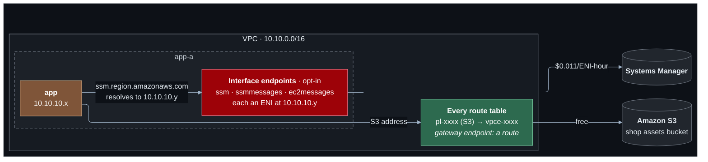

# Lab 04 — Private access to AWS services

**Difficulty:** Intermediate · **Time:** 45 min · **Cost:** free by default; **+USD 0.033/hour with interface endpoints** (opt-in)

The shop's hosts talk to two AWS services: S3, for product images, and Systems
Manager, for administration. In lab 03 that traffic left through the NAT
gateway and came back in again, paying a per-gigabyte charge to reach a
service in the same Region. VPC endpoints give the VPC a private door to the
service instead.

**Video:** extends section 6 (cloud networking). VPC endpoints are not in the
video; they are what "managed networking" looks like once the basics are in
place.

**What changes from lab 03:** `endpoints.tf` is new; `terraform.tf` gains the
`random` provider for the bucket name.

---

## Learning objectives

1. Explain the difference between a gateway endpoint and an interface
   endpoint in terms of what each one *is*: a route, or a network interface.
2. Read a route table entry whose destination is a prefix list.
3. Explain how an interface endpoint works with no route change at all — by
   changing what a DNS name resolves to.
4. Distinguish an endpoint policy from an IAM policy, and predict the outcome
   when they disagree.
5. Decide between a NAT gateway and endpoints on cost.

## Concepts covered

Gateway endpoints (S3, DynamoDB) · managed prefix lists · interface endpoints ·
AWS PrivateLink · private DNS for endpoints · route-based versus DNS-based
service access · endpoint policies versus IAM policies · the three Session
Manager endpoints · NAT versus endpoint cost modelling

---

## Architecture



Two mechanisms. The gateway endpoint changes **where the packet is routed**.
The interface endpoint changes **what the name resolves to**.

## Traffic flow

**The app host reads an object from S3 — gateway endpoint.**

1. The AWS CLI resolves `s3.ap-southeast-1.amazonaws.com`. The answer is a
   **public** S3 address, exactly as it would be anywhere.
2. The route table is consulted. It has an entry whose destination is not a
   CIDR but a **prefix list** — AWS's own list of S3's address ranges — and
   whose target is the endpoint. S3's address is in the list, and that entry
   is more specific than `0.0.0.0/0`, so it wins.
3. The packet goes to S3 over AWS's network. No NAT gateway, no internet
   gateway, no charge.
4. The **endpoint policy** is evaluated: is this bucket one the endpoint will
   carry? Then IAM: may this role read it? Both must say yes.

**The app host registers with Systems Manager — interface endpoint.**

1. The agent resolves `ssm.ap-southeast-1.amazonaws.com`. With the endpoint's
   private DNS enabled, the VPC resolver answers with `10.10.10.y` — the
   endpoint's own interface in the app subnet — instead of a public address.
2. `10.10.10.y` is inside the VPC, so the `local` route delivers it. **No
   route table was changed.**
3. The endpoint's security group must allow TCP 443 from the VPC.
4. From the interface, the request travels to Systems Manager over
   PrivateLink.

---

## Resources created

| Resource | When | Cost |
| --- | --- | --- |
| S3 bucket + one object | always | Free at this size |
| S3 gateway endpoint | `enable_s3_gateway_endpoint` (default on) | **Free** |
| Interface endpoints ×3, one zone | `enable_interface_endpoints` | **~USD 0.033/hour** (USD 24/month) + USD 0.01/GB |
| IAM policy on the app host's role | always | Free |

## Prerequisites

- Terraform `>= 1.11.0` and AWS credentials for a sandbox account
  (`aws sts get-caller-identity`).
- The state bucket from [`bootstrap/`](../../bootstrap/README.md).
- Lab 03 applied, or at least read: this lab changes what it built. See [`../03-nat-and-outbound/`](../03-nat-and-outbound/README.md).
- The [Session Manager plugin](https://docs.aws.amazon.com/systems-manager/latest/userguide/session-manager-working-with-install-plugin.html)
  for the AWS CLI, to open a shell on a host.

How the labs fit together, and what "one project, one state" means in
practice, is in [`docs/working-with-the-labs.md`](../../docs/working-with-the-labs.md).

## Deploy

Every lab uses the same state, so this lab **upgrades** what the previous one
built. Carry your settings forward and add the new ones:

```bash
cd labs/04-private-aws-access

cp ../03-nat-and-outbound/backend.hcl .
cp ../03-nat-and-outbound/terraform.tfvars .
diff terraform.tfvars terraform.tfvars.example   # what this lab adds; copy across what you want

terraform init -backend-config=backend.hcl
terraform plan                                   # read it: this is the lab
terraform apply
```

To see exactly what changed in the code: `make lab-diff FROM=03-nat-and-outbound TO=04-private-aws-access`
from the repository root.

The gateway endpoint needs no opt-in. For a shell on the private hosts you
need one path to Systems Manager — either lab 03's NAT gateway, or:

```hcl
acknowledge_costs          = true
enable_interface_endpoints = true
```

Without either, `terraform plan` prints a warning from the
`private_hosts_reachable_via_session_manager` check. It is a reminder, not an
error.

---

## Verification

`terraform output verify_endpoints` prints these with your values.

### 1. The route nobody wrote a CIDR for

```bash
terraform output -json verify_endpoints | jq -r .s3_route_in_private_route_tables | sh
```

Each route table has a row with a `pl-…` destination and a `vpce-…` target.

### 2. S3 without the internet

Turn the NAT gateway **off**, keep the interface endpoints on, and from a
shell on the app host:

```bash
aws s3 cp "s3://$(terraform output -raw assets_bucket)/hello.txt" - --region ap-southeast-1
curl -s --max-time 5 https://checkip.amazonaws.com || echo "no internet"
```

The first works. The second times out. The host has reached S3 and has no
internet access at all.

### 3. One name, two answers

On the app host, with interface endpoints on:

```bash
dig +short ssm.ap-southeast-1.amazonaws.com     # 10.10.10.y -- inside the VPC
```

On your own machine the same name returns public addresses.

### 4. All three, or nothing

```bash
terraform output interface_endpoint_ids
```

`ssm`, `ssmmessages`, `ec2messages`. Session Manager needs every one.

---

## Hands-on exercises

### 1. The endpoint policy overrides IAM

`restrict_s3_endpoint_to_shop_bucket` attaches a policy that allows only the
shop's bucket. From the app host try a public bucket you would normally be
able to list, with NAT off:

```bash
aws s3 ls s3://<any other bucket> --region ap-southeast-1
```

`AccessDenied` — immediately, not a timeout. IAM is not the reason; the
endpoint refuses to carry the request. Set the variable to `false`, apply, and
the same command is decided by IAM alone.

### 2. NAT or endpoints?

Three interface endpoints in one zone cost about USD 24/month. A NAT gateway
costs USD 43 plus USD 0.059/GB. Work out the break-even number of services,
then the answer when the hosts also need the real internet. (About five
services; and then you need the NAT gateway anyway.)

### 3. Drop one endpoint

Set `interface_endpoints = ["ssm", "ssmmessages"]` with NAT off and apply.
After a few minutes the private hosts drop out of Session Manager. No error
anywhere says `ec2messages`. Restore the list.

### 4. A gateway endpoint has no address

Look for a network interface belonging to the S3 endpoint:

```bash
aws ec2 describe-network-interfaces --filters Name=vpc-id,Values="$(terraform output -raw vpc_id)" \
  --query 'NetworkInterfaces[].{Desc:Description,IP:PrivateIpAddress}' --output table
```

The interface endpoints are there. The gateway endpoint is not: it is only a
route, which is why it cannot be reached from another VPC or from on-premises.

---

## Troubleshooting exercises

### A. Timeout or AccessDenied

Disable the gateway endpoint (`enable_s3_gateway_endpoint = false`) with NAT
off. The S3 command now **hangs** until it times out. In exercise 1 it was
refused instantly. A timeout is routing; an instant denial is policy. That
distinction tells you which half of the system to open.

### B. Endpoint exists, traffic still fails

An endpoint only affects the route tables it is associated with. Imagine
associating it with the public table only: the endpoint is `available`, and
every private host still times out. Check associations, not just existence:

```bash
aws ec2 describe-vpc-endpoints --filters Name=vpc-endpoint-type,Values=Gateway \
  --query 'VpcEndpoints[].RouteTableIds'
```

---

## Cleanup

Moving on to the next lab? **Do not destroy** -- the next lab builds on this
one. Turn off any opt-in you no longer need (set its `enable_*` flag to `false`
and `terraform apply`) so it stops billing.

Finished for now? Destroy from **this** folder -- the folder you applied last:

```bash
terraform destroy
```

Then confirm nothing is left:

```bash
aws resourcegroupstaggingapi get-resources --tag-filters Key=Project,Values=shop \
  --query 'ResourceTagMappingList[].ResourceARN' --output text
```

Empty output means clean.

---

## Further reading

- [Gateway endpoints](https://docs.aws.amazon.com/vpc/latest/privatelink/gateway-endpoints.html) — AWS
- [Interface endpoints](https://docs.aws.amazon.com/vpc/latest/privatelink/create-interface-endpoint.html) — AWS
- [Endpoint policies](https://docs.aws.amazon.com/vpc/latest/privatelink/vpc-endpoints-access.html) — AWS
- [Managed prefix lists](https://docs.aws.amazon.com/vpc/latest/userguide/managed-prefix-lists.html) — AWS
- [Session Manager without internet access](https://docs.aws.amazon.com/systems-manager/latest/userguide/session-manager-getting-started-privatelink.html) — AWS
- [PrivateLink pricing](https://aws.amazon.com/privatelink/pricing/) — AWS

**Next:** [Lab 05](../05-load-balancing/README.md)
