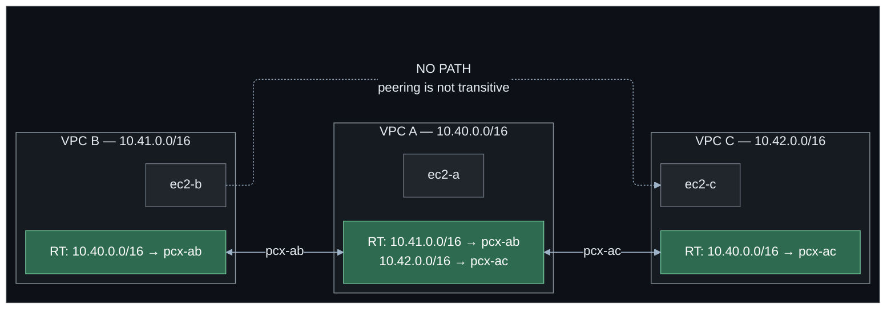

# Lab 04 — Multi-VPC connectivity and VPC peering

**Difficulty:** Intermediate · **Time:** 45–60 min
**Cost:** ~USD 0.031/hour with test instances · **Peering connections themselves are free**

Three VPCs. B is peered with A. C is peered with A. **B cannot reach C**, and no
route table entry will change that.

---

## Learning objectives

1. Design non-overlapping CIDR ranges, and explain why the constraint is
   permanent.
2. Create a peering connection and the route entries it needs on **both** sides.
3. Demonstrate that peering is **not transitive**, and explain why at the
   packet-forwarding level.
4. Calculate how a full mesh scales, and derive the argument for Transit Gateway.
5. Explain what `allow_remote_vpc_dns_resolution` changes and why it matters for
   cost as well as correctness.
6. Choose between peering, Transit Gateway and PrivateLink for a given
   requirement.

## Concepts covered

CIDR planning across VPCs · peering connection lifecycle · requester and
accepter · cross-account peering · route entries as the actual mechanism · the
non-transitivity rule · full-mesh scaling · DNS resolution over peering ·
security group referencing limits across VPCs · peering versus Transit Gateway
versus PrivateLink

---

## Architecture



## Traffic flow

**`ec2-b` → `ec2-a` (10.40.0.x)** — works

1. B's route table matches `10.40.0.0/16 → pcx-ab`.
2. The packet crosses the peering connection into VPC A.
3. A's security group is evaluated; ICMP from `10.41.0.0/16` is allowed.
4. The reply matches A's route `10.41.0.0/16 → pcx-ab` and returns.

Both route entries are required. Delete A's and the request arrives while the
reply is dropped — a timeout that looks exactly like a firewall block.

**`ec2-b` → `ec2-c` (10.42.0.x)** — fails

B's route table has no entry matching `10.42.0.0/16`, so the packet is dropped
at the VPC router. Now add one manually pointing at `pcx-ab`:

```bash
aws ec2 create-route --route-table-id <rtb-b> \
  --destination-cidr-block 10.42.0.0/16 \
  --vpc-peering-connection-id <pcx-ab>
```

AWS **rejects it**: `InvalidVpcPeeringConnectionID.Malformed` or
`RouteAlreadyExists`-style errors aside, a peering connection route may only
target a CIDR belonging to one of the two VPCs in that connection.

**Why the rule exists.** A peering connection is not a router. It is a
point-to-point link in the VPC forwarding fabric between exactly two VPCs. VPC A
does not forward packets — it is not a device with a routing table in the
network-appliance sense, it is a set of subnets whose router only knows about
destinations reachable *from* that VPC. There is nothing in A that could accept a
packet from B and re-emit it toward C.

The consequences, all following from the same rule:

- No transitive routing between VPCs.
- A peered VPC cannot use your internet gateway or NAT gateway.
- A peered VPC cannot use your gateway VPC endpoints.
- A peered VPC cannot reach your Site-to-Site VPN or Direct Connect.

Every one of those is a common design question, and the answer to all of them is
"peering will not do that; use a Transit Gateway."

---

## Resources created

| Resource | Count | Cost |
| --- | --- | --- |
| VPCs, subnets, route tables, IGWs | 3 each | Free |
| Peering connections | 2 (3 with full mesh) | **Free** |
| Peering routes | 4 (6 with full mesh) | Free |
| EC2 `t4g.nano` (opt-in) | 3 | ~USD 0.0053/hr each |
| Public IPv4 addresses (opt-in) | 3 | ~USD 0.005/hr each |

**With test instances: ~USD 0.031/hour (~USD 0.75/day). Without: free.**

Data crossing a peering connection costs ~USD 0.01/GB in each direction within a
Region, and **nothing** between instances in the same Availability Zone.

---

## Prerequisites

- [Labs 01–02](../01-vpc-fundamentals/README.md) completed
- Backend bucket from [`bootstrap/`](../../bootstrap/README.md)
- Session Manager plugin
- Default quota is 5 VPCs per Region; this lab uses 3

---

## Deploy

```bash
cd labs/04-vpc-peering

cp backend.hcl.example backend.hcl && $EDITOR backend.hcl
cp terraform.tfvars.example terraform.tfvars

terraform init -backend-config=backend.hcl
terraform apply
```

Terraform warns that B and C cannot reach each other. That is the lab.

---

## Verification

### 1. The peering connections are active

```bash
terraform output -json verify_commands | jq -r .list_peerings | bash
```

```
-------------------------------------------------------------------
|                 DescribeVpcPeeringConnections                   |
+--------------+----------+-----------------+---------------------+
|      Id      |  Status  |   Requester     |      Accepter       |
+--------------+----------+-----------------+---------------------+
|  pcx-0abc... |  active  |  10.40.0.0/16   |  10.41.0.0/16       |
|  pcx-0def... |  active  |  10.40.0.0/16   |  10.42.0.0/16       |
+--------------+----------+-----------------+---------------------+
```

`active` means accepted, not that traffic flows. Routes do that.

### 2. Route tables tell the real story

```bash
terraform output -json verify_commands | jq -r .routes_in_vpc_a | bash
terraform output -json verify_commands | jq -r .routes_in_vpc_b | bash
```

VPC A has entries for **both** `10.41.0.0/16` and `10.42.0.0/16`. VPC B has one
entry, for `10.40.0.0/16`. **B has no route to C and cannot be given one.**

### 3. Prove it with pings

```bash
terraform output connectivity_tests
terraform output instance_private_ips
terraform output -json session_manager_commands | jq -r .a
```

From `ec2-a`:

```bash
ping -c 3 <b_private_ip>    # 3 packets transmitted, 3 received
ping -c 3 <c_private_ip>    # 3 packets transmitted, 3 received
```

Now from `ec2-b`:

```bash
ping -c 3 <a_private_ip>    # works
ping -c 3 <c_private_ip>    # 100% packet loss
```

The security groups permit ICMP from all three VPC CIDRs — the lab configures
that deliberately, so a failed ping cannot be blamed on filtering. The only
possible explanation is routing.

### 4. Watch AWS refuse the route

```bash
RTB=$(terraform output -json route_table_ids | jq -r .b)
PCX=$(terraform output -json peering_connection_ids | jq -r '."a-b"')
CIDR_C=$(terraform output -json vpc_cidrs | jq -r .c)

aws ec2 create-route --route-table-id "$RTB" \
  --destination-cidr-block "$CIDR_C" \
  --vpc-peering-connection-id "$PCX" \
  --region $(terraform output -raw aws_region)
```

```
An error occurred (InvalidParameterValue) when calling the CreateRoute operation:
Route table contains an unsupported route target ... The destination CIDR block
10.42.0.0/16 is not in the peer VPC.
```

The rule is enforced by the API, not by convention.

---

## Hands-on exercises

### 1. Add the third connection, then count

```hcl
enable_b_to_c_peering = true
```

```bash
terraform apply
terraform output peering_topology
```

B can now ping C. Read the `connections_needed_for_full_mesh` field, then do the
arithmetic for larger fleets:

| VPCs | Peering connections | Route entries |
| --- | --- | --- |
| 3 | 3 | 6 |
| 5 | 10 | 20 |
| 10 | **45** | **90** |
| 20 | **190** | **380** |

Every one of those route entries is maintained by hand or by code you wrote, and
adding VPC 21 means touching all twenty existing route tables. The default quota
is 50 active peering connections per VPC and 50 routes per route table, so a
20-VPC mesh is already close to the limit.

A Transit Gateway replaces all of it with N attachments and one route table.

### 2. Break one direction

Comment out the route from B to A only:

```hcl
# In main.tf, add to aws_route.peering:
#   for_each = { for k, v in local.peering_routes : k => v if k != "a-b-b-to-a" }
```

Apply, then ping A from B. It fails. Ping B from A — **it also fails**, because
the ICMP echo arrives at B and B has no route to send the reply back.

A one-way route produces a symmetric-looking failure. Always check both tables.

### 3. DNS across peering

```bash
terraform output -json verify_commands | jq -r .dns_resolution_options | bash
```

Both sides show `true`. From `ec2-a`, resolve `ec2-b`'s private DNS name:

```bash
dig +short <ec2-b-private-dns-name>
```

You get the **private** address, so traffic follows the peering connection.

Set both `allow_remote_vpc_dns_resolution` values to `false` in `main.tf` and
apply. The same lookup now returns the **public** address. Traffic to it leaves
via the internet gateway, gets billed as internet egress, and never touches the
peering connection you are paying to maintain.

It still works. That is what makes it dangerous — you find out from the bill.

### 4. Security group referencing across VPCs

In lab 01 you referenced one security group from another. Try it across a
peering connection: reference `ec2-b`'s security group in a rule on `ec2-a`.

It is permitted **only** for VPCs in the same Region (and works cross-account
with peering), and never across a Transit Gateway. Try it and read the error:

```bash
aws ec2 authorize-security-group-ingress \
  --group-id <sg-in-vpc-a> --protocol tcp --port 443 \
  --source-group <sg-in-vpc-b> --region <region>
```

This is one of the few things peering does that Transit Gateway does not.

---

## Choosing between peering, Transit Gateway and PrivateLink

|  | VPC peering | Transit Gateway | PrivateLink |
| --- | --- | --- | --- |
| **What it connects** | Exactly 2 VPCs | Many VPCs, VPNs, Direct Connect | One *service*, not a network |
| **Transitive** | **No** | Yes | N/A |
| **Scaling** | n(n-1)/2 connections | n attachments | 1 endpoint per consumer |
| **Overlapping CIDRs** | Impossible | Impossible (same route table) | **Fine** — no routing involved |
| **Hourly cost** | **Free** | ~USD 0.05/attachment-hour | ~USD 0.011/ENI-hour |
| **Data cost** | ~USD 0.01/GB each way | ~USD 0.02/GB processed | ~USD 0.01/GB processed |
| **Cross-Region** | Yes | Yes, via TGW peering | Yes, with extra setup |
| **Cross-account** | Yes | Yes, via RAM | Yes — the common case |
| **Segmentation** | By route table, coarse | Multiple TGW route tables | Per-service by design |
| **SG referencing** | Yes, same Region | No | No |
| **Bandwidth limit** | None (VPC limits apply) | 50 Gbps per attachment | 100 Gbps per endpoint |

**Rules of thumb**

- **Two or three VPCs that need full IP connectivity, in one Region, permanently:**
  peering. It is free and simple, and the complexity argument does not bite yet.
- **More than about four VPCs, or any hybrid connectivity, or any need for
  network segmentation:** Transit Gateway. Pay the attachment cost; it buys back
  far more in operational simplicity.
- **One team needs to consume one service from another team:** PrivateLink.
  It exposes a single endpoint rather than joining two networks, it works with
  overlapping CIDRs, and it is unidirectional by design — the consumer can reach
  the service and not the other way around. Lab 06 covers it.

The last one is underused. A great many "we need to peer these VPCs" requests
are really "team X needs to call team Y's API", and PrivateLink solves that
without merging two address spaces forever.

---

## Cross-account peering

Same resources, two providers:

```hcl
provider "aws" {
  alias  = "requester"
  region = var.aws_region
}

provider "aws" {
  alias   = "accepter"
  region  = var.aws_region
  profile = var.accepter_profile     # or assume_role
}

resource "aws_vpc_peering_connection" "cross_account" {
  provider      = aws.requester
  vpc_id        = var.requester_vpc_id
  peer_vpc_id   = var.accepter_vpc_id
  peer_owner_id = var.accepter_account_id
  auto_accept   = false               # cannot auto-accept across accounts
}

resource "aws_vpc_peering_connection_accepter" "cross_account" {
  provider                  = aws.accepter
  vpc_peering_connection_id = aws_vpc_peering_connection.cross_account.id
  auto_accept               = true
}
```

Both accounts must add their own route entries; neither can write to the other's
route tables. `auto_accept = true` on the requester side is silently ignored
across accounts, which is a confusing failure — the connection sits in
`pending-acceptance` forever.

This lab does not deploy the cross-account case, because it needs a second AWS
account that most learners do not have. The code above is complete and correct
if you do.

---

## Troubleshooting exercises

### A. `pending-acceptance` forever

```bash
aws ec2 describe-vpc-peering-connections \
  --query 'VpcPeeringConnections[?Status.Code!=`active`].[VpcPeeringConnectionId,Status.Code,Status.Message]' \
  --output text
```

Same account: check `auto_accept = true`. Cross-account: the accepter must
explicitly accept, and requests expire after 7 days.

### B. `active` but no traffic

Almost always missing routes. Check **both** tables:

```bash
for vpc in a b c; do
  echo "== VPC $vpc =="
  aws ec2 describe-route-tables \
    --route-table-ids $(terraform output -json route_table_ids | jq -r ".$vpc") \
    --region $(terraform output -raw aws_region) \
    --query 'RouteTables[0].Routes[].[DestinationCidrBlock,VpcPeeringConnectionId,State]' --output text
done
```

Watch for `State: blackhole` — that means the route exists but its target does
not (a deleted peering connection). A blackhole route silently drops traffic and
is not an error.

### C. It works, but the bill says internet egress

Symptom: peering traffic appears as internet data transfer. Cause:
`allow_remote_vpc_dns_resolution` is false, so hostnames resolve to public
addresses and traffic goes out over the internet gateway. See exercise 3.

### D. Overlapping CIDRs discovered too late

Set `vpc_b_cidr = "10.40.0.0/16"` and run `terraform plan`. The variable
validation fails immediately with an explanation.

Without that check, AWS would return
`InvalidVpcPeeringConnection.OverlappingCidrBlocks` at apply time — after both
VPCs exist. In production this is discovered when two organisations merge, and
the only fixes are rebuilding a VPC (weeks) or PrivateLink (which does not need
unique addresses at all, and is why it is the right answer surprisingly often).

---

## Cleanup

```bash
terraform destroy
```

Peering connections are free, so an incomplete destroy costs nothing directly —
but a stranded VPC counts against the 5-per-Region quota.

```bash
REGION=$(terraform output -raw aws_region 2>/dev/null || echo ap-southeast-1)

aws ec2 describe-vpc-peering-connections --region $REGION \
  --filters Name=tag:Lab,Values=04-vpc-peering \
  --query 'VpcPeeringConnections[?Status.Code!=`deleted`].[VpcPeeringConnectionId,Status.Code]' --output text

aws ec2 describe-instances --region $REGION \
  --filters Name=tag:Lab,Values=04-vpc-peering Name=instance-state-name,Values=running \
  --query 'Reservations[].Instances[].InstanceId' --output text

aws ec2 describe-vpcs --region $REGION \
  --filters Name=tag:Lab,Values=04-vpc-peering --query 'Vpcs[].VpcId' --output text
```

---

## Further reading

- [VPC peering](https://docs.aws.amazon.com/vpc/latest/peering/what-is-vpc-peering.html) — AWS
- [Unsupported VPC peering configurations](https://docs.aws.amazon.com/vpc/latest/peering/invalid-peering-configurations.html) — AWS (the transitive routing rule, stated formally)
- [Update route tables for a peering connection](https://docs.aws.amazon.com/vpc/latest/peering/vpc-peering-routing.html) — AWS
- [DNS resolution over peering](https://docs.aws.amazon.com/vpc/latest/peering/modify-peering-connections.html) — AWS
- [Building a scalable and secure multi-VPC network infrastructure](https://docs.aws.amazon.com/whitepapers/latest/building-scalable-secure-multi-vpc-network-infrastructure/welcome.html) — AWS whitepaper
- [VPC peering pricing](https://aws.amazon.com/vpc/pricing/) — AWS

**Next:** [Lab 05 — Transit Gateway](../05-transit-gateway/README.md)
