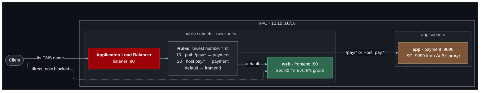

# Lab 05 — Load balancing

**Difficulty:** Intermediate · **Time:** 45 min · **Cost:** **+USD 0.035/hour with the load balancer** (opt-in)

The shop has one web server and one address. Replace the server and the
address changes; add a second server and there is nowhere to send people.
This lab puts an Application Load Balancer in front: one stable name, health
checks, and routing decisions made by reading the HTTP request.

**Video:** the idea behind section 8's *Ingress* — host- and path-based
routing — built with the AWS service that implements it. Lab 07 comes back to
it on Kubernetes.

**What changes from lab 04:** `load-balancing.tf` is new; `compute.tf` stops
accepting the internet on the web server; `dns.tf` points the shop's name at
the load balancer.

---

## Learning objectives

1. Explain what a load balancer adds to a single server: a stable entry point,
   health checking and a place to make routing decisions.
2. Route requests by URL path and by host name, and predict which rule wins.
3. Explain why a load balancer has a DNS name and not an IP address.
4. Trace the two separate TCP connections in one request, and find the
   client's real address.
5. Tighten security groups so backends accept only the load balancer.

## Concepts covered

Layer 7 load balancing · listeners · target groups · health checks ·
path-based and host-based routing · rule priority · alias records ·
`X-Forwarded-For` · security group chaining through a load balancer ·
multi-AZ entry points

---

## Architecture



## Traffic flow

**`curl http://<load balancer name>/pay/checkout`**

1. The client resolves the load balancer's name. The answer is two addresses,
   one per Availability Zone, and they change over time — which is why you are
   given a name.
2. **Connection one:** client → load balancer node, TCP 80. The load
   balancer's security group allows it from `allowed_client_cidr`.
3. The load balancer **terminates** the connection and reads the HTTP request:
   method, `Host` header, path.
4. It evaluates its rules in priority order. Rule 10 matches the path
   `/pay/*`. First match wins; it stops looking.
5. It picks a **healthy** target from the payment target group.
6. **Connection two:** load balancer node → `app:9090`. A new TCP connection,
   whose source is the load balancer's private address. The app security group
   allows 9090 from the load balancer's security group.
7. The app answers the load balancer, which answers the client.

The backend's `client_seen` is now the load balancer. The real client is in
the `X-Forwarded-For` header the load balancer added, which the stand-in
reports as `forwarded_for`.

**`curl http://<web public IP>/`** — the direct route that worked in lab 04 —
now times out. The rule allowing the internet to the web server is gone;
`compute.tf` only creates it when there is no load balancer.

---

## Resources created

| Resource | Count | Cost |
| --- | --- | --- |
| Application Load Balancer | 1 | **~USD 0.0252/hour** + capacity units |
| Public IPv4 addresses (one per zone) | 2 | USD 0.01/hour |
| Target groups, listener, 2 rules | — | Free |
| Security group + rules | — | Free |

About USD 0.035/hour, USD 26/month. All of it only when
`enable_load_balancer = true`.

## Prerequisites

- Terraform `>= 1.11.0` and AWS credentials for a sandbox account
  (`aws sts get-caller-identity`).
- The state bucket from [`bootstrap/`](../../bootstrap/README.md).
- Lab 04 applied, or at least read: this lab changes what it built. See [`../04-private-aws-access/`](../04-private-aws-access/README.md).
- The [Session Manager plugin](https://docs.aws.amazon.com/systems-manager/latest/userguide/session-manager-working-with-install-plugin.html)
  for the AWS CLI, to open a shell on a host.

How the labs fit together, and what "one project, one state" means in
practice, is in [`docs/working-with-the-labs.md`](../../docs/working-with-the-labs.md).

## Deploy

Every lab uses the same state, so this lab **upgrades** what the previous one
built. Carry your settings forward and add the new ones:

```bash
cd labs/05-load-balancing

cp ../04-private-aws-access/backend.hcl .
cp ../04-private-aws-access/terraform.tfvars .
diff terraform.tfvars terraform.tfvars.example   # what this lab adds; copy across what you want

terraform init -backend-config=backend.hcl
terraform plan                                   # read it: this is the lab
terraform apply
```

To see exactly what changed in the code: `make lab-diff FROM=04-private-aws-access TO=05-load-balancing`
from the repository root.

```hcl
acknowledge_costs    = true
enable_load_balancer = true
```

The load balancer takes two to three minutes to become active, and targets
another thirty seconds to pass their first health checks.

### About HTTPS

The listener is HTTP. HTTPS needs a certificate, and a certificate needs a
domain you control, which the labs cannot assume. With a domain the change is
small: request a certificate in ACM, add a second listener on 443 that uses
it, and turn the port-80 listener into a redirect. Nothing about the routing
in this lab changes.

---

## Verification

`terraform output verify_load_balancer` prints these with your values.

### 1. Three requests, three rules

```bash
LB=$(terraform output -raw load_balancer_dns_name)
curl -s "http://$LB/"                              # default  -> frontend
curl -s "http://$LB/pay/checkout"                  # path     -> payment
curl -s -H 'Host: pay.shop.test' "http://$LB/"     # host     -> payment
```

The `service` field tells you who answered. The third request has the same
URL as the first — only the `Host` header differs.

### 2. Who the backend thinks it is talking to

In any answer, compare `client_seen` (a `10.10.x.x` address: the load
balancer) with `forwarded_for` (your public address).

### 3. A name, not an address

```bash
dig +short "$LB"
```

Two addresses. Run it again tomorrow and they may differ.

### 4. Healthy targets

```bash
terraform output -json verify_load_balancer | jq -r .target_health | sh
```

### 5. The web server is no longer a front door

```bash
curl -s --max-time 5 "http://$(terraform output -raw web_public_ip)/" || echo "timed out, as intended"
```

---

## Hands-on exercises

### 1. Health checks in action

On the app host: `sudo systemctl stop shop-payment`. Watch target health go
`unhealthy` within thirty seconds, and request `/pay/checkout`: `503`, from
the load balancer itself — there is no healthy target to try. The frontend
still works. Start the service and watch it return.

### 2. Rule priority

Add a rule with priority **5** that matches path `/p*` and forwards to the
frontend. `/pay/checkout` is now answered by the frontend: rule 5 matched
first and rule 10 was never consulted. Remove it. (Lab 14 hides this one.)

### 3. Your own name

With `public_zone_name` set, `dns.tf` creates an **alias** record for
`shop.<zone>` and a wildcard beneath it. Then:

```bash
curl -s http://shop.<zone>/           # frontend
curl -s http://pay.shop.<zone>/       # payment, by host rule -- no header trick
```

An alias is Route 53 answering with the load balancer's current addresses. A
plain A record could not follow them.

### 4. Why two public subnets

Lab 02 built a public subnet in each zone and used only one. The load
balancer is the reason for the other: it refuses to be created with fewer
than two. Check where its nodes are:

```bash
aws ec2 describe-network-interfaces --filters Name=description,Values='ELB app/shop-alb/*' \
  --query 'NetworkInterfaces[].{AZ:AvailabilityZone,Private:PrivateIpAddress,Public:Association.PublicIp}' --output table
```

---

## Troubleshooting exercises

### A. 502, 503, 504

Each means something different at a load balancer: **503** no healthy target,
**504** a target did not answer in time (often a security group), **502** a
target answered with something that was not valid HTTP. Produce a 504: remove
the `target_from_alb` rule for the app tier and request `/pay/checkout`.

### B. Healthy targets, wrong answers

Health checks hit `/` on each target directly and say nothing about the
rules. A listener can be routing every request to the wrong place while every
target is green.

---

## Cleanup

Moving on to the next lab? **Do not destroy** -- the next lab builds on this
one. Turn off any opt-in you no longer need (set its `enable_*` flag to `false`
and `terraform apply`) so it stops billing.

Finished for now? Destroy from **this** folder -- the folder you applied last:

```bash
terraform destroy
```

Then confirm nothing is left:

```bash
aws resourcegroupstaggingapi get-resources --tag-filters Key=Project,Values=shop \
  --query 'ResourceTagMappingList[].ResourceARN' --output text
```

Empty output means clean.

---

## Further reading

- [What is an Application Load Balancer?](https://docs.aws.amazon.com/elasticloadbalancing/latest/application/introduction.html) — AWS
- [Listener rules](https://docs.aws.amazon.com/elasticloadbalancing/latest/application/listener-update-rules.html) — AWS
- [Target group health checks](https://docs.aws.amazon.com/elasticloadbalancing/latest/application/target-group-health-checks.html) — AWS
- [X-Forwarded headers](https://docs.aws.amazon.com/elasticloadbalancing/latest/application/x-forwarded-headers.html) — AWS
- [Alias records](https://docs.aws.amazon.com/Route53/latest/DeveloperGuide/resource-record-sets-choosing-alias-non-alias.html) — AWS
- [Troubleshoot Application Load Balancers](https://docs.aws.amazon.com/elasticloadbalancing/latest/application/load-balancer-troubleshooting.html) — AWS

**Next:** [Lab 06](../06-container-networking/README.md)
