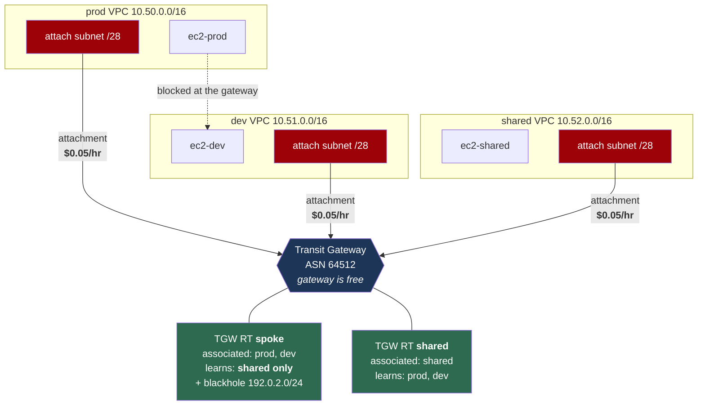

# Lab 05 — Transit Gateway

**Difficulty:** Advanced · **Time:** 60–90 min
**Cost:** ⚠️ **~USD 0.15/hour with the Transit Gateway enabled (~USD 110/month)** · Free when disabled

> ### ⚠️ The most expensive lab in this repository
>
> | Item | Cost |
> | --- | --- |
> | Transit Gateway itself | **Free** |
> | **Each VPC attachment** | **~USD 0.05/hour ≈ USD 36/month** |
> | Data processed | ~USD 0.02/GB |
>
> Three attachments = **~USD 0.15/hour, USD 3.60/day, USD 110/month.**
>
> Both `acknowledge_costs` and `enable_transit_gateway` must be `true` before
> anything chargeable is created. With them off, the lab builds three free,
> unconnected VPCs so you can read the topology and the code at zero cost.
>
> **Work through it in one sitting (about an hour, roughly fifteen cents), then
> destroy.**

Three VPCs on one gateway, where prod and dev can each reach shared services and
**neither can reach the other** — enforced by routing, in one place.

---

## Learning objectives

1. Explain what a Transit Gateway attachment is and what it costs.
2. State the difference between **association** and **propagation** without
   hesitating, and predict the symptom of getting each one wrong.
3. Build network segmentation with Transit Gateway route tables.
4. Use a blackhole route, and explain why it is invisible during troubleshooting.
5. Summarise routes at the VPC edge and say why that makes the design scale.
6. Describe the shared-services and centralised-inspection patterns.
7. Explain how a Transit Gateway is shared across accounts with AWS RAM.

## Concepts covered

Hub-and-spoke topology · VPC attachments · dedicated attachment subnets ·
Transit Gateway route tables · association versus propagation · network
segmentation · blackhole routes · route summarisation · shared-services and
inspection VPC patterns · appliance mode · cross-account sharing with RAM ·
Transit Gateway ASN and ECMP

---

## Architecture



## Traffic flow

**`ec2-prod` (10.50.0.5) → `ec2-shared` (10.52.0.5)** — works

1. prod's VPC route table matches the summary route `10.48.0.0/12 → tgw-xxx`.
2. The packet reaches the Transit Gateway via the prod attachment.
3. The gateway looks up the route table **associated** with that attachment: the
   `spoke` table.
4. `spoke` contains `10.52.0.0/16 → shared attachment`, learned by propagation.
5. The packet is delivered into the shared VPC.
6. The reply enters via the shared attachment, whose **association** is the
   `shared` table, which has learned `10.50.0.0/16`. It returns.

**`ec2-prod` → `ec2-dev` (10.51.0.5)** — dropped

Steps 1–3 are identical. At step 4 the `spoke` table has **no route** for
`10.51.0.0/16`, because dev was never propagated into it. The gateway discards
the packet.

Notice where the decision happened. prod's VPC route table happily forwarded the
packet — it has one broad summary route and knows nothing about segmentation.
The security groups permit ICMP from the whole supernet. **The only thing that
stopped it was the absence of one entry in one Transit Gateway route table.**

That is the design pattern: forwarding is dumb and centralised, policy lives in
one place, and adding a VPC does not mean editing every other VPC.

### Association versus propagation

This is where most Transit Gateway confusion lives.

| | Association | Propagation |
| --- | --- | --- |
| Answers | "Which table do I consult when **sending**?" | "Which tables **learn** my CIDR?" |
| Count per attachment | Exactly **one** | **Any number**, including zero |
| Direction | Outbound | Inbound (how others find you) |

Getting one wrong does not error:

- **Associated but not propagated** — you can send; nobody can reply.
- **Propagated but not associated** — others reach you; you cannot initiate.

Both look like a broken firewall. Neither is.

---

## Resources created

| Resource | Count | Cost |
| --- | --- | --- |
| VPCs, subnets, route tables, IGWs | 3 each | Free |
| Transit Gateway | 1 | Free |
| **VPC attachments** | **3** | **~USD 0.05/hr each** |
| TGW route tables | 2 | Free |
| Associations | 3 | Free |
| Propagations | 4 | Free |
| Blackhole route | 1 | Free |
| VPC routes to TGW | 3 | Free |
| EC2 `t4g.nano` + public IP | 3 | ~USD 0.031/hr total |

**Enabled: ~USD 0.15/hour. Disabled: USD 0.00.**

---

## Prerequisites

- [Lab 04](../04-vpc-peering/README.md) completed — you should be able to state
  why peering is not transitive before starting here
- Backend bucket from [`bootstrap/`](../../bootstrap/README.md)
- 3 VPCs of quota headroom
- Session Manager plugin

---

## Deploy

**Step 1 — free.** Look at the topology before paying for it:

```bash
cd labs/05-transit-gateway
cp backend.hcl.example backend.hcl && $EDITOR backend.hcl
cp terraform.tfvars.example terraform.tfvars

terraform init -backend-config=backend.hcl
terraform apply         # three free VPCs; Terraform warns the TGW is off
```

**Step 2 — the chargeable part.** When you have an hour free:

```hcl
# terraform.tfvars
acknowledge_costs      = true
enable_transit_gateway = true
```

```bash
terraform apply
terraform output cost_warning
```

Attachments take 2–4 minutes to reach `available`.

---

## Verification

### 1. Attachments exist and are billing

```bash
terraform output -json verify_commands | jq -r .list_attachments | bash
```

```
--------------------------------------------------------------------
|                DescribeTransitGatewayAttachments                 |
+---------------------+------+----------------+-------------------+
|         Id          | Type |   Resource     |      State        |
+---------------------+------+----------------+-------------------+
|  tgw-attach-0aaa... |  vpc |  vpc-0prod...  |  available        |
|  tgw-attach-0bbb... |  vpc |  vpc-0dev...   |  available        |
|  tgw-attach-0ccc... |  vpc |  vpc-0shar...  |  available        |
+---------------------+------+----------------+-------------------+
```

Three × USD 0.05/hour, from this moment.

### 2. The spoke route table proves the segmentation

```bash
terraform output -json verify_commands | jq -r .spoke_route_table | bash
```

```
------------------------------------------------------------------
|                  SearchTransitGatewayRoutes                    |
+-----------------+-------------+-------------+-----------------+
|      CIDR       |    Type     |    State    |   Attachment    |
+-----------------+-------------+-------------+-----------------+
|  10.52.0.0/16   |  propagated |  active     |  vpc-0shar...   |
|  192.0.2.0/24   |  static     |  blackhole  |  None           |
+-----------------+-------------+-------------+-----------------+
```

**`10.50.0.0/16` and `10.51.0.0/16` are absent.** prod and dev consult this
table, and it has no idea the other exists.

Compare:

```bash
terraform output -json verify_commands | jq -r .shared_route_table | bash
```

Both prod and dev appear. The asymmetry is the design.

### 3. Associations and propagations

```bash
terraform output -json verify_commands | jq -r .associations | bash
terraform output -json verify_commands | jq -r .propagations | bash
```

The spoke table has **two associations** (prod, dev) and **one propagation**
(shared). Read those two lists side by side until the difference is obvious.

### 4. Test it

```bash
terraform output connectivity_tests
terraform output segmentation_matrix
terraform output -json session_manager_commands | jq -r .prod
```

From `ec2-prod`:

```bash
ping -c 3 <shared_private_ip>    # 3 received
ping -c 3 <dev_private_ip>       # 100% packet loss
ping -c 3 192.0.2.10             # 100% packet loss — blackholed
```

From `ec2-shared`, both prod and dev respond.

---

## Hands-on exercises

### 1. Collapse the segmentation with one line

```hcl
allow_dev_to_prod = true
```

```bash
terraform apply
terraform output segmentation_matrix
```

One propagation added. prod can now ping dev. Nothing in any VPC changed — no
route table, no security group, no NACL.

This is worth sitting with. In a real account, whoever can add a Transit Gateway
propagation can join two environments that a compliance auditor believes are
isolated, and the change is a single line that no VPC-level review would catch.
Transit Gateway route tables belong under the same change control as security
groups.

Set it back to `false`.

### 2. Break it by confusing association and propagation

In `main.tf`, comment out
`aws_ec2_transit_gateway_route_table_propagation.into_shared_rt` and apply.

- prod → shared: the ICMP echo **arrives**. The spoke table still routes to
  shared.
- The reply is dropped: the shared table no longer knows where `10.50.0.0/16`
  lives.
- Symptom: 100% packet loss, exactly as if the route were missing entirely.

Now do the opposite — comment out
`aws_ec2_transit_gateway_route_table_association.spoke`. prod's attachment falls
back to no association at all, and prod can send nothing anywhere.

Neither produces an error message. Restore both.

### 3. Watch a blackhole route hide

```bash
terraform output -json verify_commands | jq -r .spoke_route_table | bash
```

`192.0.2.0/24` shows `State: blackhole`. It is a healthy, intentional entry.

Change `blackhole_cidr` to the shared VPC's range (`10.52.0.0/16`) and apply.
prod can no longer reach shared services — and:

- The VPC route table is unchanged and looks correct.
- The propagated route to shared **still exists** in the spoke table.
- The security groups are unchanged.
- Nothing errors.

The blackhole is more specific in the route table's eyes only because it is an
explicit static entry; a static route always wins over a propagated one for the
same prefix. This is a genuinely hard fault to find without knowing to look.
Flow logs (lab 08) show the traffic leaving and never arriving.

Set `blackhole_cidr` back to `192.0.2.0/24`.

### 4. Add a fourth VPC without touching anything

Sketch what it would take to add a `sandbox` VPC at `10.53.0.0/16`:

| With peering (lab 04) | With Transit Gateway |
| --- | --- |
| 3 new peering connections | 1 new attachment |
| 6 new route entries across 4 VPCs | **0** new VPC route entries — `10.48.0.0/12` already covers it |
| Every existing VPC's route table edited | 1 propagation decides what it can reach |

The summary route is what buys that. It is why `supernet_cidr` exists in this
lab and why serious designs reserve a contiguous block per Region up front.

### 5. Design a centralised inspection VPC

You want all inter-VPC traffic to pass through a firewall.

```
spoke VPCs  --associated-->  TGW RT "spoke"
                             default route 0.0.0.0/0 -> inspection attachment

inspection VPC --associated--> TGW RT "inspection"
                               learns every spoke CIDR
```

Traffic leaves a spoke, hits the gateway, is forced to the inspection VPC by a
default route, passes through the firewall appliance, returns to the gateway,
and is delivered. The spoke table contains **no** spoke-to-spoke routes at all —
only the default route to inspection.

One thing this needs that nothing else in the lab does: **appliance mode** on the
inspection VPC's attachment
(`appliance_mode_support = "enable"`). Without it, the Transit Gateway may send
the two directions of a flow through different Availability Zones, and a
stateful firewall that sees only half a conversation drops it. This is the
classic asymmetric-routing failure in centralised inspection designs.

Lab 08 builds the AWS Network Firewall version of this.

### 6. Cross-account sharing

A Transit Gateway is shared with other accounts using AWS Resource Access
Manager, not by peering:

```hcl
resource "aws_ram_resource_share" "tgw" {
  name                      = "transit-gateway-share"
  allow_external_principals = false     # keep it inside the organisation
}

resource "aws_ram_resource_association" "tgw" {
  resource_arn       = aws_ec2_transit_gateway.this[0].arn
  resource_share_arn = aws_ram_resource_share.tgw.arn
}

resource "aws_ram_principal_association" "spoke_account" {
  principal          = var.spoke_account_id      # or an Organizations OU ARN
  resource_share_arn = aws_ram_resource_share.tgw.arn
}
```

The spoke account then creates its **own** `aws_ec2_transit_gateway_vpc_attachment`
referencing the shared gateway ID. Points that catch people out:

- The **attachment** belongs to the spoke account and is billed to it. The
  network account owns the gateway and pays only for data processing.
- Only the gateway **owner** can manage route tables, associations and
  propagations. A spoke account can attach and nothing more — which is exactly
  the separation of duties you want.
- Sharing to an Organizations OU requires RAM sharing to be enabled for the
  organisation first.

This lab does not deploy it, because a second AWS account is needed and most
learners do not have one. The code above is complete.

---

## Troubleshooting exercises

### A. Attachment stuck in `pending`

```bash
aws ec2 describe-transit-gateway-attachments \
  --region $(terraform output -raw aws_region) \
  --query 'TransitGatewayAttachments[?State!=`available`].[TransitGatewayAttachmentId,State]' --output text
```

Usual causes: the attachment subnet does not exist in the AZ you named, the
Transit Gateway is still `pending` itself, or a cross-account share was not
accepted.

### B. Ping fails and every route looks right

Work down this list — the order matters, because each step is cheaper than the
next:

1. **VPC route table** — is there a route to the TGW covering the destination?
2. **TGW route table association** — which table does this attachment consult?
   `get-transit-gateway-route-table-associations`.
3. **Route in that table** — `search-transit-gateway-routes`. Missing, or
   present as a **blackhole**?
4. **Return path** — repeat steps 2 and 3 from the destination's side. Half the
   Transit Gateway faults in the world are one-way.
5. **Security group / NACL** at the destination.
6. **The attachment subnet's NACL** — if the attachment shares a subnet with
   workloads, its NACL applies to transiting traffic. This lab uses a dedicated
   /28 precisely to remove that possibility.

### C. Route table has the CIDR twice

A static route always beats a propagated route for the same prefix, regardless
of which was created first and regardless of prefix length being equal. If
someone added a static route "to be sure", it is now overriding BGP or
propagation learning and you cannot see that from the propagation list.

```bash
aws ec2 search-transit-gateway-routes \
  --transit-gateway-route-table-id <tgw-rtb-id> \
  --filters Name=state,Values=active,blackhole \
  --query 'Routes[].{CIDR:DestinationCidrBlock,Type:Type,State:State}' --output table
```

Look at the `Type` column. `static` beating `propagated` is the answer to a
surprising number of "but BGP is advertising it" tickets.

---

## Cleanup

**Do this promptly. Attachments bill by the hour whether or not traffic flows.**

```bash
terraform destroy
```

Attachment deletion takes several minutes. Then verify:

```bash
REGION=$(terraform output -raw aws_region 2>/dev/null || echo ap-southeast-1)

aws ec2 describe-transit-gateway-attachments --region $REGION \
  --filters Name=tag:Lab,Values=05-transit-gateway \
  --query 'TransitGatewayAttachments[?State!=`deleted`].[TransitGatewayAttachmentId,State]' --output text

aws ec2 describe-transit-gateways --region $REGION \
  --filters Name=tag:Lab,Values=05-transit-gateway \
  --query 'TransitGateways[?State!=`deleted`].[TransitGatewayId,State]' --output text
```

Both must be empty. **An orphaned attachment costs USD 36/month doing nothing**,
and it does not appear in the VPC console's main view — it is the most expensive
thing in this repository to forget about.

If `terraform destroy` fails on the Transit Gateway because attachments still
exist, wait two minutes for them to finish deleting and run it again. Deletion
order is enforced by AWS and Terraform sometimes races it.

---

## Further reading

- [What is a transit gateway?](https://docs.aws.amazon.com/vpc/latest/tgw/what-is-transit-gateway.html) — AWS
- [Transit Gateway route tables](https://docs.aws.amazon.com/vpc/latest/tgw/tgw-route-tables.html) — AWS
- [Transit Gateway design best practices](https://docs.aws.amazon.com/vpc/latest/tgw/tgw-best-design-practices.html) — AWS
- [Appliance mode support](https://docs.aws.amazon.com/vpc/latest/tgw/transit-gateway-appliance-scenario.html) — AWS
- [Sharing a transit gateway with AWS RAM](https://docs.aws.amazon.com/vpc/latest/tgw/tgw-transit-gateways.html#tgw-sharing) — AWS
- [Building a scalable and secure multi-VPC network infrastructure](https://docs.aws.amazon.com/whitepapers/latest/building-scalable-secure-multi-vpc-network-infrastructure/welcome.html) — AWS whitepaper
- [Transit Gateway pricing](https://aws.amazon.com/transit-gateway/pricing/) — AWS

**Next:** [Lab 06 — DNS and private service connectivity](../06-dns-and-privatelink/README.md)
