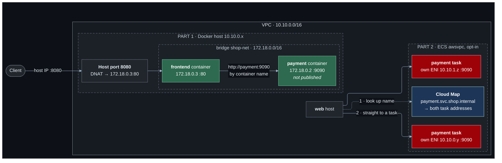

# Lab 06 — Container networking

**Difficulty:** Intermediate · **Time:** 60 min · **Cost:** USD 0.016/hour for the Docker host; **+USD 0.024/hour with ECS** (opt-in)

So far every application ran directly on a host and used the host's network.
A container has a network of its own. This lab runs the shop in containers
twice, to show the two ways that private network is joined to everything
else: translated at the host, or made a first-class member of the VPC.

**Video:** section 7 (container networking).

**What changes from lab 05:** `containers.tf` is new. Nothing else is touched.

---

## Learning objectives

1. Describe a Docker bridge network: where it exists, what addresses it uses,
   and who can reach it.
2. Explain how containers on a user-defined bridge find each other by name.
3. Explain port mapping as destination address translation, and find the rule
   that implements it.
4. Explain what an overlay network is for, and why ECS `awsvpc` mode does not
   need one.
5. Explain why replicas make service discovery necessary, and resolve a
   service name to its replicas.

## Concepts covered

Network namespaces · bridge networks · container DNS · container ports versus
host ports · port mapping (publishing) · DNAT · overlay networks · `awsvpc`
networking · task ENIs · service replicas · service discovery (Cloud Map) ·
IP target groups

---

## Architecture



On the left, `172.18.x.x` addresses exist only inside one host; the VPC has
never heard of them. On the right, each task has an address the VPC routes to
directly.

## Traffic flow

**Part 1 — `curl http://<docker host public IP>:8080/`**

1. The packet arrives at the host on port 8080. The security group allowed
   it — it knows about the **host** port and nothing about containers.
2. Nothing on the host is listening on 8080 in the usual sense. Docker
   installed a **DNAT** rule: destination `host:8080` becomes
   `172.18.0.3:80`, the frontend container's address on the bridge.
3. The packet crosses the `shop-net` bridge into the container's network
   namespace, where the frontend is listening on 80.
4. The frontend calls `http://payment:9090/`. Docker's embedded DNS server,
   present on every user-defined bridge, answers `172.18.0.2`. The packet
   crosses the bridge; it never leaves the host.
5. The payment container published no port. Nothing outside the host can
   reach it, whatever the security group says.

**Part 2 — the web host calls `payment.svc.shop.internal:9090`**

1. The VPC resolver answers with one A record per running task — two
   addresses, both real VPC addresses.
2. The web host connects to one. The `local` route delivers it to the task's
   own network interface. No host port, no translation.
3. The task's **own security group** allows 9090 from the VPC.
4. ECS replaces a task: its address changes, Cloud Map is updated, and the
   next lookup returns the new set. Nobody edits a configuration file.

**Where overlay networks fit.** A bridge stops at the edge of one host. To
connect containers on *different* hosts, Docker Swarm and many Kubernetes
setups build an **overlay**: a virtual network whose packets are wrapped
inside ordinary packets between the hosts. `awsvpc` mode avoids the problem
instead of solving it — the VPC is already a network that spans hosts, so
each task simply joins it.

---

## Resources created

| Resource | When | Cost |
| --- | --- | --- |
| Docker host (`t4g.micro`) + public IPv4 | `enable_docker_host` (default on) | ~USD 0.016/hour |
| ECS cluster, task definition, log group | `enable_ecs` | Free |
| Fargate tasks ×2 (0.25 vCPU, 0.5 GiB, ARM) | `enable_ecs` | **~USD 0.024/hour** |
| Cloud Map namespace + service | `enable_ecs` | ~USD 0.50/month for the hosted zone |
| IP target group + listener rule | `enable_ecs` and `enable_load_balancer` | Free |

## Prerequisites

- Terraform `>= 1.11.0` and AWS credentials for a sandbox account
  (`aws sts get-caller-identity`).
- The state bucket from [`bootstrap/`](../../bootstrap/README.md).
- Lab 05 applied, or at least read: this lab changes what it built. See [`../05-load-balancing/`](../05-load-balancing/README.md).
- The [Session Manager plugin](https://docs.aws.amazon.com/systems-manager/latest/userguide/session-manager-working-with-install-plugin.html)
  for the AWS CLI, to open a shell on a host.

How the labs fit together, and what "one project, one state" means in
practice, is in [`docs/working-with-the-labs.md`](../../docs/working-with-the-labs.md).

## Deploy

Every lab uses the same state, so this lab **upgrades** what the previous one
built. Carry your settings forward and add the new ones:

```bash
cd labs/06-container-networking

cp ../05-load-balancing/backend.hcl .
cp ../05-load-balancing/terraform.tfvars .
diff terraform.tfvars terraform.tfvars.example   # what this lab adds; copy across what you want

terraform init -backend-config=backend.hcl
terraform plan                                   # read it: this is the lab
terraform apply
```

To see exactly what changed in the code: `make lab-diff FROM=05-load-balancing TO=06-container-networking`
from the repository root.

Part 1 needs nothing set. For part 2:

```hcl
acknowledge_costs = true
enable_ecs        = true
```

With no NAT gateway the tasks run in the public subnets with a public address
each, because they must pull their image. With `enable_nat_gateway = true`
they move to the app subnets. That choice is in `containers.tf` and is worth
reading.

---

## Verification

`terraform output verify_containers` prints these with your values.

### 1. Through the published port

```bash
curl -s "$(terraform output -raw docker_frontend_url)"
```

Expected — look at the addresses:

```json
{"service": "frontend", "host": "3f9c2a…", "client_seen": "198.51.100.23",
 "upstream": {"service": "payment", "host": "a81b07…", "client_seen": "172.18.0.3"}}
```

`host` is a container ID. The payment container saw the request come from
`172.18.0.3`: an address that exists nowhere in the VPC.

### 2. Inside the host

Open a shell with `terraform output -raw ssm_docker_host`, then:

```bash
sudo docker network inspect shop-net --format '{{range .Containers}}{{.Name}} {{.IPv4Address}}{{println}}{{end}}'
sudo docker port frontend                       # 80/tcp -> 0.0.0.0:8080
sudo docker exec frontend python -c "import socket; print(socket.gethostbyname('payment'))"
sudo nft list ruleset | grep -i dnat            # the translation rule itself
ip -4 addr show | grep -E 'br-|docker0'          # the bridge is an interface on the host
```

### 3. Not published means not reachable

```bash
curl -s --max-time 5 "http://<docker host public IP>:9090/" || echo "timed out, as intended"
```

### 4. Tasks are VPC hosts

```bash
terraform output -json verify_containers | jq -r .task_addresses | sh
```

Two tasks, two `10.10.x.x` addresses, in two Availability Zones.

### 5. Service discovery

From a shell on the web host:

```bash
dig +short payment.svc.shop.internal            # two addresses
for i in 1 2 3 4; do curl -s http://payment.svc.shop.internal:9090/ | grep -o '"host": "[^"]*"'; done
```

Different `host` values across requests: different replicas answered.

### 6. Behind the load balancer

With lab 05's load balancer on, `/tasks` is routed to the tasks through an
**IP** target group:

```bash
curl -s "http://$(terraform output -raw load_balancer_dns_name)/tasks"
```

---

## Hands-on exercises

### 1. The default bridge has no DNS

On the Docker host, start a container on the default bridge and try to
resolve `payment`:

```bash
sudo docker run --rm public.ecr.aws/docker/library/python:3.13-alpine \
  python -c "import socket; print(socket.gethostbyname('payment'))"
```

It fails. Add `--network shop-net` and it works. Name resolution is a feature
of user-defined networks.

### 2. Two containers, the same container port

Run a second frontend on `shop-net` with `-p 8081:80`. Both containers listen
on port 80 without conflict — each has its own network namespace. Only the
**host** port has to be unique.

### 3. Kill a replica

```bash
aws ecs list-tasks --cluster shop --query 'taskArns[0]' --output text | xargs aws ecs stop-task --cluster shop --task
```

Repeat `dig +short payment.svc.shop.internal` every few seconds. One address
disappears, a different one appears. This is why clients must use the name.

### 4. Scale

Set `ecs_desired_count = 4` and apply. Four records. No client changed.

---

## Troubleshooting exercises

### A. The security group is open and it still times out

Open port 9090 on the Docker host's security group. It still times out,
because no host port is mapped to the payment container. **A firewall rule
cannot make something listen.**

### B. Tasks stuck in PENDING

Fargate tasks that cannot pull their image never start. With no NAT gateway,
`assign_public_ip` is what gives them a path; set it to `false` in your head
and trace where the pull fails. The fix on a real project is ECR interface
endpoints plus the S3 gateway endpoint from lab 04.

---

## Cleanup

Moving on to the next lab? **Do not destroy** -- the next lab builds on this
one. Turn off any opt-in you no longer need (set its `enable_*` flag to `false`
and `terraform apply`) so it stops billing.

Finished for now? Destroy from **this** folder -- the folder you applied last:

```bash
terraform destroy
```

Then confirm nothing is left:

```bash
aws resourcegroupstaggingapi get-resources --tag-filters Key=Project,Values=shop \
  --query 'ResourceTagMappingList[].ResourceARN' --output text
```

Empty output means clean.

---

## Further reading

- [Docker bridge network driver](https://docs.docker.com/engine/network/drivers/bridge/) — Docker
- [Docker overlay network driver](https://docs.docker.com/engine/network/drivers/overlay/) — Docker
- [Published ports](https://docs.docker.com/engine/network/port-publishing/) — Docker
- [ECS task networking: awsvpc](https://docs.aws.amazon.com/AmazonECS/latest/developerguide/task-networking-awsvpc.html) — AWS
- [ECS service discovery](https://docs.aws.amazon.com/AmazonECS/latest/developerguide/service-discovery.html) — AWS
- [Fargate pricing](https://aws.amazon.com/fargate/pricing/) — AWS

**Next:** [Lab 07](../07-kubernetes-networking/README.md)
