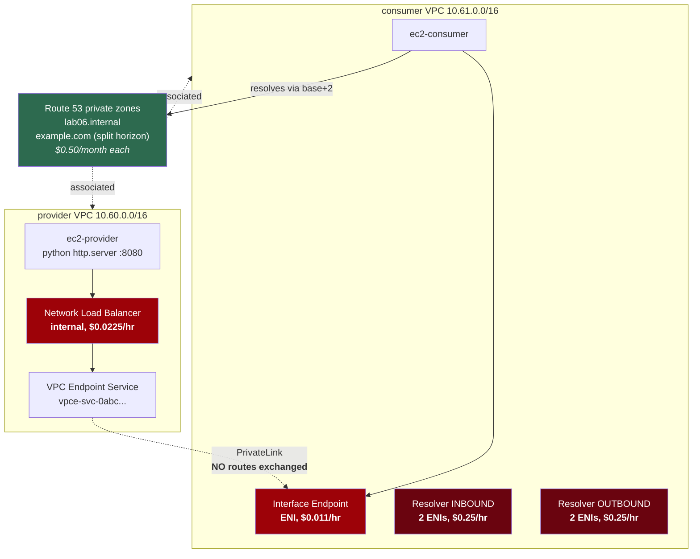

# Lab 06 — DNS and private service connectivity

**Difficulty:** Advanced · **Time:** 60–75 min
**Cost:** ~USD 0.011/hour + USD 1/month for zones · **+~USD 0.045/hour PrivateLink** · ⚠️ **+USD 0.25/hour per Resolver endpoint**

DNS and PrivateLink are one lab because in practice a PrivateLink problem is
almost always a DNS problem.

---

## Learning objectives

1. Explain what a Route 53 private hosted zone is and why it resolves only from
   associated VPCs.
2. Build split-horizon DNS and describe both its use and its failure mode.
3. Publish a service with PrivateLink and consume it from another VPC **without
   exchanging any routes**.
4. Explain why PrivateLink works with overlapping CIDRs and peering does not.
5. Describe what inbound and outbound Route 53 Resolver endpoints do, and why
   they cost USD 180/month each.
6. Diagnose the four distinct ways DNS breaks in a VPC.

## Concepts covered

Private hosted zones · zone-to-VPC association · the VPC resolver at base+2 ·
split-horizon DNS · PrivateLink endpoint services · Network Load Balancers as
the service front end · allowed principals · endpoint DNS names and friendly
aliases · Route 53 Resolver inbound and outbound endpoints · Resolver forwarding
rules and rule associations · DNS over UDP and TCP

---

## Architecture



## Traffic flow

**`ec2-consumer` → the provider's service**

1. The application resolves `service.lab06.internal`. The VPC resolver (at the
   VPC base address plus two — `10.61.0.2`) answers from the private hosted
   zone with a CNAME to the endpoint's DNS name, which resolves to a private
   address **in the consumer VPC**: `10.61.0.x`.
2. The packet matches `10.61.0.0/16 → local`. It never leaves the consumer VPC's
   routing domain.
3. The endpoint ENI's security group is evaluated on TCP 8080.
4. PrivateLink forwards the connection to the provider's NLB over the AWS
   backbone.
5. The NLB forwards to `ec2-provider` on 8080.

**The consumer VPC has no route to `10.60.0.0/16` and never learns it exists.**
The provider's address space is entirely invisible. That is why the two VPCs may
use identical CIDRs, and why PrivateLink is the right answer to "team X needs to
call team Y's API" far more often than peering is.

It is also unidirectional by construction. The provider cannot initiate anything
toward the consumer — there is no path in that direction at all.

---

## Resources created

| Resource | Count | Cost |
| --- | --- | --- |
| VPCs, subnets, route tables, IGWs | 2 each | Free |
| Private hosted zones | 1–2 | **USD 0.50/month each** |
| DNS records | 3–4 | Free (queries: USD 0.40 per million) |
| EC2 `t4g.nano` + public IP | 1–2 | ~USD 0.010/hr each |
| **Network Load Balancer (opt-in)** | 1 | **~USD 0.0225/hr + LCUs** |
| **Endpoint service + interface endpoint (opt-in)** | 1 + 2 ENIs | **~USD 0.011/ENI-hr** |
| **Resolver inbound endpoint (opt-in)** | 2 ENIs | **USD 0.25/hr — USD 180/month** |
| **Resolver outbound endpoint (opt-in)** | 2 ENIs | **USD 0.25/hr — USD 180/month** |

> ### ⚠️ Route 53 Resolver endpoints
>
> USD 0.125 per ENI-hour, and **AWS requires a minimum of two ENIs in different
> Availability Zones**. There is no cheaper configuration. USD 0.25/hour is
> USD 6/day and USD 180/month.
>
> Enable one for twenty minutes (about eight cents), run the tests, disable it.

---

## Prerequisites

- [Lab 03](../03-private-access-and-vpc-endpoints/README.md) — you should
  already know what an interface endpoint is
- Backend bucket from [`bootstrap/`](../../bootstrap/README.md)
- `dig` on your laptop (`bind-utils` / `dnsutils`)

---

## Deploy

**Step 1 — DNS only, almost free:**

```bash
cd labs/06-dns-and-privatelink
cp backend.hcl.example backend.hcl && $EDITOR backend.hcl
cp terraform.tfvars.example terraform.tfvars

terraform init -backend-config=backend.hcl
terraform apply
```

**Step 2 — PrivateLink**, when you want the interesting half:

```hcl
acknowledge_costs  = true
enable_privatelink = true
```

**Step 3 — Resolver endpoints**, briefly:

```hcl
enable_resolver_inbound_endpoint = true
```

---

## Verification

### 1. Private zones resolve only inside the VPC

```bash
terraform output -raw session_manager_command | bash
```

In the session:

```bash
cat /etc/resolv.conf
# nameserver 10.61.0.2      <- the VPC base address plus two

dig +short consumer.lab06.internal
# 10.61.0.147
```

Now, **on your laptop**:

```bash
dig +short consumer.lab06.internal
# (empty — NXDOMAIN)
```

Same name, same Route 53 service, different answer. A private hosted zone is
scoped to the VPCs it is associated with, and there is no path to it from
anywhere else without a Resolver inbound endpoint.

### 2. Split-horizon DNS

In the session:

```bash
dig +short example.com
# 10.61.0.147     <- your consumer instance
```

On your laptop:

```bash
dig +short example.com
# 23.215.0.136 (or whatever the real answer is today)
```

You have overridden a public domain for everything inside two VPCs. Used
deliberately, this points `api.example.com` at an internal load balancer for
internal clients. Used carelessly, it black-holes a third-party service for your
whole VPC and produces a support ticket nobody can reproduce from outside.

The critical detail: a private hosted zone is **authoritative** inside its
associated VPCs. Route 53 does not fall through to the public answer for names
it does not find in the private zone — if you create a private zone for
`example.com` and it contains only an apex record, then `www.example.com` is
`NXDOMAIN` inside the VPC even though it resolves fine publicly.

### 3. PrivateLink

```bash
terraform output privatelink_service_name
# com.amazonaws.vpce.ap-southeast-1.vpce-svc-0abc123def456
```

That string is the entire interface. Hand it to a consuming team and they can
build an endpoint; it tells them nothing about your VPC, your CIDR, or your
instances.

In the consumer session:

```bash
terraform output dns_tests     # from your laptop first, to get the names

# The generated name — accurate, unusable
curl -s http://vpce-0abc-xyz.vpce-svc-0def.ap-southeast-1.vpce.amazonaws.com:8080/

# The friendly alias in the private hosted zone
curl -s http://service.lab06.internal:8080/
```

Both return:

```
Hello from the PROVIDER VPC, reached over AWS PrivateLink.
Your packets never left the AWS network and no routes were exchanged.
```

Then prove the point:

```bash
dig +short service.lab06.internal
# 10.61.0.x    <- an address in the CONSUMER VPC. The provider's 10.60.x.x is invisible.

ip route
# no route to 10.60.0.0/16 anywhere
```

### 4. Resolver inbound endpoint

```bash
terraform output resolver_inbound_ips
# ["10.61.0.55", "10.61.1.87"]
```

From the consumer instance, query it directly rather than through the default
resolver — which is exactly what an on-premises DNS server would do over a VPN:

```bash
dig @10.61.0.55 +short consumer.lab06.internal
# 10.61.0.147
```

That is the whole function of an inbound endpoint: a private-hosted-zone
resolver with an address reachable from outside AWS.

---

## Hands-on exercises

### 1. Give both VPCs the same CIDR

```hcl
provider_vpc_cidr = "10.60.0.0/16"
consumer_vpc_cidr = "10.60.0.0/16"
```

Apply, and re-run the `curl` test. **It works.** PrivateLink exchanges no
routes, so there is no address conflict to resolve.

Then try the same thing in [lab 04](../04-vpc-peering/README.md). Terraform's
validation stops you, and AWS would reject the peering connection. This single
difference decides a great many real architecture arguments — two teams whose
address spaces collide can integrate over PrivateLink today, or spend a quarter
re-addressing a VPC.

### 2. Turn on acceptance and watch the endpoint hang

```hcl
# In main.tf, aws_vpc_endpoint_service.provider:
acceptance_required = true
```

Apply. The consumer endpoint sits in `pendingAcceptance`:

```bash
terraform output -json verify_commands | jq -r .endpoint_connections | bash
```

Nothing works until the provider accepts. In production this is the right
default — it means a consumer cannot connect to your service just by knowing its
name. Accept it:

```bash
aws ec2 accept-vpc-endpoint-connections \
  --service-id <svc-id> --vpc-endpoint-ids <vpce-id> \
  --region $(terraform output -raw aws_region)
```

### 3. Remove yourself from the allowed principals

Comment out `aws_vpc_endpoint_service_allowed_principal.this_account` and apply,
then destroy and recreate the consumer endpoint. It fails: with no allowed
principals, nobody may connect at all — not even the service owner's own
account. Allowed principals are the access control layer; acceptance is the
workflow layer. You need both.

### 4. The Resolver outbound endpoint and an honest failure

```hcl
enable_resolver_outbound_endpoint = true
forward_domain                    = "corp.internal"
forward_target_ips                = ["192.0.2.53"]
```

Apply, wait a minute, then from the consumer instance:

```bash
dig +short test.corp.internal
# ;; connection timed out; no servers could be reached
```

**This is correct behaviour, not a broken lab.** `192.0.2.53` is an RFC 5737
documentation address; nothing is listening. The rule, the association and the
endpoint are all real and correctly configured — they are faithfully forwarding
queries to a server that does not exist.

That is precisely what a misconfigured hybrid DNS setup looks like in
production, and the diagnostic path is the same:

```bash
# Is the rule associated with this VPC at all?
aws route53resolver list-resolver-rule-associations --region <region>

# Is the endpoint healthy?
aws route53resolver list-resolver-endpoints --region <region>

# Can anything in the VPC reach the target on 53/udp?
nc -vzu 192.0.2.53 53
```

In a real deployment, `forward_target_ips` would be on-premises DNS servers
reachable over the Site-to-Site VPN from [lab 07](../07-hybrid-networking/README.md).
Point `forward_target_ips` at the simulated on-premises host from that lab and
this becomes a working hybrid DNS setup.

**Disable the outbound endpoint immediately afterwards — USD 6/day.**

### 5. Compare the three private-connectivity mechanisms

| Requirement | Answer | Why |
| --- | --- | --- |
| Full IP connectivity, 2 VPCs, one Region | Peering | Free, simple |
| Full IP connectivity, 8 VPCs + on-premises | Transit Gateway | Peering needs 28 connections |
| One team consumes one API from another | **PrivateLink** | No route exchange, works with overlapping CIDRs, unidirectional |
| Reach S3 from a private subnet | S3 gateway endpoint | Free |
| Reach SSM from a private subnet | Interface endpoint | The only option without NAT |
| Resolve on-premises names from AWS | Resolver **outbound** endpoint + rule | |
| Resolve AWS private zones from on-premises | Resolver **inbound** endpoint | |

---

## Troubleshooting exercises

### A. The four ways DNS breaks in a VPC

| Symptom | Cause | Check |
| --- | --- | --- |
| Nothing resolves at all | `enable_dns_support` off on the VPC | `describe-vpc-attribute --attribute enableDnsSupport` |
| Private zone names do not resolve | Zone not associated with this VPC | `list-hosted-zones-by-vpc` |
| Interface endpoint private DNS does nothing | `enable_dns_hostnames` off | `describe-vpc-attribute --attribute enableDnsHostnames` |
| A public name resolves to the wrong address | A private hosted zone is shadowing it | `list-hosted-zones-by-vpc`, look for the parent domain |

The fourth one is the nasty one. Symptoms appear for a service you do not own,
only from inside one VPC, and the cause is a zone somebody created months ago.

### B. Disassociate the zone

```bash
aws route53 disassociate-vpc-from-hosted-zone \
  --hosted-zone-id $(terraform output -raw private_hosted_zone_id) \
  --vpc VPCRegion=$(terraform output -raw aws_region),VPCId=$(terraform output -json vpc_ids | jq -r .consumer)
```

From the consumer instance, `dig consumer.lab06.internal` now returns
`NXDOMAIN`. The zone still exists, the record still exists, and the VPC simply
cannot see it. `terraform apply` puts it back.

### C. Allow UDP 53 but not TCP 53

Comment out `aws_vpc_security_group_ingress_rule.resolver_tcp` and apply. Short
answers keep working; anything over 512 bytes fails. This produces intermittent
DNS failures that correlate with response size rather than with anything
obvious, and it is a real and common firewall mistake.

### D. PrivateLink endpoint exists but connections fail

Work down this list:

1. **Endpoint state** — `pendingAcceptance` means the provider has not approved.
2. **Endpoint security group** — must allow the service port, from the consumer
   subnet.
3. **NLB target health** — `describe-target-health`. An unhealthy target means
   the endpoint is fine and the service is not.
4. **Target's security group** — an NLB has no security group, so the target
   must allow the **VPC CIDR**, not a source security group.

Point 4 catches people who are used to Application Load Balancers, which do have
security groups you can reference.

---

## Cleanup

```bash
terraform destroy
```

```bash
REGION=$(terraform output -raw aws_region 2>/dev/null || echo ap-southeast-1)

# Resolver endpoints are the expensive leftover: USD 6/day each.
aws route53resolver list-resolver-endpoints --region $REGION \
  --query 'ResolverEndpoints[?Status!=`DELETING`].[Id,Name,Direction,Status]' --output text

aws elbv2 describe-load-balancers --region $REGION \
  --query 'LoadBalancers[?contains(LoadBalancerName, `lab06`)].[LoadBalancerName,State.Code]' --output text

aws ec2 describe-vpc-endpoint-service-configurations --region $REGION \
  --query 'ServiceConfigurations[].[ServiceId,ServiceState]' --output text

# Private hosted zones survive if a VPC association blocks deletion.
aws route53 list-hosted-zones --query 'HostedZones[?Config.PrivateZone==`true`].[Id,Name]' --output text
```

An endpoint service cannot be deleted while a consumer endpoint is connected;
Terraform handles the ordering, but a manually created endpoint will block it.

---

## Further reading

- [Working with private hosted zones](https://docs.aws.amazon.com/Route53/latest/DeveloperGuide/hosted-zones-private.html) — AWS
- [Route 53 Resolver](https://docs.aws.amazon.com/Route53/latest/DeveloperGuide/resolver.html) — AWS
- [Resolver forwarding rules](https://docs.aws.amazon.com/Route53/latest/DeveloperGuide/resolver-rules-managing.html) — AWS
- [Share your services through AWS PrivateLink](https://docs.aws.amazon.com/vpc/latest/privatelink/privatelink-share-your-services.html) — AWS
- [Configure a VPC endpoint service](https://docs.aws.amazon.com/vpc/latest/privatelink/create-endpoint-service.html) — AWS
- [Private DNS names for endpoint services](https://docs.aws.amazon.com/vpc/latest/privatelink/manage-dns-names.html) — AWS
- [Hybrid DNS resolution patterns](https://docs.aws.amazon.com/whitepapers/latest/hybrid-cloud-dns-options-for-vpc/hybrid-cloud-dns-options-for-vpc.html) — AWS whitepaper
- [Route 53 Resolver pricing](https://aws.amazon.com/route53/pricing/) — AWS

**Next:** [Lab 07 — Hybrid networking](../07-hybrid-networking/README.md)
