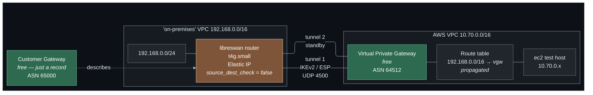
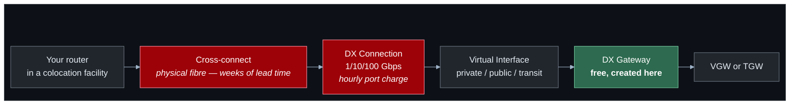

# Lab 07 — Hybrid networking

**Difficulty:** Advanced · **Time:** 75–90 min
**Cost:** Free by default · **+~USD 0.05/hour VPN connection** · **+~USD 0.026/hour simulated on-premises router**

A real IPsec tunnel between AWS and a "data centre" — which is a second VPC
running libreswan, configured from the actual pre-shared keys AWS generates.
The tunnels genuinely come UP.

---

## Learning objectives

1. Distinguish a customer gateway, a virtual private gateway, a VPN connection
   and a VPN attachment, and say which of them cost money.
2. Explain why AWS always provisions **two** tunnels and what that buys.
3. Configure a real IPsec peer from the tunnel parameters AWS generates.
4. Compare static routing with BGP, and describe what changes at failover.
5. Explain why a virtual private gateway does not scale and a Transit Gateway
   VPN attachment does.
6. Describe the Direct Connect architecture — connections, virtual interfaces,
   DX gateways — and say precisely which parts Terraform can and cannot create.
7. Diagnose a tunnel that will not come up.

## Concepts covered

Customer gateways · virtual private gateways · Site-to-Site VPN · IKEv2 and
IPsec phase 1/phase 2 · pre-shared keys · NAT traversal · dead peer detection ·
static routes versus BGP · route propagation · redundant tunnels · Transit
Gateway VPN attachments · Direct Connect connections, virtual interfaces and DX
gateways · source/destination checking on EC2 · reverse-path filtering

---

## Architecture



## Traffic flow

**`ec2` in AWS (10.70.0.5) → a host on-premises (192.168.0.10)**

1. The VPC route table has `192.168.0.0/16 → vgw-xxx`, **propagated** from the
   VPN's static route rather than typed by hand.
2. The virtual private gateway encrypts the packet with the phase 2 security
   association and sends it to the customer gateway's public address, as ESP
   encapsulated in UDP 4500.
3. The router decrypts it. The kernel's IPsec policy matched
   `10.70.0.0/16 → 192.168.0.0/16`.
4. The router forwards it onto the on-premises LAN. This needs
   `net.ipv4.ip_forward = 1` **and** EC2's source/destination check disabled —
   without the latter, EC2 drops the packet before it leaves the instance.

**Why there are always two tunnels.** AWS terminates each VPN connection on two
endpoints in two Availability Zones. This is not an upsell; it is how AWS
maintains its VPN SLA, since either endpoint can be taken out for maintenance.

- **Static routing:** one tunnel carries traffic. When dead peer detection
  notices it has gone, traffic moves to the second. Failover takes tens of
  seconds.
- **BGP:** the on-premises router peers over both tunnels. With ECMP enabled on
  a Transit Gateway, both carry traffic simultaneously, and failover is a BGP
  convergence — seconds, and no route table is edited by anyone.

Production uses BGP. This lab defaults to static because the simulated router
runs an IPsec daemon and not a routing daemon, and pretending otherwise would
be exactly the kind of thing this repository avoids.

---

## Resources created

| Resource | Cost |
| --- | --- |
| VPC, subnets, route tables, IGW | Free |
| Customer gateway | **Free** — only a record of an IP and an ASN |
| Virtual private gateway | **Free** |
| Direct Connect gateway (opt-in) | **Free** with no virtual interfaces attached |
| **Site-to-Site VPN connection (opt-in)** | **~USD 0.05/hour**, billed from creation whether or not a tunnel comes up |
| **Simulated on-premises VPC + router (opt-in)** | ~USD 0.021/hr `t4g.small` + ~USD 0.005/hr Elastic IP |
| **Transit Gateway + 2 attachments (opt-in)** | ~USD 0.10/hour |
| AWS-side test instance | ~USD 0.010/hour |

**Fully enabled with the simulation: ~USD 0.09/hour (~USD 2.15/day).**

> ⚠️ A VPN connection bills from the moment it exists. If you create one with
> nothing on the far side, the tunnels stay `DOWN` and you are charged anyway.
> The `on_premises_side_exists` check block warns about exactly this.

### Terraform state contains secrets

AWS generates the pre-shared keys and Terraform stores them in state. The
`vpn_preshared_keys` output is marked `sensitive`, and the rendered user data on
the router contains them too — readable from that instance's metadata service.
Your state bucket is encrypted and blocked from public access; treat it as a
secret store. See [SECURITY.md](../../SECURITY.md).

---

## Deploy

**Step 1 — free.** Everything except the VPN connection:

```bash
cd labs/07-hybrid-networking
cp backend.hcl.example backend.hcl && $EDITOR backend.hcl
cp terraform.tfvars.example terraform.tfvars

terraform init -backend-config=backend.hcl
terraform apply
```

**Step 2 — the tunnel.** Roughly nine cents an hour with the simulation:

```hcl
acknowledge_costs            = true
enable_site_to_site_vpn      = true
enable_simulated_on_premises = true
```

```bash
terraform apply     # 4-6 minutes; VPN connections are slow to provision
```

Then wait. The router installs libreswan on first boot and negotiates; the
tunnels typically reach `UP` **3–6 minutes** after the instance launches.

---

## Verification

### 1. Watch the tunnels come up

```bash
watch -n 20 "aws ec2 describe-vpn-connections \
  --vpn-connection-ids $(terraform output -raw vpn_connection_id) \
  --region $(terraform output -raw aws_region) \
  --query 'VpnConnections[0].VgwTelemetry[].{Outside:OutsideIpAddress,Status:Status,Message:StatusMessage,Routes:AcceptedRouteCount}' \
  --output table"
```

At first:

```
|  13.213.x.x  |  DOWN  |  IPSEC IS DOWN  |  0  |
|  54.254.x.x  |  DOWN  |  IPSEC IS DOWN  |  0  |
```

After a few minutes, at least one:

```
|  13.213.x.x  |  UP    |  IPSEC IS UP    |  1  |
```

`IPSEC IS UP` means phase 2 completed. With static routing the second tunnel
usually stays `DOWN` until the first fails — that is standby, not a fault.

### 2. From the router

```bash
terraform output -json session_manager_commands | jq -r .on_premises_router
```

In the session:

```bash
sudo tunnel-status
```

Look for `ISAKMP SA established` (phase 1) and `IPsec SA established` (phase 2),
and for byte counters in `ipsec trafficstatus`.

If it is not up:

```bash
sudo cat /var/log/lab07-router-setup.log
sudo journalctl -u ipsec -n 100 --no-pager
```

The setup log is written by the user-data script and shows package
installation, the rendered configuration, and the first connection attempt.

### 3. Ping across

```bash
terraform output aws_instance_private_ip
```

From the router:

```bash
ping -c 5 10.70.0.x
```

Packets that cross an IPsec tunnel between two VPCs, over the public internet,
encrypted. Watch it happen:

```bash
sudo tcpdump -ni any esp or 'udp port 4500' -c 20
```

### 4. Routes were propagated, not typed

```bash
terraform output -json tunnel_tests | jq -r '."5_vpc_route_table"' | bash
```

```
|  10.70.0.0/16     |  local     |  CreateRouteTable  |  active |
|  0.0.0.0/0        |  igw-0...  |  CreateRoute       |  active |
|  192.168.0.0/16   |  vgw-0...  |  EnableVgwRoutePropagation | active |
```

`Origin: EnableVgwRoutePropagation` is the tell. Nobody wrote that route;
`aws_vpn_gateway_route_propagation` let the gateway install it. With BGP the
same mechanism installs whatever the far side advertises.

---

## Hands-on exercises

### 1. Break the tunnel and watch failover

From the router:

```bash
sudo ipsec auto --down aws-tunnel1
```

Re-run the telemetry command. Tunnel 1 goes `DOWN`; within about 30 seconds
tunnel 2 goes `UP` and traffic resumes. Bring it back:

```bash
sudo ipsec auto --up aws-tunnel1
```

This is the failover a static-routing VPN gives you: correct, and measured in
tens of seconds. With BGP it would be single-digit seconds and both tunnels
would have been carrying traffic already.

### 2. Break source/destination checking

```bash
aws ec2 modify-instance-attribute \
  --instance-id $(terraform output -raw on_premises_router_id) \
  --source-dest-check \
  --region $(terraform output -raw aws_region)
```

The tunnel stays `UP`. Pings from other hosts on the on-premises LAN to AWS
stop, because EC2 now drops packets the router is forwarding on behalf of
others. Pings from the router itself still work, because those are its own
traffic.

**A working tunnel with no traffic passing is almost always this**, or IP
forwarding. Restore it:

```bash
aws ec2 modify-instance-attribute \
  --instance-id $(terraform output -raw on_premises_router_id) \
  --no-source-dest-check \
  --region $(terraform output -raw aws_region)
```

### 3. Terminate on a Transit Gateway instead

```hcl
enable_transit_gateway_attachment = true
```

Apply. The virtual private gateway is replaced by a Transit Gateway with a VPC
attachment and a VPN attachment. Functionally identical for one VPC — and
completely different for ten, because a VGW serves exactly one VPC and cannot be
shared, while one VPN attachment on a Transit Gateway serves every VPC attached
to it.

| | Virtual private gateway | Transit Gateway VPN attachment |
| --- | --- | --- |
| VPCs served | Exactly 1 | All attached VPCs |
| Cost | Free | ~USD 0.05/hr per attachment |
| ECMP across tunnels | No | Yes, with BGP |
| Route control | VPC route tables | Transit Gateway route tables |

Ten VPCs needing on-premises access means ten VGWs and ten VPN connections
(USD 360/month) versus one VPN attachment and ten VPC attachments.

### 4. Read AWS's own configuration for a real device

```bash
aws ec2 get-vpn-connection-device-types --region <region> --output table

aws ec2 get-vpn-connection-device-sample-configuration \
  --vpn-connection-id $(terraform output -raw vpn_connection_id) \
  --vpn-connection-device-type-id <id> \
  --region <region> --output text
```

AWS generates a complete, vendor-specific configuration — Cisco, Juniper,
Fortinet, pfSense, generic — with the real keys and addresses filled in. Compare
it against `templates/on-premises-router.sh.tftpl`; the structure is the same.
This is what you would hand to a network team.

### 5. What BGP would change

With `use_bgp = true` and a real BGP-capable device:

- `aws_vpn_connection_route` disappears. The far side advertises its prefixes.
- The tunnel inside `/30`s (`terraform output vpn_tunnel_inside_cidrs`) stop
  being decorative and carry the BGP session.
- The customer gateway ASN matters: it must differ from the AWS side's.
- With `vpn_ecmp_support` on a Transit Gateway, both tunnels carry traffic.
- `AcceptedRouteCount` in the telemetry shows how many prefixes AWS learned —
  the fastest way to tell whether BGP is actually working.

---

## Direct Connect

**What this lab creates:** an `aws_dx_gateway` and its association to the
virtual private gateway, when `enable_direct_connect_gateway = true`. Both are
real and both are free.

**What it cannot create, and does not pretend to:** the Direct Connect
connection itself and the virtual interfaces on it.



**Why the physical piece cannot be automated.** A Direct Connect connection is a
port on an AWS router in a specific facility, reached by a fibre cross-connect
that a data centre technician physically patches. AWS's API can *request* a
connection (`aws_dx_connection`), but the result is a Letter of Authorisation
and Connecting Facility Assignment (LOA-CFA) that a human takes to the
colocation provider. Nothing Terraform does makes light travel down a fibre.

A dedicated connection also carries a real hourly port charge (roughly
USD 0.30/hour for 1 Gbps, plus data transfer out) and cannot be created and
destroyed in an afternoon.

**The three virtual interface types**

| VIF type | Reaches | Typical use |
| --- | --- | --- |
| Private | One VPC (via VGW) or many (via DX gateway) | Normal private connectivity |
| Public | AWS public endpoints — S3, DynamoDB, public IPs | Avoid the internet for public service traffic |
| Transit | A Transit Gateway, via a DX gateway | Hybrid at scale, many VPCs |

**What you would write once the circuit exists**

```hcl
# The connection: created by AWS after you order it, then imported.
data "aws_dx_connection" "primary" {
  name = "my-1g-connection"
}

resource "aws_dx_private_virtual_interface" "vif" {
  connection_id    = data.aws_dx_connection.primary.id
  name             = "prod-vif"
  vlan             = 101                # assigned by the colocation provider
  address_family   = "ipv4"
  bgp_asn          = 65000              # your ASN
  dx_gateway_id    = aws_dx_gateway.this[0].id
}
```

**Direct Connect versus VPN**

| | Site-to-Site VPN | Direct Connect |
| --- | --- | --- |
| Provisioning | Minutes, from an API | Weeks, involves physical work |
| Bandwidth | Up to ~1.25 Gbps per tunnel | 50 Mbps to 100 Gbps |
| Latency | Variable — public internet | Consistent, low |
| Encryption | Always (IPsec) | **None by default** — add MACsec or run a VPN over it |
| Cost | ~USD 36/month + data | Port charge + lower data-out rates |
| Resilience | Two tunnels included | One circuit is a single point of failure; buy two, ideally at two locations |

That encryption row surprises people. Direct Connect is a private circuit, not
an encrypted one. Regulated workloads commonly run an IPsec VPN *over* Direct
Connect to get both properties — which is why this lab teaches the VPN first.

---

## Troubleshooting exercises

### A. Tunnel stuck at `IPSEC IS DOWN`

Work in order. Phase 1 must succeed before phase 2 is even attempted.

```bash
# 1. Is the customer gateway pointing at the right address?
terraform output customer_gateway_ip
terraform output on_premises_router_public_ip     # these must match

# 2. Can IKE reach the router at all? From the router:
sudo tcpdump -ni any 'udp port 500 or udp port 4500' -c 20
# Nothing inbound => security group, or the address is wrong.

# 3. Did phase 1 complete?
sudo journalctl -u ipsec | grep -i 'ISAKMP SA established'

# 4. Do the proposals match? Look for NO_PROPOSAL_CHOSEN.
sudo journalctl -u ipsec | grep -iE 'no_proposal|no acceptable|AUTHENTICATION_FAILED'
```

| Log message | Cause |
| --- | --- |
| `NO_PROPOSAL_CHOSEN` | Encryption, integrity or DH group mismatch. The algorithms in `main.tf` and in the template must agree. |
| `AUTHENTICATION_FAILED` | Wrong pre-shared key, or the wrong `leftid`. |
| Phase 1 up, phase 2 never | Traffic selector mismatch — `leftsubnet`/`rightsubnet` versus the VPN's static routes. |
| Nothing at all in tcpdump | Security group, or the customer gateway names an address that is not the router. |

### B. Tunnel is UP but no traffic passes

The tunnel is a red herring here. Check, in order:

1. **VPC route table** — is `192.168.0.0/16` present? Is
   `aws_vpn_gateway_route_propagation` in place?
2. **VPN static route** — `describe-vpn-connections`, look at `Routes`. With
   static routing AWS must be told which prefixes are on the far side.
3. **Source/destination check** on the router — exercise 2 above.
4. **IP forwarding** — `sysctl net.ipv4.ip_forward` must be `1`.
5. **Security groups** on the AWS-side instance — does it allow ICMP from
   `192.168.0.0/16`?
6. **Reverse-path filtering** — `cat /proc/sys/net/ipv4/conf/all/rp_filter`
   must be `0`. Traffic emerging from an IPsec tunnel routinely fails the
   reverse-path test.

### C. Overlapping address space

Set `on_premises_cidr = "10.70.0.0/16"` — the same as the AWS VPC — and apply.
Terraform succeeds; AWS creates everything; the tunnel comes up.

And nothing works. Every host's route table matches `10.70.0.0/16` locally, so
no packet is ever sent toward the tunnel. There is no error anywhere.

This is the single most common hybrid networking disaster, usually discovered
during an acquisition. There is no NAT option for a Site-to-Site VPN. The fixes
are re-addressing one side, or using PrivateLink
([lab 06](../06-dns-and-privatelink/README.md)) for the specific services that
need to talk, which does not care about address collisions at all.

---

## Cleanup

**Do this promptly — the VPN connection bills whether or not it works.**

```bash
terraform destroy
```

VPN connection deletion takes several minutes.

```bash
REGION=$(terraform output -raw aws_region 2>/dev/null || echo ap-southeast-1)

aws ec2 describe-vpn-connections --region $REGION \
  --filters Name=tag:Lab,Values=07-hybrid-networking \
  --query 'VpnConnections[?State!=`deleted`].[VpnConnectionId,State]' --output text

# An Elastic IP that is not attached to anything is still billed.
aws ec2 describe-addresses --region $REGION \
  --query 'Addresses[?AssociationId==null].[PublicIp,AllocationId]' --output text

aws ec2 describe-vpn-gateways --region $REGION \
  --filters Name=tag:Lab,Values=07-hybrid-networking \
  --query 'VpnGateways[?State!=`deleted`].[VpnGatewayId,State]' --output text

aws directconnect describe-direct-connect-gateways --region $REGION \
  --query 'directConnectGateways[?directConnectGatewayName!=`null`].[directConnectGatewayId,directConnectGatewayName]' --output text
```

A DX gateway must be disassociated from every gateway before it can be deleted;
Terraform handles the ordering.

---

## Further reading

- [AWS Site-to-Site VPN](https://docs.aws.amazon.com/vpn/latest/s2svpn/VPC_VPN.html) — AWS
- [Your customer gateway device](https://docs.aws.amazon.com/vpn/latest/s2svpn/your-cgw.html) — AWS
- [Site-to-Site VPN tunnel options](https://docs.aws.amazon.com/vpn/latest/s2svpn/VPNTunnels.html) — AWS
- [Transit Gateway VPN attachments](https://docs.aws.amazon.com/vpn/latest/s2svpn/tgw-vpn-attachments.html) — AWS
- [AWS Direct Connect](https://docs.aws.amazon.com/directconnect/latest/UserGuide/Welcome.html) — AWS
- [Direct Connect virtual interfaces](https://docs.aws.amazon.com/directconnect/latest/UserGuide/WorkingWithVirtualInterfaces.html) — AWS
- [Direct Connect gateways](https://docs.aws.amazon.com/directconnect/latest/UserGuide/direct-connect-gateways.html) — AWS
- [AWS Direct Connect resiliency recommendations](https://aws.amazon.com/directconnect/resiliency-recommendation/) — AWS
- [libreswan documentation](https://libreswan.org/wiki/Main_Page)

**Next:** [Lab 08 — Security and observability](../08-security-and-observability/README.md)
