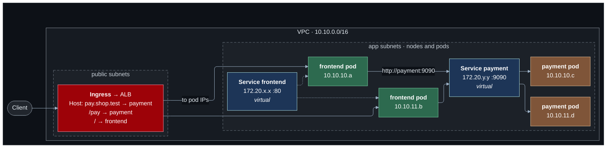

# Lab 07 — Kubernetes networking

**Difficulty:** Advanced · **Time:** 60–90 min · **Cost:** nothing by default; **about USD 0.20–0.25/hour with the cluster** (opt-in, and it needs the NAT gateway)

The same shop, on Amazon EKS. Kubernetes has its own vocabulary for the ideas
in the last six labs — an address per pod, a stable name in front of
replicas, a router for requests from outside. This lab maps each one onto the
VPC underneath.

**Video:** section 8 (Kubernetes networking).

**What changes from lab 06:** `kubernetes.tf` and `k8s/shop.yaml.tftpl` are
new.

---

## Learning objectives

1. Explain where a pod's IP address comes from on EKS, and what containers in
   one pod share.
2. Explain why pod addresses cannot be relied on.
3. Describe what a Service provides, and which of its addresses are real.
4. Explain how cluster DNS turns a Service name into an address.
5. Route external requests to Services by host and path with an Ingress, and
   recognise it as the load balancer from lab 05.

## Concepts covered

Pods and pod IPs · shared pod networking · the VPC CNI · ephemeral pods ·
Services and ClusterIP · the Service CIDR · endpoints · cluster DNS
(CoreDNS) · service discovery · Ingress · host- and path-based routing ·
IngressClass · EKS Auto Mode · control-plane endpoint access

## How it maps to what you have built

| Kubernetes | What it is | Earlier lab |
| --- | --- | --- |
| Pod IP | A VPC address from the node's subnet | ECS task ENI (06) |
| Service | Stable virtual IP + DNS name in front of pods | Cloud Map name (06) |
| Cluster DNS | Resolver for Service names | VPC resolver, Docker DNS (06) |
| Ingress | Host/path rules for outside traffic | ALB listener rules (05) |
| NetworkPolicy | Which pods may talk to which | Security groups (02) |

---

## Architecture



Pod addresses (`10.10.x.x`) are real VPC addresses. Service addresses
(`172.20.x.x`) are not in the VPC at all: no route table mentions them.

## Traffic flow

**Pod to pod, through a Service.** The frontend pod requests
`http://payment:9090/`.

1. The pod's resolver is the cluster DNS. `payment` expands to
   `payment.shop.svc.cluster.local` and resolves to the Service's **ClusterIP**,
   `172.20.y.y`.
2. The pod sends to `172.20.y.y:9090`. That address belongs to nothing. On the
   node, a rule installed for the Service rewrites the destination to the
   address of one healthy payment pod — DNAT, the same trick as Docker's port
   mapping.
3. The packet leaves with a pod IP as source and a pod IP as destination. Both
   are VPC addresses, so the VPC routes it like any other packet, even to a
   pod on a node in the other Availability Zone. No overlay.
4. A payment pod is deleted. Its replacement gets a new IP; the Service's
   endpoint list is updated; the next connection goes to the new pod. The
   name and the ClusterIP never changed.

**From outside, through the Ingress.** `curl http://<ingress address>/pay`

1. The Ingress is implemented by an Application Load Balancer that EKS Auto
   Mode created in the public subnets.
2. The load balancer matches the path `/pay` — the same rule evaluation as
   lab 05, written as YAML instead of Terraform.
3. It forwards **directly to a pod IP**, using an IP target group like lab
   06's. The Service is used to *find* the pods, not as a hop.

---

## Resources created

| Resource | When | Cost |
| --- | --- | --- |
| EKS cluster (control plane) | `enable_eks` | **USD 0.10/hour** |
| Nodes (Auto Mode, on demand) | once pods are scheduled | EC2 price + ~12% management fee |
| Application Load Balancer | once the Ingress is applied | ~USD 0.035/hour |
| IAM roles ×2 | `enable_eks` | Free |
| NAT gateway (required) | `enable_nat_gateway` | USD 0.059/hour |

Roughly USD 0.20–0.25/hour, **USD 150–180/month if forgotten**. Do the lab in
one sitting and turn it off.

## Prerequisites

- Terraform `>= 1.11.0` and AWS credentials for a sandbox account
  (`aws sts get-caller-identity`).
- The state bucket from [`bootstrap/`](../../bootstrap/README.md).
- Lab 06 applied, or at least read: this lab changes what it built. See [`../06-container-networking/`](../06-container-networking/README.md).
- The [Session Manager plugin](https://docs.aws.amazon.com/systems-manager/latest/userguide/session-manager-working-with-install-plugin.html)
  for the AWS CLI, to open a shell on a host.

How the labs fit together, and what "one project, one state" means in
practice, is in [`docs/working-with-the-labs.md`](../../docs/working-with-the-labs.md).
- [`kubectl`](https://kubernetes.io/docs/tasks/tools/), within one minor
  version of the cluster.

## Deploy

Every lab uses the same state, so this lab **upgrades** what the previous one
built. Carry your settings forward and add the new ones:

```bash
cd labs/07-kubernetes-networking

cp ../06-container-networking/backend.hcl .
cp ../06-container-networking/terraform.tfvars .
diff terraform.tfvars terraform.tfvars.example   # what this lab adds; copy across what you want

terraform init -backend-config=backend.hcl
terraform plan                                   # read it: this is the lab
terraform apply
```

To see exactly what changed in the code: `make lab-diff FROM=06-container-networking TO=07-kubernetes-networking`
from the repository root.

```hcl
acknowledge_costs    = true
enable_nat_gateway   = true           # nodes pull images through it
enable_eks           = true
eks_api_allowed_cidr = "203.0.113.7/32"   # your address
```

The cluster takes about ten minutes. Then deploy the shop onto it:

```bash
eval "$(terraform output -raw kubeconfig_command)"
terraform output -raw k8s_manifest | kubectl apply -f -
kubectl -n shop get pods -w        # the first pods wait while a node is launched
```

Read the manifest first — `terraform output -raw k8s_manifest | less`. It is
short, and every object in it is commented.

---

## Verification

`terraform output verify_kubernetes` prints these.

### 1. Pod addresses are VPC addresses

```bash
kubectl -n shop get pods -o wide
kubectl get nodes -o wide
```

Every pod IP falls inside `10.10.10.0/24` or `10.10.11.0/24` — the app
subnets. Find one in the VPC:

```bash
aws ec2 describe-network-interfaces --filters Name=addresses.private-ip-address,Values=<pod ip> \
  --query 'NetworkInterfaces[].{Subnet:SubnetId,Desc:Description}'
```

### 2. Service addresses are not

```bash
kubectl -n shop get services
```

`CLUSTER-IP` values are in `172.20.0.0/16`. No subnet, no route, no network
interface has that range.

### 3. What is behind a Service

```bash
kubectl -n shop get endpointslices
```

The pod IPs from step 1, grouped by Service.

### 4. Call a Service by name

```bash
kubectl -n shop exec deploy/frontend -- python -c \
  "import urllib.request; print(urllib.request.urlopen('http://payment:9090/').read().decode())"
```

Run it several times: `host` alternates between the payment pods.

### 5. Ingress rules

```bash
ADDR=$(kubectl -n shop get ingress shop -o jsonpath='{.status.loadBalancer.ingress[0].hostname}')
curl -s "http://$ADDR/"                             # frontend-pod
curl -s "http://$ADDR/pay"                          # payment-pod, by path
curl -s -H 'Host: pay.shop.test' "http://$ADDR/"    # payment-pod, by host
```

The address takes two or three minutes to appear after the manifest is
applied.

---

## Hands-on exercises

### 1. Pods are disposable

```bash
kubectl -n shop get pods -o wide -l app=payment
kubectl -n shop delete pod -l app=payment
kubectl -n shop get pods -o wide -l app=payment     # new names, new IPs
kubectl -n shop get service payment                 # same ClusterIP
```

### 2. Two containers, one address

Add a second container to the frontend pod template — the same image, running
`python /app/app.py sidecar 8081` — and apply. From either container,
`http://127.0.0.1:8081/` and `http://127.0.0.1:8080/` both work: containers in
a pod share one network namespace, so they share an IP and must not share a
port.

### 3. Find the Ingress in AWS

```bash
aws elbv2 describe-load-balancers --query 'LoadBalancers[].{Name:LoadBalancerName,Scheme:Scheme,DNS:DNSName}' --output table
aws elbv2 describe-target-groups --query 'TargetGroups[].{Name:TargetGroupName,Type:TargetType,Port:Port}' --output table
```

A load balancer you did not write, with `ip` target groups whose targets are
pod addresses. Compare its listener rules with the Ingress YAML.

### 4. Scale and watch the endpoints

`kubectl -n shop scale deploy/payment --replicas=4`, then
`kubectl -n shop get endpointslices -w`.

---

## Troubleshooting exercises

### A. The Service CIDR must not collide

`kubernetes_service_cidr` is `172.20.0.0/16`. Suppose it were
`10.20.0.0/16` — the shared VPC that arrives in lab 09. Pods could never
reach that VPC: the node would rewrite the destination before the packet left.
Virtual ranges are invisible in the VPC console and still part of the address
plan.

### B. Running out of addresses

Every pod consumes a VPC address. A `/24` app subnet has 251. Count the
addresses in use by nodes and pods, and estimate how many replicas fit. This
is the price of having no overlay, and why EKS subnets are usually much
larger than `/24`.

---

## Cleanup

**Delete the Kubernetes objects first.** The load balancer was created by the
cluster, not by Terraform, and Terraform does not know it exists:

```bash
terraform output -raw k8s_manifest | kubectl delete -f -
kubectl -n shop get ingress        # wait until it is gone
```

Then set `enable_eks = false` and apply, or destroy:

Moving on to the next lab? **Do not destroy** -- the next lab builds on this
one. Turn off any opt-in you no longer need (set its `enable_*` flag to `false`
and `terraform apply`) so it stops billing.

Finished for now? Destroy from **this** folder -- the folder you applied last:

```bash
terraform destroy
```

Then confirm nothing is left:

```bash
aws resourcegroupstaggingapi get-resources --tag-filters Key=Project,Values=shop \
  --query 'ResourceTagMappingList[].ResourceARN' --output text
```

Empty output means clean.

---

## Further reading

- [Amazon VPC CNI](https://docs.aws.amazon.com/eks/latest/best-practices/vpc-cni.html) — AWS
- [EKS Auto Mode](https://docs.aws.amazon.com/eks/latest/userguide/automode.html) — AWS
- [Application load balancing on EKS Auto Mode](https://docs.aws.amazon.com/eks/latest/userguide/auto-configure-alb.html) — AWS
- [Services](https://kubernetes.io/docs/concepts/services-networking/service/) — Kubernetes
- [Ingress](https://kubernetes.io/docs/concepts/services-networking/ingress/) — Kubernetes
- [DNS for Services and Pods](https://kubernetes.io/docs/concepts/services-networking/dns-pod-service/) — Kubernetes
- [EKS pricing](https://aws.amazon.com/eks/pricing/) — AWS

**Next:** [Lab 08](../08-security-and-observability/README.md)
