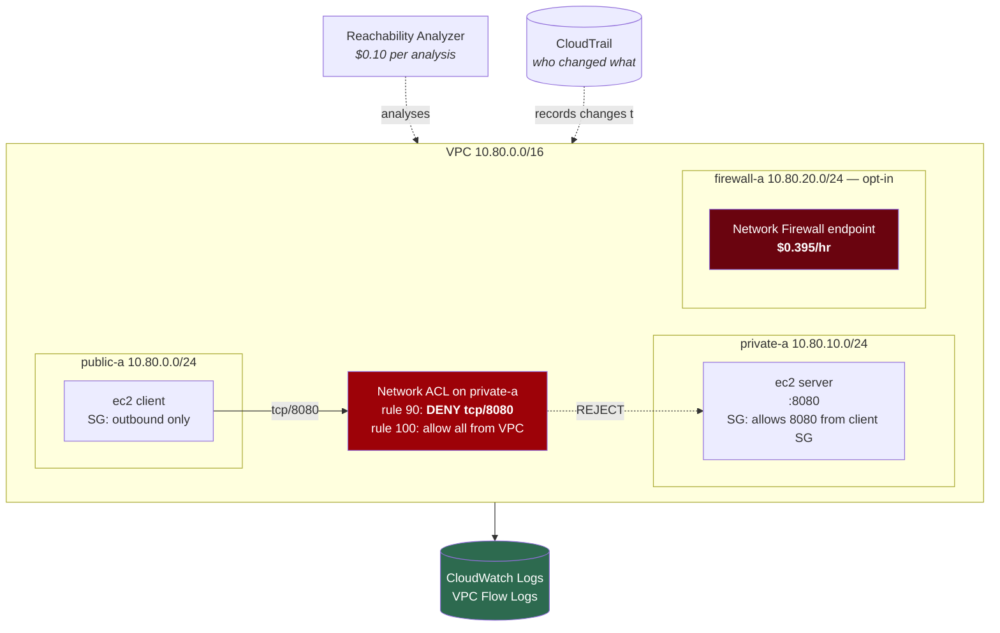

# Lab 08 — Security and observability

**Difficulty:** Advanced · **Time:** 60–75 min
**Cost:** ~USD 0.016/hour + USD 0.20 one-off · ⚠️ **+USD 0.395/hour with Network Firewall**

One question drives this lab: **was the packet blocked, or did it never arrive?**
Flow logs answer it. Reachability Analyzer names the component responsible.

---

## Learning objectives

1. State the differences between a security group and a network ACL precisely,
   and predict the symptom of each getting it wrong.
2. Read VPC Flow Logs and distinguish a `REJECT` from a missing record.
3. Explain why a custom flow log format with `pkt-srcaddr` matters behind NAT.
4. Use Reachability Analyzer to identify a blocking component without sending a
   packet.
5. Explain what CloudTrail contributes to a network investigation.
6. Describe centralised inspection with AWS Network Firewall, and why the
   firewall needs a subnet of its own.
7. Place WAF, Shield and traffic mirroring correctly relative to the above.

## Concepts covered

Security groups versus network ACLs · statefulness · rule ordering · VPC Flow
Logs · custom log formats · CloudWatch Logs Insights · Reachability Analyzer ·
CloudTrail for network change auditing · AWS Network Firewall · Suricata rules ·
inspection routing · least-privilege IAM for log delivery · log retention

---

## Architecture



## Traffic flow

**`client` → `server:8080`, with the deny rule active**

1. The client's security group allows the outbound connection. Stateful, so the
   reply would be permitted automatically.
2. The packet is routed to `private-a` via the `local` route.
3. **The private subnet's network ACL is evaluated.** Rule 90 denies TCP 8080
   inbound from the VPC CIDR. Evaluation stops at the first match.
4. The packet is dropped. A `REJECT` record appears in the flow log.
5. The server's security group is never consulted. The server never sees a
   connection attempt.

The security group **allows this traffic**. The connection still fails. That is
the entire point of the two layers: they are independent, both must permit, and
only one of them can deny.

### Security group versus network ACL

| | Security group | Network ACL |
| --- | --- | --- |
| Attached to | An ENI | A subnet |
| Stateful | **Yes** — replies allowed automatically | **No** — replies need their own rule |
| Deny rules | No, allow-only | **Yes** |
| Evaluation | All rules; any allow wins | In rule-number order; **first match wins** |
| Default | Deny all inbound, allow all outbound | Default ACL allows everything |
| Reference another group | **Yes** | No — CIDRs only |
| Applies to | Traffic in and out of the ENI | Traffic crossing the subnet boundary |

**Common failure modes**

| Symptom | Layer | Cause |
| --- | --- | --- |
| Outbound works, replies never arrive | NACL | Missing ephemeral-port inbound rule (1024–65535) |
| An allow rule appears to be ignored | NACL | A lower-numbered deny matched first |
| Rule works for one instance, not another | SG | The other instance is not in the referenced group |
| It works and you cannot see why | Default NACL | The default allows everything; someone assumed otherwise |

---

## Resources created

| Resource | Cost |
| --- | --- |
| VPC, subnets, route tables, IGW | Free |
| Security groups, network ACL and rules | Free |
| EC2 `t4g.nano` × 2 + one public IP | ~USD 0.016/hour |
| VPC Flow Logs → CloudWatch Logs | ~USD 0.50/GB — cents for a lab |
| Network Insights **paths** | **Free** |
| Network Insights **analyses** | **USD 0.10 each** (2 run = USD 0.20) |
| CloudTrail (opt-in) | First copy of management events free + S3 storage |
| **AWS Network Firewall (opt-in)** | **~USD 0.395/hour + ~USD 0.065/GB** |

> ### ⚠️ AWS Network Firewall
> ~USD 0.395 per endpoint-hour is **USD 9.48/day** and **USD 288/month** — the
> most expensive resource in this repository. Both `acknowledge_costs` and
> `enable_network_firewall` are required. Thirty minutes costs about twenty cents.

---

## Deploy

```bash
cd labs/08-security-and-observability
cp backend.hcl.example backend.hcl && $EDITOR backend.hcl
cp terraform.tfvars.example terraform.tfvars

terraform init -backend-config=backend.hcl
terraform apply
```

Apply takes 3–5 minutes; the Reachability Analyzer runs wait for completion.

---

## Verification

### 1. Reachability Analyzer already answered the question

```bash
terraform output reachability_results
```

```
{
  "tcp_22" = "NOT REACHABLE -- expected; the server security group only allows TCP 8080 from the client group"
  "tcp_8080" = "NOT REACHABLE -- expected while enable_nacl_block is true; the network ACL denies it"
}
```

Two paths, same source, same destination, **different blocking components**. Get
the detail:

```bash
terraform output -json verify_commands | jq -r .reachability_explanation | bash
```

```json
{
  "Found": false,
  "Explanations": [
    {
      "Direction": "ingress",
      "ExplanationCode": "ACL_RULE",
      "Acl": { "Id": "acl-0abc123" },
      "AclRule": {
        "Cidr": "10.80.0.0/16",
        "Egress": false,
        "PortRange": { "From": 8080, "To": 8080 },
        "Protocol": "tcp",
        "RuleAction": "deny",
        "RuleNumber": 90
      }
    }
  ]
}
```

`ExplanationCode: ACL_RULE`, `RuleNumber: 90`. No packet was sent — this is
static analysis of the configuration. Twenty cents to be handed the answer.

### 2. Now watch it happen

In one window:

```bash
terraform output -raw flow_log_tail_command | bash
```

In another, open a shell on the client and generate traffic:

```bash
terraform output -raw session_manager_command | bash
```

```bash
SERVER=<server_private_ip>       # terraform output -raw server_private_ip

ping -c 3 $SERVER                                     # succeeds
curl -sS --max-time 8 http://$SERVER:8080/ || echo TIMED_OUT    # times out
```

Within a minute (the aggregation interval), the tail shows something like:

```
2 vpc-0abc subnet-0def i-0123 eni-0456 10.80.0.87 10.80.10.42 43210 8080 6 3 180 ... REJECT OK 10.80.0.87 10.80.10.42 ingress -
2 vpc-0abc subnet-0def i-0123 eni-0456 10.80.0.87 10.80.10.42 0 0 1 3 252 ... ACCEPT OK ...
```

The ICMP flow is `ACCEPT`. The TCP 8080 flow is `REJECT`. Same source, same
destination, one minute apart.

**The three diagnostic outcomes**

| Flow log shows | Means | Look at |
| --- | --- | --- |
| `REJECT` | A security group or NACL dropped it. **It arrived.** | Filtering rules |
| `ACCEPT` out, nothing back | Usually a stateless NACL blocking the reply | NACL inbound ephemeral rules |
| **Nothing at all** | The packet never reached an interface | **Routing** |

That third row is why flow logs are worth the money. Without them you cannot
distinguish "blocked" from "misrouted", and the two have entirely different fixes.

### 3. Query with Logs Insights

```bash
terraform output flow_log_queries
```

Paste `rejected_flows` into the CloudWatch Logs Insights console against the log
group from `terraform output flow_log_group_name`.

The `original_vs_translated` query is the one to remember. It surfaces flows
where `srcAddr` differs from `pktSrcAddr` — which is what happens behind a NAT
gateway. With the default (version 2) log format those fields do not exist, and
every outbound flow appears to originate from the NAT gateway. That single
omission has cost people entire afternoons.

---

## Hands-on exercises

### 1. Remove the deny and watch the verdict flip

```hcl
enable_nacl_block = false
```

```bash
terraform apply
terraform output reachability_results
```

`tcp_8080` is now `REACHABLE`. From the client:

```bash
curl -sS http://$SERVER:8080/
# lab08 server reached successfully
```

The flow log now shows `ACCEPT` for the same five-tuple. Nothing else changed —
not the security groups, not the routes, not the instances.

### 2. Break statefulness

With `enable_nacl_block = false`, comment out
`aws_network_acl_rule.allow_ephemeral_inbound` and apply.

Now from the **server** (reachable only after enabling something like the NAT
gateway from lab 02, or reason it through on paper): an outbound connection's
SYN leaves under the outbound allow rule. The SYN-ACK comes back addressed to an
ephemeral source port, matches no inbound rule, and hits the implicit
`deny all` at 32767.

The connection hangs. `curl` reports a timeout, which looks exactly like a
routing failure. The flow log distinguishes them: you will see an `ACCEPT`
egress record and a `REJECT` ingress record.

A security group in the same position would have worked, because it tracks the
connection.

### 3. Rule ordering

Change `aws_network_acl_rule.deny_service_port` from `rule_number = 90` to
`rule_number = 110` and apply. The deny is now **after** the allow-all at 100,
so it is never reached and the traffic flows.

Network ACLs never report an unreachable rule. Auditing one means reading it
top to bottom in number order, as a routing table rather than a rule set.

### 4. Re-run an analysis after a change

```bash
terraform output -json verify_commands | jq -r .rerun_analysis
```

Each run costs USD 0.10. In a real incident that is a bargain — the alternative
is deploying test instances into a network you do not yet understand.

Reachability Analyzer's limits are worth knowing: it evaluates **configuration**,
not liveness. It cannot tell you that the service crashed, that the OS firewall
is blocking, or that a route is blackholed at a Transit Gateway. `path_found =
true` means "nothing in the AWS network configuration stops this", which is a
narrower claim than "it works".

### 5. CloudTrail

```hcl
enable_cloudtrail = true
```

Apply, wait about fifteen minutes for the first log delivery, then make a change
by hand and find it:

```bash
terraform output -json verify_commands | jq -r .recent_network_changes | bash
```

Every network change is an EC2 API call: `AuthorizeSecurityGroupIngress`,
`CreateRoute`, `ReplaceNetworkAclEntry`, `ModifyVpcAttribute`,
`CreateVpcPeeringConnection`. CloudTrail is the only place that records **who**
and **when**. Flow logs tell you traffic changed; CloudTrail tells you why.

### 6. AWS Network Firewall — twenty cents

```hcl
acknowledge_costs       = true
enable_network_firewall = true
```

```bash
terraform apply     # 5-10 minutes; firewalls are slow to create
terraform output cost_warning
```

The firewall goes in a **dedicated subnet**, and the public route table now
sends traffic destined for `private-a` to the firewall endpoint rather than
straight there.

```bash
terraform output firewall_endpoint_id
aws ec2 describe-route-tables --route-table-ids $(terraform output -raw public_route_table_id 2>/dev/null || echo) --region <region>
```

From the client, `curl http://$SERVER:8080/` is now dropped by the Suricata rule
rather than by the NACL:

```
drop tcp any any -> any 8080 (msg:"Lab 08 blocked service port"; sid:1000001; rev:1;)
```

Watch the alerts:

```bash
aws logs tail $(terraform output -raw firewall_alert_log_group) --follow --region <region>
```

**Why the dedicated subnet.** The firewall subnet's route table must not send
traffic back to the firewall — that would loop every packet. A firewall sharing
a subnet with workloads cannot satisfy both requirements. This is the same
reason lab 05 gives Transit Gateway attachments their own `/28`.

**Destroy it when you are done.** USD 9.48 a day.

---

## Concepts this lab does not deploy

Each of these is either expensive, needs resources outside a networking lab, or
both. They are covered here because the exam and real designs both expect you to
place them correctly.

### AWS WAF

Layer 7. Inspects HTTP requests — SQL injection, cross-site scripting, rate
limits, geo-blocking — and attaches to a **CloudFront distribution, Application
Load Balancer, API Gateway, AppSync or Cognito**. It cannot attach to a VPC, a
subnet, or a Network Load Balancer, because it operates on HTTP and those do not
terminate HTTP.

Cost: ~USD 5/month per web ACL, ~USD 1/month per rule, ~USD 0.60 per million
requests.

### AWS Shield

**Shield Standard** is free, automatic, and always on for every AWS customer. It
absorbs common layer 3 and 4 DDoS attacks — SYN floods, reflection attacks — at
the network edge.

**Shield Advanced** is **USD 3,000 per month** with a one-year commitment. It
adds a 24/7 response team, cost protection for scaling during an attack, and
layer 7 protections. It is not something a learning account should enable, and
no lab in this repository will.

### Traffic mirroring

Copies **actual packets** from an ENI to a monitoring appliance, where flow logs
copy only metadata. Use it for intrusion detection, protocol analysis, or
capturing a payload you need to see.

Constraints: Nitro-based instances only, it consumes the source instance's
network bandwidth, and it needs a target appliance (an NLB or a monitoring ENI)
to receive the traffic. There is no per-session charge, but the target
infrastructure is real cost, and the volume can be enormous.

### Centralised inspection at scale

The pattern lab 05 sketched, now with the firewall in it:

```
spoke VPCs → Transit Gateway (spoke route table: 0.0.0.0/0 → inspection attachment)
           → inspection VPC → Network Firewall → back to the Transit Gateway
           → destination spoke
```

The one non-obvious requirement is **appliance mode** on the inspection VPC's
Transit Gateway attachment. Without it the gateway may send the two directions
of a flow through different Availability Zones, and a stateful firewall that
sees only half a conversation drops it. This is the classic asymmetric-routing
failure in centralised inspection designs, and it presents as intermittent
connection resets rather than as a clean block.

---

## Troubleshooting exercises

### A. Build the decision tree

Given "connection times out", in cost order:

1. **Reachability Analyzer** — USD 0.10, no packet sent, names the component.
2. **Flow logs** — `REJECT` means filtered, nothing means misrouted.
3. **Route tables** — if flow logs show nothing.
4. **Security group and NACL** — if flow logs show `REJECT`.
5. **The instance itself** — if flow logs show `ACCEPT` both ways. The service
   is down, or an OS firewall is blocking.

Step 5 matters: `ACCEPT` in both directions means AWS delivered the packets and
the problem is above the network.

### B. Flow logs show nothing at all

Not necessarily a routing problem. Also check:

- Has the aggregation interval elapsed? Sixty seconds feels long when you are
  waiting.
- Is the flow log capturing the right resource? A VPC-level log covers every
  ENI; a subnet-level one does not.
- Is `traffic_type` set to `REJECT` when you are looking for accepted flows?
- Is the delivery IAM role intact? `describe-flow-logs` shows
  `DeliverLogsStatus` and `DeliverLogsErrorMessage`.

```bash
aws ec2 describe-flow-logs --region <region> \
  --query 'FlowLogs[].{Id:FlowLogId,Status:FlowLogStatus,Delivery:DeliverLogsStatus,Error:DeliverLogsErrorMessage}' \
  --output table
```

### C. Reachability says reachable, traffic still fails

Reachability Analyzer evaluates configuration. It does not know about:

- a service that is not listening
- an OS-level firewall (`firewalld`, `iptables`, Windows Firewall)
- application-level authentication
- a blackhole route at a Transit Gateway
- DNS

Confirm the service is up before blaming the network:

```bash
sudo ss -tlnp | grep 8080
```

---

## Cleanup

```bash
terraform destroy
```

```bash
REGION=$(terraform output -raw aws_region 2>/dev/null || echo ap-southeast-1)

# Network Firewall is USD 9.48/day. Check this first.
aws network-firewall list-firewalls --region $REGION --query 'Firewalls[].[FirewallName]' --output text

# Log groups survive a partial destroy and keep billing for storage.
aws logs describe-log-groups --region $REGION \
  --log-group-name-prefix /aws/vpc-flow-logs/awsnet-lab08 \
  --query 'logGroups[].[logGroupName,retentionInDays]' --output text

aws logs describe-log-groups --region $REGION \
  --log-group-name-prefix /aws/network-firewall \
  --query 'logGroups[].[logGroupName]' --output text

# A CloudTrail trail is account-wide and easy to forget.
aws cloudtrail describe-trails --region $REGION \
  --query 'trailList[?contains(Name, `lab08`)].[Name,S3BucketName]' --output text
```

If `terraform destroy` fails on the firewall, check that `delete_protection` is
`false` — this lab sets it so, but production should not.

---

## Further reading

- [Compare security groups and network ACLs](https://docs.aws.amazon.com/vpc/latest/userguide/infrastructure-security.html) — AWS
- [VPC Flow Logs](https://docs.aws.amazon.com/vpc/latest/userguide/flow-logs.html) — AWS
- [Flow log record fields](https://docs.aws.amazon.com/vpc/latest/userguide/flow-logs.html#flow-logs-fields) — AWS
- [Reachability Analyzer](https://docs.aws.amazon.com/vpc/latest/reachability/what-is-reachability-analyzer.html) — AWS
- [Reachability Analyzer explanation codes](https://docs.aws.amazon.com/vpc/latest/reachability/explanation-codes.html) — AWS
- [AWS Network Firewall](https://docs.aws.amazon.com/network-firewall/latest/developerguide/what-is-aws-network-firewall.html) — AWS
- [Network Firewall deployment models](https://aws.amazon.com/blogs/networking-and-content-delivery/deployment-models-for-aws-network-firewall/) — AWS
- [Traffic mirroring](https://docs.aws.amazon.com/vpc/latest/mirroring/what-is-traffic-mirroring.html) — AWS
- [AWS WAF](https://docs.aws.amazon.com/waf/latest/developerguide/what-is-aws-waf.html) — AWS
- [AWS Shield](https://docs.aws.amazon.com/waf/latest/developerguide/shield-chapter.html) — AWS
- [Logging network API calls with CloudTrail](https://docs.aws.amazon.com/vpc/latest/userguide/monitoring-cloudtrail.html) — AWS

**Next:** [Lab 09 — Multi-Region networking](../09-multi-region-networking/README.md)
