# Lab 08 — Security and observability

**Difficulty:** Advanced · **Time:** 60 min · **Cost:** a few cents for flow logs; **+USD 0.395/hour with Network Firewall** (opt-in)

Until now, every check was "curl it and see". That works while things work.
A dropped packet looks identical from the client whatever dropped it — a
route, a security group, a network ACL, a firewall. This lab adds the tools
that tell them apart, breaks the shop on purpose, and has you find the fault
with evidence rather than by reading every rule.

**Video:** returns to section 4 (firewalls, layered security), with the
cloud's version of a network firewall and the visibility the video does not
cover.

**What changes from lab 07:** `observability.tf` and `firewall.tf` are new.

---

## Learning objectives

1. Read a VPC flow log record and say what ACCEPT, REJECT and *no record at
   all* each mean.
2. Use the direction of a REJECT to tell a security group from a network ACL.
3. Use Reachability Analyzer to get the blocking component by name.
4. Use CloudTrail to find who changed the network and when.
5. Explain inspection routing: why a firewall sees only the traffic route
   tables send it, and why both directions must go through it.

## Concepts covered

VPC Flow Logs · custom log formats · `pkt-srcaddr` versus `srcaddr` ·
CloudWatch Logs Insights · Reachability Analyzer · CloudTrail for network
changes · security groups versus network ACLs · rule ordering · AWS Network
Firewall · Suricata rules · inspection routing · more-specific routes ·
symmetric routing

---

## Architecture

```mermaid
---
config:
  layout: elk
  theme: base
  themeVariables:
    lineColor: "#9fb3c8"
    textColor: "#e6edf3"
    primaryColor: "#21262d"
    primaryTextColor: "#e6edf3"
    primaryBorderColor: "#6e7681"
    edgeLabelBackground: "#0d1117"
    clusterBkg: "#161b22"
    clusterBorder: "#6e7681"
    titleColor: "#e6edf3"
  flowchart:
    curve: rounded
    wrappingWidth: 420
---
flowchart LR
    subgraph CANVAS[" "]
        subgraph VPC["VPC · 10.10.0.0/16"]
            WEB["<b>web</b>"]
            FWALL["<b>Network Firewall</b> · opt-in<br/>own subnet 10.10.30.0/24<br/>drop tcp → blocked port"]
            APP["<b>app</b> · payment :9090"]
            NACL["<b>Data network ACL</b><br/>rule 90: <b>DENY tcp/3306</b> · the fault<br/>rule 100: allow 3306 from app"]
            DB["<b>db</b> · database :3306"]
        end

        FL[("<b>Flow logs</b><br/>ACCEPT / REJECT<br/>per interface")]
        RA["<b>Reachability Analyzer</b><br/>names the blocking component<br/><i>$0.10 per analysis</i>"]
        CT[("<b>CloudTrail</b><br/>who changed what, when")]
    end

    WEB -->|"routed via firewall<br/>when enabled"| FWALL --> APP
    APP -->|"tcp/3306"| NACL
    NACL -.->|"REJECT"| DB
    VPC --> FL
    RA -.-> VPC
    CT -.-> VPC

    classDef canvas fill:#0d1117,stroke:#30363d,color:#e6edf3
    classDef vpc fill:#161b22,stroke:#8b949e,color:#e6edf3
    classDef az fill:#1c2128,stroke:#6e7681,color:#c9d1d9,stroke-dasharray:6 4
    classDef free fill:#2d6a4f,stroke:#74c69d,color:#fff
    classDef private fill:#7f5539,stroke:#ddb892,color:#fff
    classDef gateway fill:#1d3557,stroke:#a8dadc,color:#fff
    classDef billed fill:#9d0208,stroke:#ff8fa3,color:#fff
    classDef costly fill:#6a040f,stroke:#ff8fa3,color:#fff

    class CANVAS canvas
    class VPC vpc
    class FWALL costly
    class FL,RA,CT free
    class APP,DB private
```



## Traffic flow

**With `enable_nacl_block = true`: the payment service calls the database.**

1. `app → db:3306` leaves the app host. Its security group allows all
   outbound. Flow log on the app interface: **ACCEPT**, egress.
2. The `local` route delivers it to the data subnet.
3. The data network ACL is evaluated in rule-number order. Rule **90** denies
   TCP 3306 from the VPC. Evaluation stops. Rule 100, which allows it, is
   never reached.
4. The packet is dropped at the subnet boundary. It never reaches the db
   interface, so the db security group is never consulted.
5. Flow log on the db interface: **REJECT**, ingress.

**Reading the evidence.**

| What the flow logs show | What it means |
| --- | --- |
| No record on the destination interface | The packet never arrived: **routing** |
| REJECT on the destination, ingress | It arrived and was filtered: **security group or network ACL** |
| ACCEPT in, REJECT out, same flow | The reply was dropped: a **network ACL** — security groups cannot do this |
| ACCEPT both ways | The network delivered it: look at the **application** |

**With the firewall on.** Two extra routes are added. In the public route
table, `10.10.10.0/24 → firewall endpoint` is more specific than
`10.10.0.0/16 → local`, so web → app traffic goes to the firewall first. In
the zone-A private route table, routes for the public subnets send the
**replies** back through it. A stateful firewall that sees one direction only
discards the connection.

---

## Resources created

| Resource | When | Cost |
| --- | --- | --- |
| VPC flow log + log group + IAM role | `enable_flow_logs` (default on) | ~USD 0.67/GB ingested — cents |
| Reachability Analyzer paths ×2 | always | Free |
| Reachability analyses | `run_reachability_analysis` | **USD 0.10 each** |
| Network ACL deny rule | `enable_nacl_block` | Free |
| CloudTrail trail + bucket | `enable_cloudtrail` | Free for management events |
| Network Firewall + subnet + routes | `enable_network_firewall` | **USD 0.395/hour — USD 288/month** |

## Prerequisites

- Terraform `>= 1.11.0` and AWS credentials for a sandbox account
  (`aws sts get-caller-identity`).
- The state bucket from [`bootstrap/`](../../bootstrap/README.md).
- Lab 07 applied, or at least read: this lab changes what it built. See [`../07-kubernetes-networking/`](../07-kubernetes-networking/README.md).
- The [Session Manager plugin](https://docs.aws.amazon.com/systems-manager/latest/userguide/session-manager-working-with-install-plugin.html)
  for the AWS CLI, to open a shell on a host.

How the labs fit together, and what "one project, one state" means in
practice, is in [`docs/working-with-the-labs.md`](../../docs/working-with-the-labs.md).

## Deploy

Every lab uses the same state, so this lab **upgrades** what the previous one
built. Carry your settings forward and add the new ones:

```bash
cd labs/08-security-and-observability

cp ../07-kubernetes-networking/backend.hcl .
cp ../07-kubernetes-networking/terraform.tfvars .
diff terraform.tfvars terraform.tfvars.example   # what this lab adds; copy across what you want

terraform init -backend-config=backend.hcl
terraform plan                                   # read it: this is the lab
terraform apply
```

To see exactly what changed in the code: `make lab-diff FROM=07-kubernetes-networking TO=08-security-and-observability`
from the repository root.

Apply with the defaults first: flow logs on, nothing broken.

---

## Verification

`terraform output verify_observability` prints these with your values.

### 1. Flow logs are arriving

```bash
eval "$(terraform output -raw flow_log_tail_command)"
```

Leave it running in a second terminal and `curl` the shop. Records appear
within a minute or two — flow logs are aggregated, not live.

### 2. Break it

```hcl
enable_nacl_block = true
```

Apply, then `curl` the shop. The answer contains
`"upstream_error": "http://10.10.20.x:3306/: timed out"` from the payment
service. The fault is somewhere between `app` and `db`.

### 3. Find it with flow logs

`terraform output flow_log_queries` gives CloudWatch Logs Insights queries.
Run `rejected_flows`: rows with `dstPort = 3306`, `action = REJECT`, on the
database's interface. It arrived and was filtered — so not routing. A security
group or a network ACL.

### 4. Name it with Reachability Analyzer

```hcl
run_reachability_analysis = true     # USD 0.20 for the two paths
```

```bash
terraform output reachability_results
terraform output -json verify_observability | jq -r .explain_app_to_db | sh
```

`app_to_db` is `NOT REACHABLE`, and the explanation names the network ACL and
rule **90**. `web_to_db` is `NOT REACHABLE` too, and names the database's
security group — that one is intended.

### 5. Who did it

```bash
terraform output -json verify_observability | jq -r .recent_network_changes | sh
```

A `CreateNetworkAclEntry` event with your identity and a timestamp. CloudTrail
keeps 90 days of management events without any trail; `enable_cloudtrail`
keeps them for longer in a bucket.

Set `enable_nacl_block = false` and apply.

---

## Hands-on exercises

### 1. Addresses before and after translation

Run the `original_vs_translated` query with the NAT gateway or load balancer
on. `srcAddr` is the interface that logged the packet; `pktSrcAddr` is the
address in the packet itself. They differ exactly where something rewrote or
relayed it.

### 2. A security group rejection

Remove the app rule that allows 9090 from the web group. The REJECT is now on
the **app** interface, ingress — the same signature as the network ACL fault.
Flow logs cannot tell the two apart; Reachability Analyzer can.

### 3. The firewall (about 20 cents for half an hour)

```hcl
acknowledge_costs       = true
enable_network_firewall = true
firewall_blocked_port   = 9090
```

Apply — the firewall takes five to ten minutes. The shop's frontend loses the
payment service. Then:

```bash
terraform output -json verify_firewall | jq -r .inspection_routes | sh
terraform output -json verify_firewall | jq -r .alert_log | sh
```

The alert log shows the Suricata rule that fired. Set `firewall_blocked_port`
back to `9999`: traffic flows again, still through the firewall.
**Turn the firewall off when you are done.**

### 4. One direction only

With the firewall on, think through removing
`aws_route.app_to_public_via_firewall`: requests would be inspected and
replies would bypass the firewall. The firewall sees a SYN and never a
SYN-ACK. What does a stateful device do with the third packet?

---

## Troubleshooting exercises

### A. No record at all

Suppose a route in the public route table sent `10.10.10.0/24` somewhere
useless. Web → app would fail, and **no** REJECT would appear on the app
host's interface, because nothing reached it. **Absence of a record is itself
evidence** — and it points at routing, not filtering. Lab 14's
`wrong-next-hop` challenge builds exactly this.

### B. Network ACLs never tell you

Nothing in the console, CLI or Terraform said the shop was broken in step 2.
A deny rule is a healthy, valid rule. Only flow logs recorded it.

---

## Cleanup

Moving on to the next lab? **Do not destroy** -- the next lab builds on this
one. Turn off any opt-in you no longer need (set its `enable_*` flag to `false`
and `terraform apply`) so it stops billing.

Finished for now? Destroy from **this** folder -- the folder you applied last:

```bash
terraform destroy
```

Then confirm nothing is left:

```bash
aws resourcegroupstaggingapi get-resources --tag-filters Key=Project,Values=shop \
  --query 'ResourceTagMappingList[].ResourceARN' --output text
```

Empty output means clean.

---

## Further reading

- [VPC Flow Logs](https://docs.aws.amazon.com/vpc/latest/userguide/flow-logs.html) — AWS
- [Flow log record fields](https://docs.aws.amazon.com/vpc/latest/userguide/flow-log-records.html) — AWS
- [Reachability Analyzer](https://docs.aws.amazon.com/vpc/latest/reachability/what-is-reachability-analyzer.html) — AWS
- [AWS Network Firewall](https://docs.aws.amazon.com/network-firewall/latest/developerguide/what-is-aws-network-firewall.html) — AWS
- [Routing for a firewall between subnets](https://docs.aws.amazon.com/vpc/latest/userguide/route-table-options.html#route-tables-appliance-routing) — AWS
- [Logging network changes with CloudTrail](https://docs.aws.amazon.com/awscloudtrail/latest/userguide/cloudtrail-user-guide.html) — AWS

**Next:** [Lab 09](../09-vpc-peering/README.md)
