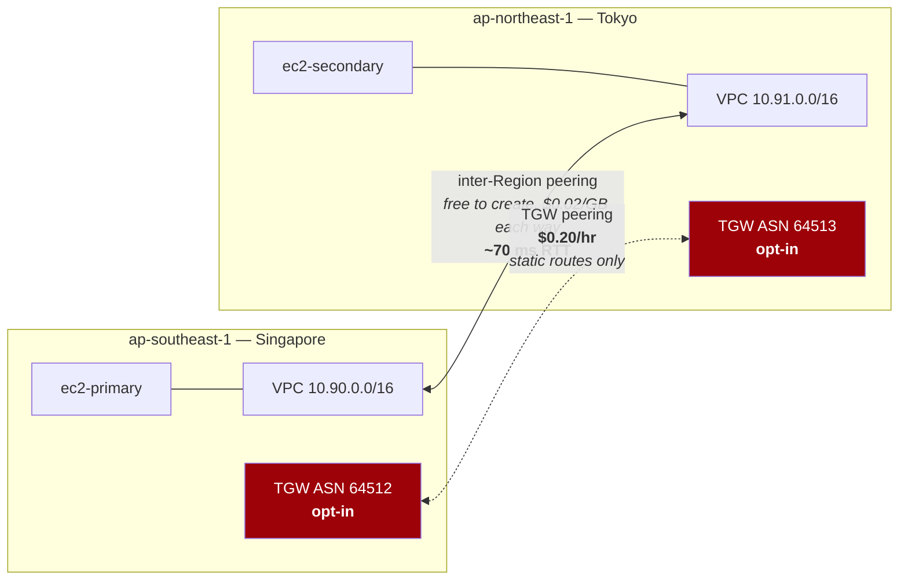

# Lab 09 — Multi-Region networking

**Difficulty:** Advanced · **Time:** 45–60 min
**Cost:** ~USD 0.021/hour · Peering is free to create · **+~USD 0.20/hour with Transit Gateway peering**

Two VPCs in two Regions, peered. The interesting number in this lab is not a
price — it is the 70 milliseconds that no design can remove.

---

## Learning objectives

1. Create an inter-Region VPC peering connection with two provider aliases, and
   explain why `auto_accept` cannot work across Regions.
2. Name three things that stop working across a Region boundary.
3. Explain why a Transit Gateway peering attachment does **not** propagate routes.
4. Describe what Route 53 health checks enable, and how each routing policy uses
   them.
5. Place Global Accelerator and CloudFront correctly against each other and
   against DNS-based routing.
6. Reason about multi-Region cost, latency and consistency trade-offs.

## Concepts covered

Provider aliases · inter-Region VPC peering · requester and accepter across
Regions · cross-Region DNS resolution over peering · Transit Gateway peering ·
static routes on peering attachments · Route 53 health checks · failover,
latency, geolocation and weighted routing · Global Accelerator · CloudFront ·
inter-Region data transfer pricing

---

## Architecture



## What changes at a Region boundary

A Region is the hardest boundary in AWS. Nothing crosses it implicitly.

| | Same Region | Cross-Region |
| --- | --- | --- |
| Round-trip latency | < 1 ms in-AZ, ~1 ms cross-AZ | **60–250 ms**, set by physics |
| Data transfer | ~USD 0.01/GB cross-AZ | **~USD 0.02/GB each way** |
| Security group references | **Work** across peering | **Do not work.** CIDRs only |
| AZ names | Meaningful | Meaningless — different Regions entirely |
| `auto_accept` on peering | Works | **Does not work.** Separate accepter resource |
| TGW route propagation | Works on VPC attachments | **Peering attachments do not propagate** |
| Private hosted zones | One association | Must associate the zone with each VPC explicitly |
| Console visibility | Right there | **Only if you switch Regions** — the main cause of leaked cost |

The security group row bites people who tested a design with same-Region
peering and then extended it across Regions. Rules that referenced a group must
be rewritten as CIDRs, which is both less precise and less self-maintaining.

---

## Resources created

| Resource | Cost |
| --- | --- |
| VPCs, subnets, route tables, IGWs (×2 Regions) | Free |
| **Inter-Region VPC peering connection** | **Free to create**; ~USD 0.02/GB each way |
| EC2 `t4g.nano` + public IP (×2) | ~USD 0.021/hour |
| **Transit Gateways ×2 (opt-in)** | Free |
| **TGW attachments ×4 (opt-in)** | **~USD 0.20/hour ≈ USD 146/month** |
| Route 53 health checks ×2 (opt-in) | USD 0.50/month each |
| CloudWatch alarms ×2 (opt-in) | USD 0.10/month each |

**Default: ~USD 0.021/hour. With Transit Gateway peering: ~USD 0.22/hour.**

---

## Prerequisites

- [Lab 04](../04-vpc-peering/README.md) and, for the opt-in half,
  [lab 05](../05-transit-gateway/README.md)
- Backend bucket from [`bootstrap/`](../../bootstrap/README.md)
- Both Regions enabled on your account. Regions introduced after 2019
  (ap-east-1, me-south-1, af-south-1, …) require explicit opt-in in the account
  settings, which is itself worth knowing.

**Note:** the S3 backend stays in whichever Region `bootstrap/` created it in.
State location is independent of where the lab deploys.

---

## Deploy

```bash
cd labs/09-multi-region-networking
cp backend.hcl.example backend.hcl && $EDITOR backend.hcl
cp terraform.tfvars.example terraform.tfvars

terraform init -backend-config=backend.hcl
terraform apply
```

Apply takes 3–4 minutes. Terraform makes calls to both Regions from one run,
using the two provider aliases.

---

## Verification

### 1. The peering is active across two Regions

```bash
terraform output -json verify_commands | jq -r .peering_status | bash
```

```
------------------------------------------------------------------------
|                    DescribeVpcPeeringConnections                     |
+----------+-----------------+----------------+----------+-------------+
|  Status  | RequesterRegion | AccepterRegion | ...Cidr  |  ...Cidr    |
+----------+-----------------+----------------+----------+-------------+
|  active  | ap-southeast-1  | ap-northeast-1 | 10.90... | 10.91...    |
+----------+-----------------+----------------+----------+-------------+
```

Note the shape of the Terraform that produced it: a
`aws_vpc_peering_connection` with `auto_accept = false` and a separate
`aws_vpc_peering_connection_accepter` running against `provider = aws.secondary`.
Across Regions the requester genuinely cannot accept on the accepter's behalf —
the accept is an API call in the other Region.

### 2. Routes in both Regions

```bash
terraform output -json verify_commands | jq -r .primary_routes | bash
terraform output -json verify_commands | jq -r .secondary_routes | bash
```

Each has one peering route pointing at the other's CIDR. Same rule as lab 04:
the connection is a permission, the routes do the work, and one missing route
produces a timeout that looks like a firewall.

### 3. Measure the thing that matters

```bash
terraform output latency_tests
terraform output -json session_manager_commands | jq -r .primary
```

From the primary instance:

```bash
ping -c 10 <secondary_private_ip>
```

```
10 packets transmitted, 10 received, 0% packet loss
rtt min/avg/max/mdev = 68.2/69.1/71.4/0.9 ms
```

**Sit with that number.** Singapore to Tokyo is about 5,300 km. Light in fibre
travels at roughly 200,000 km/s, so the theoretical round trip is about 53 ms.
You measured 69. AWS's backbone is within 30% of the speed of light, and there
is no architecture, instance type or protocol that improves on it.

The design consequences follow directly:

- A synchronous database write replicated to another Region adds ~70 ms to
  **every** transaction.
- A chatty protocol making 20 sequential round trips costs 1.4 seconds.
- Anything latency-sensitive must be served from the user's Region, which means
  either read replicas or eventual consistency — not a network problem.

Compare with a local ping:

```bash
ping -c 10 10.90.0.1        # the VPC router: ~0.3 ms
```

Two hundred times faster.

---

## Hands-on exercises

### 1. Security group references stop at the Region boundary

Try to reference the secondary Region's security group from a rule in the
primary:

```bash
aws ec2 authorize-security-group-ingress \
  --region $(terraform output -raw primary_region) \
  --group-id <sg-in-primary> \
  --protocol tcp --port 443 \
  --source-group <sg-in-secondary>
```

```
An error occurred (InvalidGroup.NotFound) ...
```

Security group IDs are Regional. That is why `main.tf` uses
`cidr_ipv4 = var.secondary_vpc_cidr` in the ingress rules rather than a group
reference — and it is a real loss, because a CIDR rule does not automatically
follow instances the way a group reference does.

### 2. Transit Gateway peering, and the propagation trap

```hcl
acknowledge_costs              = true
enable_transit_gateway_peering = true
```

```bash
terraform apply     # 5-10 minutes; peering attachments are slow
terraform output -json verify_commands | jq -r .tgw_peering_status | bash
```

Now look at how `main.tf` routes across it:

```hcl
resource "aws_ec2_transit_gateway_route" "primary_to_secondary" {
  destination_cidr_block         = var.secondary_vpc_cidr
  transit_gateway_route_table_id = ...
  transit_gateway_attachment_id  = aws_ec2_transit_gateway_peering_attachment.this[0].id
}
```

**Static routes, on both sides.** A Transit Gateway peering attachment does not
propagate. A VPC attachment propagates its CIDR into route tables automatically;
a peering attachment does not, and there is no setting that makes it.

The failure mode is exact: the attachment reports `available`, both gateways
look healthy, and nothing routes. Delete the two static routes and watch
connectivity vanish with no error anywhere.

Other Transit Gateway peering constraints worth knowing:

- The two gateways must have **different ASNs**. This lab uses 64512 and 64513.
- Inter-Region peering attachments do not support multicast.
- **Appliance mode is not supported** on peering attachments, which constrains
  centralised inspection designs that span Regions.

**Destroy this promptly — USD 4.80/day.**

### 3. Health checks

```hcl
enable_route53_health_checks = true
```

```bash
terraform output -json verify_commands | jq -r .health_checks | bash
```

These are `CLOUDWATCH_METRIC` checks watching each instance's EC2 status check.
The more familiar `HTTP` and `TCP` types require an inbound port open to Route
53's health checkers on the public internet, and this repository does not open
inbound ports on lab instances. The CloudWatch variant is a real alternative,
not a workaround, and it is often better: it can watch any metric, including
ones that have nothing to do with a listening socket.

**What each routing policy does with a health check**

| Policy | Behaviour | Needs a health check |
| --- | --- | --- |
| **Failover** | Returns primary while healthy, secondary otherwise | **Yes** — this is the mechanism |
| **Latency** | Returns the Region with the lowest measured latency to the resolver | Recommended, so failed Regions drop out |
| **Weighted** | Splits traffic by a numeric weight | Optional; used for canaries |
| **Geolocation** | Answers by the resolver's country or continent | Optional |
| **Geoproximity** | Answers by geographic distance, with a bias you can tune | Optional |
| **Multivalue answer** | Returns up to 8 healthy records at random | **Yes** |

Actually attaching these to records needs a domain you control, which a lab
cannot assume. The health checks are real and inspectable; the records are the
part you would add in your own hosted zone.

### 4. Cost the alternatives

You have users in Europe complaining about latency to Singapore.

| Option | Monthly | Latency improvement | Fits when |
| --- | --- | --- | --- |
| Do nothing | USD 0 | None | Latency is not actually the problem |
| CloudFront | ~USD 0.085/GB out | Large for **cacheable** content | Static assets, API responses with TTLs |
| Global Accelerator | USD 0.025/hr (~USD 18) + ~USD 0.015/GB | Moderate — traffic joins the AWS backbone at the nearest edge | Non-HTTP, or TCP/UDP needing static anycast IPs |
| Route 53 latency routing | ~USD 0.50/million queries | Only if you **have** a European deployment | Multi-Region active-active |
| Deploy a second Region | Everything, twice | Largest | You need it for resilience anyway |

**CloudFront versus Global Accelerator** is the comparison worth being precise
about:

| | CloudFront | Global Accelerator |
| --- | --- | --- |
| Layer | HTTP/HTTPS (7) | TCP and UDP (4) |
| **Caches content** | **Yes** — the main benefit | **No** — it only routes |
| IP addresses | Distribution DNS name | **Two static anycast IPs** |
| Failover | Origin groups | Endpoint health checks, seconds |
| Priced on | Data out + requests | Fixed hourly + data processed |
| Use it for | Websites, APIs, media | Gaming, IoT, VoIP, anything needing fixed IPs |

If your traffic is HTTP and cacheable, CloudFront wins on both latency and cost,
because a cache hit never reaches your Region at all. If it is UDP, or the
client hardcodes an IP address, Global Accelerator is the only one of the two
that applies.

Neither is deployed here: Global Accelerator costs USD 18/month whether used or
not, and a useful CloudFront lab is a content-delivery exercise rather than a
networking one.

---

## Troubleshooting exercises

### A. Peering stuck in `pending-acceptance`

Across Regions this almost always means the accepter resource did not run.
`auto_accept = true` on the requester is **silently ignored** cross-Region. The
symptom is a connection that sits pending forever with no error.

```bash
aws ec2 describe-vpc-peering-connections --region <primary> \
  --query 'VpcPeeringConnections[?Status.Code!=`active`].[VpcPeeringConnectionId,Status.Code,Status.Message]' \
  --output text
```

### B. Peering active, no traffic

```bash
# Check BOTH Regions. Half the failures are one-sided.
terraform output -json verify_commands | jq -r .primary_routes | bash
terraform output -json verify_commands | jq -r .secondary_routes | bash
```

Then the security groups. Remember: **CIDRs, not group references**. A rule
copied from a same-Region design that referenced a group will not exist here.

### C. Resources left behind in the secondary Region

The expensive multi-Region mistake. Your console shows one Region; the bill
shows all of them.

```bash
terraform output -json verify_commands | jq -r .find_leftovers_in_secondary | bash
```

Sweep every Region for anything tagged by this repository:

```bash
for r in $(aws ec2 describe-regions --query 'Regions[].RegionName' --output text); do
  found=$(aws ec2 describe-instances --region "$r" \
    --filters Name=tag:Project,Values=awsnet Name=instance-state-name,Values=running \
    --query 'Reservations[].Instances[].InstanceId' --output text 2>/dev/null)
  [ -n "$found" ] && echo "$r: $found"
done
```

That loop is worth keeping. It is the only reliable way to find a lab you forgot
in a Region you rarely open.

### D. Transit Gateway peering available, nothing routes

The static route trap from exercise 2. Confirm:

```bash
aws ec2 search-transit-gateway-routes \
  --transit-gateway-route-table-id <tgw-rtb> \
  --filters Name=state,Values=active,blackhole \
  --region <region> --output table
```

If the remote CIDR is absent, propagation is not going to add it. Add a static
route referencing the peering attachment, in **both** Regions.

---

## Cleanup

```bash
terraform destroy
```

Terraform destroys in both Regions from one run. Then verify explicitly,
because the secondary Region is the one you will not check by habit:

```bash
PRIMARY=$(terraform output -raw primary_region 2>/dev/null || echo ap-southeast-1)
SECONDARY=$(terraform output -raw secondary_region 2>/dev/null || echo ap-northeast-1)

for R in $PRIMARY $SECONDARY; do
  echo "=== $R ==="
  aws ec2 describe-instances --region $R \
    --filters Name=tag:Lab,Values=09-multi-region-networking Name=instance-state-name,Values=running \
    --query 'Reservations[].Instances[].InstanceId' --output text
  aws ec2 describe-transit-gateway-attachments --region $R \
    --filters Name=tag:Lab,Values=09-multi-region-networking \
    --query 'TransitGatewayAttachments[?State!=`deleted`].[TransitGatewayAttachmentId,State]' --output text
  aws ec2 describe-vpcs --region $R \
    --filters Name=tag:Lab,Values=09-multi-region-networking \
    --query 'Vpcs[].VpcId' --output text
done

# Health checks are global rather than Regional.
aws route53 list-health-checks --query 'HealthChecks[].[Id,HealthCheckConfig.Type]' --output text
```

---

## Further reading

- [Inter-Region VPC peering](https://docs.aws.amazon.com/vpc/latest/peering/what-is-vpc-peering.html) — AWS
- [Transit Gateway peering attachments](https://docs.aws.amazon.com/vpc/latest/tgw/tgw-peering.html) — AWS
- [Route 53 routing policies](https://docs.aws.amazon.com/Route53/latest/DeveloperGuide/routing-policy.html) — AWS
- [Route 53 health checks](https://docs.aws.amazon.com/Route53/latest/DeveloperGuide/dns-failover.html) — AWS
- [AWS Global Accelerator](https://docs.aws.amazon.com/global-accelerator/latest/dg/what-is-global-accelerator.html) — AWS
- [Global Accelerator or CloudFront?](https://aws.amazon.com/global-accelerator/faqs/) — AWS
- [Multi-Region application architecture](https://docs.aws.amazon.com/whitepapers/latest/aws-multi-region-fundamentals/aws-multi-region-fundamentals.html) — AWS whitepaper
- [Data transfer pricing](https://aws.amazon.com/ec2/pricing/on-demand/#Data_Transfer) — AWS
- [Provider aliases](https://developer.hashicorp.com/terraform/language/providers/configuration#alias-multiple-provider-configurations) — HashiCorp

**Next:** [Lab 10 — Troubleshooting challenges](../10-troubleshooting-challenges/README.md)
