# Lab 09 — More VPCs, and VPC peering

**Difficulty:** Intermediate · **Time:** 45 min · **Cost:** about +USD 0.021/hour (two more `t4g.nano` with public IPv4 addresses)

The shop is no longer the only workload. A **shared** VPC appears, holding
tools every team uses, and a **dev** VPC, where the next version is built.
This lab connects them with the simplest mechanism AWS has, and runs straight
into its limit.

**What changes from lab 08:** `more-vpcs.tf` and `peering.tf` are new.

---

## Learning objectives

1. Explain why workloads are split across VPCs rather than subnets.
2. Plan address ranges so that VPCs can be connected later.
3. Describe a peering connection's lifecycle, and why `active` does not mean
   traffic flows.
4. Write the routes peering needs — on both sides, in every route table.
5. Explain non-transitivity, and count the connections a full mesh needs.

## Concepts covered

VPCs as isolation boundaries · CIDR planning across VPCs · supernets ·
overlapping ranges · peering connections · requester and accepter · routes
as the actual mechanism · non-transitive peering · full-mesh scaling · DNS
resolution over peering

---

## Architecture

```mermaid
---
config:
  layout: elk
  theme: base
  themeVariables:
    lineColor: "#9fb3c8"
    textColor: "#e6edf3"
    primaryColor: "#21262d"
    primaryTextColor: "#e6edf3"
    primaryBorderColor: "#6e7681"
    edgeLabelBackground: "#0d1117"
    clusterBkg: "#161b22"
    clusterBorder: "#6e7681"
    titleColor: "#e6edf3"
  flowchart:
    curve: rounded
    wrappingWidth: 420
---
flowchart LR
    subgraph CANVAS[" "]
        subgraph SHOP["shop VPC · 10.10.0.0/16"]
            WEB["<b>web · app · db</b>"]
            RTS["<b>3 route tables</b><br/>10.20.0.0/16 → pcx-shop-shared"]
        end

        subgraph SHARED["shared VPC · 10.20.0.0/16"]
            RTH["<b>Route table</b><br/>10.10.0.0/16 → pcx-shop-shared<br/>10.30.0.0/16 → pcx-dev-shared"]
            TOOLS["<b>shared host</b><br/>tools :8080"]
        end

        subgraph DEV["dev VPC · 10.30.0.0/16"]
            RTD["<b>Route table</b><br/>10.20.0.0/16 → pcx-dev-shared"]
            DEVH["<b>dev host</b>"]
        end
    end

    WEB --- RTS
    RTS <-->|"pcx-shop-shared"| RTH
    RTH --- TOOLS
    RTH <-->|"pcx-dev-shared"| RTD
    RTD --- DEVH
    WEB -.->|"NO PATH · peering is not transitive"| DEVH

    classDef canvas fill:#0d1117,stroke:#30363d,color:#e6edf3
    classDef vpc fill:#161b22,stroke:#8b949e,color:#e6edf3
    classDef az fill:#1c2128,stroke:#6e7681,color:#c9d1d9,stroke-dasharray:6 4
    classDef free fill:#2d6a4f,stroke:#74c69d,color:#fff
    classDef private fill:#7f5539,stroke:#ddb892,color:#fff
    classDef gateway fill:#1d3557,stroke:#a8dadc,color:#fff
    classDef billed fill:#9d0208,stroke:#ff8fa3,color:#fff
    classDef costly fill:#6a040f,stroke:#ff8fa3,color:#fff

    class CANVAS canvas
    class SHOP,SHARED,DEV vpc
    class RTS,RTH,RTD free
```



## Traffic flow

**The web server calls the shared tools: `10.10.0.x → 10.20.0.y:8080`**

1. `public-a`'s route table: the destination is not in `10.10.0.0/16`, so
   `local` does not match. `10.20.0.0/16 → pcx-shop-shared` does.
2. The packet crosses the peering connection. Nothing is translated: the
   shared host sees the web server's real private address.
3. The shared host's security group allows 8080 from the supernet.
4. **The reply needs its own route.** The shared VPC's route table has
   `10.10.0.0/16 → pcx-shop-shared`, so it goes back. Delete that one route
   and the request still arrives and every connection times out.

**The web server tries the dev host: `10.10.0.x → 10.30.0.z`**

1. The shop's route tables have no route for `10.30.0.0/16`. The packet is
   dropped by the VPC router before it leaves the subnet.
2. Suppose you add `10.30.0.0/16 → pcx-shop-shared`, hoping shared will
   forward it. The packet reaches the peering connection and is discarded: a
   peering connection only carries traffic **between its two VPCs**. A VPC is
   not a router for its neighbours.

The only way to connect shop and dev with peering is a third connection.

---

## Resources created

| Resource | Count | Cost |
| --- | --- | --- |
| VPCs (shared, dev), each with one public subnet | 2 | Free |
| EC2 instances (`t4g.nano`) + public IPv4 | 2 | ~USD 0.021/hour |
| Peering connections | 2 (3 with `enable_shop_to_dev_peering`) | **Free** |
| Routes | 10 | Free |

Peering has no hourly charge. Data crossing it within one Availability Zone
is free; across zones it is billed as ordinary inter-zone transfer.

## Prerequisites

- Terraform `>= 1.11.0` and AWS credentials for a sandbox account
  (`aws sts get-caller-identity`).
- The state bucket from [`bootstrap/`](../../bootstrap/README.md).
- Lab 08 applied, or at least read: this lab changes what it built. See [`../08-security-and-observability/`](../08-security-and-observability/README.md).
- The [Session Manager plugin](https://docs.aws.amazon.com/systems-manager/latest/userguide/session-manager-working-with-install-plugin.html)
  for the AWS CLI, to open a shell on a host.

How the labs fit together, and what "one project, one state" means in
practice, is in [`docs/working-with-the-labs.md`](../../docs/working-with-the-labs.md).

## Deploy

Every lab uses the same state, so this lab **upgrades** what the previous one
built. Carry your settings forward and add the new ones:

```bash
cd labs/09-vpc-peering

cp ../08-security-and-observability/backend.hcl .
cp ../08-security-and-observability/terraform.tfvars .
diff terraform.tfvars terraform.tfvars.example   # what this lab adds; copy across what you want

terraform init -backend-config=backend.hcl
terraform plan                                   # read it: this is the lab
terraform apply
```

To see exactly what changed in the code: `make lab-diff FROM=08-security-and-observability TO=09-vpc-peering`
from the repository root.

`terraform plan` prints a warning from the `peering_is_not_transitive` check.
That is the lab, not an error.

---

## Verification

`terraform output verify_peering` prints these with your addresses.

### 1. Connections and their state

```bash
terraform output -json verify_peering | jq -r .connections | sh
```

Two connections, both `active`.

### 2. Shop → shared, and dev → shared

From a shell on the web server, then on the dev host
(`terraform output ssm_other_hosts`):

```bash
curl -s http://<shared host private ip>:8080/
```

`client_seen` is the caller's private address, unchanged.

### 3. Shop → dev: nothing

From the web server:

```bash
curl -s --max-time 5 http://<dev host private ip>:8080/ || echo "timed out: peering is not transitive"
```

### 4. The routes that do the work

```bash
terraform output -json verify_peering | jq -r .routes_using_peering | sh
```

Count them: the shop needs three (one per route table), shared needs two, dev
one — and the same again for the return direction where it applies.

---

## Hands-on exercises

### 1. Active, and useless

Comment out the `"${key}:${p.to}-…"` half of `peering_routes` in `peering.tf`
so the return routes are not created, and plan. The connections stay
`active`. Nothing would work. Do not apply; restore it.

### 2. The full mesh

Set `enable_shop_to_dev_peering = true`. One more connection, and **four**
more routes (three shop route tables, one dev). Now work out ten VPCs:
`n(n-1)/2` connections — 45 — and every new VPC means editing every existing
VPC's route tables. Turn it back off: production and dev should stay apart.

### 3. Overlap

Set `dev_vpc_cidr = "10.20.0.0/16"` and plan. The
`vpc_ranges_do_not_overlap` check fails, and AWS would refuse the peering
too: a route table cannot have two different answers for the same
destination. Overlap cannot be routed around — only re-addressed, or avoided
with PrivateLink (lab 11).

### 4. Why the supernet matters

The shared host's security group allows `10.0.0.0/8` — one rule that already
covers a VPC that does not exist yet. Find where `supernet_cidr` is used, and
note which later labs depend on every VPC being inside it.

---

## Troubleshooting exercises

### A. One subnet works, another does not

Remove the peering route from only the zone-B private route table. Hosts in
zone A reach shared; hosts in zone B time out. Same VPC, same security
groups. **Routes are per route table, not per VPC.**

### B. Security group references across a peering

A security group rule can reference a group in a peered VPC in the same
Region, but not across Regions and not through a Transit Gateway. The rules
in `more-vpcs.tf` use address ranges so they survive lab 10.

---

## Cleanup

Moving on to the next lab? **Do not destroy** -- the next lab builds on this
one. Turn off any opt-in you no longer need (set its `enable_*` flag to `false`
and `terraform apply`) so it stops billing.

Finished for now? Destroy from **this** folder -- the folder you applied last:

```bash
terraform destroy
```

Then confirm nothing is left:

```bash
aws resourcegroupstaggingapi get-resources --tag-filters Key=Project,Values=shop \
  --query 'ResourceTagMappingList[].ResourceARN' --output text
```

Empty output means clean.

---

## Further reading

- [What is VPC peering?](https://docs.aws.amazon.com/vpc/latest/peering/what-is-vpc-peering.html) — AWS
- [Peering limitations](https://docs.aws.amazon.com/vpc/latest/peering/vpc-peering-basics.html#vpc-peering-limitations) — AWS
- [Update route tables for peering](https://docs.aws.amazon.com/vpc/latest/peering/vpc-peering-routing.html) — AWS
- [DNS resolution over peering](https://docs.aws.amazon.com/vpc/latest/peering/vpc-peering-dns.html) — AWS
- [VPC CIDR blocks](https://docs.aws.amazon.com/vpc/latest/userguide/vpc-cidr-blocks.html) — AWS

**Next:** [Lab 10](../10-transit-gateway/README.md)
