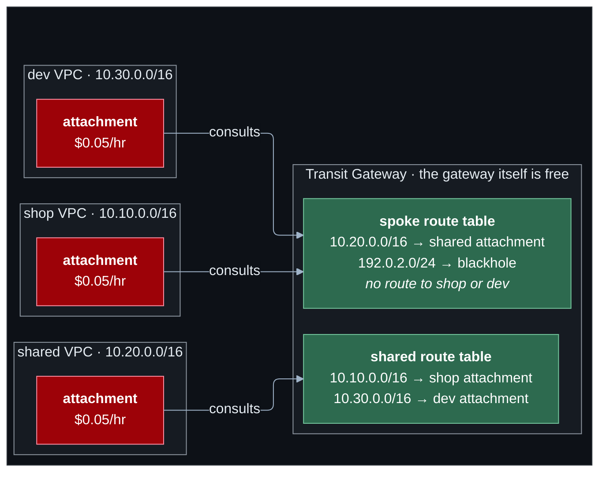

# Lab 10 — Transit Gateway

**Difficulty:** Advanced · **Time:** 60 min · **Cost:** **+USD 0.15/hour with the Transit Gateway** (opt-in). Without it the three VPCs are disconnected.

Peering joined pairs. This lab **removes** the peering connections and
replaces them with a hub: every VPC attaches once, every route table gets one
route, and who may talk to whom is decided in one place.

**What changes from lab 09:** `peering.tf` is deleted; `transit-gateway.tf`
is new. Applying this lab destroys the peering connections and their routes.

---

## Learning objectives

1. Explain hub-and-spoke routing and what it replaces.
2. Distinguish a Transit Gateway route table **association** (which table an
   attachment consults) from a **propagation** (which tables learn about it).
3. Build network segmentation with two route tables, and explain why it is
   asymmetric on purpose.
4. Use one summary route per VPC route table, and say what it depends on.
5. Recognise a blackhole route.

## Concepts covered

Hub-and-spoke topology · transitive routing · VPC attachments · attachment
subnets · Transit Gateway route tables · association versus propagation ·
segmentation · summary routes · blackhole routes · shared-services pattern

---

## Architecture



Each attachment consults exactly one table. Shop and dev consult the same
one, and it has no route to either of them.

## Traffic flow

**The web server calls the shared tools.**

1. Shop route table: `10.0.0.0/8 → tgw`. One route covers every VPC in the
   project, including ones that do not exist yet.
2. The packet enters the Transit Gateway through the shop's **attachment**.
3. The gateway asks: which route table is this attachment *associated* with?
   The **spoke** table. That table is consulted — and only that table.
4. The spoke table has `10.20.0.0/16 → shared attachment`, because the shared
   attachment *propagates* into it. The packet is forwarded.
5. The reply enters through the shared attachment, which is associated with
   the **shared** table. That table learned `10.10.0.0/16` from the shop
   attachment's propagation. The reply goes back.

**The web server tries the dev host.**

1. Shop route table: `10.0.0.0/8 → tgw` matches. The packet reaches the
   gateway — further than it got with peering.
2. The spoke table has no route for `10.30.0.0/16`. Dev's attachment does not
   propagate into it. The packet is dropped **at the gateway**.

Lab 09 kept shop and dev apart as a side effect of how peering works. Here it
is a written policy: one propagation is all that separates them.

---

## Resources created

| Resource | Count | Cost |
| --- | --- | --- |
| Transit Gateway | 1 | Free |
| VPC attachments | 3 | **USD 0.05/hour each — USD 110/month for three** + USD 0.02/GB |
| Attachment subnets (the last /28 of each VPC) | 3 | Free |
| Transit Gateway route tables | 2 | Free |
| VPC routes to the gateway | 5 | Free |

## Prerequisites

- Terraform `>= 1.11.0` and AWS credentials for a sandbox account
  (`aws sts get-caller-identity`).
- The state bucket from [`bootstrap/`](../../bootstrap/README.md).
- Lab 09 applied, or at least read: this lab changes what it built. See [`../09-vpc-peering/`](../09-vpc-peering/README.md).
- The [Session Manager plugin](https://docs.aws.amazon.com/systems-manager/latest/userguide/session-manager-working-with-install-plugin.html)
  for the AWS CLI, to open a shell on a host.

How the labs fit together, and what "one project, one state" means in
practice, is in [`docs/working-with-the-labs.md`](../../docs/working-with-the-labs.md).

## Deploy

Every lab uses the same state, so this lab **upgrades** what the previous one
built. Carry your settings forward and add the new ones:

```bash
cd labs/10-transit-gateway

cp ../09-vpc-peering/backend.hcl .
cp ../09-vpc-peering/terraform.tfvars .
diff terraform.tfvars terraform.tfvars.example   # what this lab adds; copy across what you want

terraform init -backend-config=backend.hcl
terraform plan                                   # read it: this is the lab
terraform apply
```

To see exactly what changed in the code: `make lab-diff FROM=09-vpc-peering TO=10-transit-gateway`
from the repository root.

```hcl
acknowledge_costs      = true
enable_transit_gateway = true
```

Read the plan: the peering connections and their ten routes are **destroyed**,
and the gateway takes their place. With `enable_transit_gateway = false` only
the destruction happens, and the VPCs are left isolated — `terraform plan`
says so through the `transit_gateway_is_disabled` check.

---

## Verification

`terraform output verify_transit_gateway` prints these with your values.

### 1. Same results as lab 09, different mechanism

From the web server: the shared host answers, the dev host times out. From
the dev host: the shared host answers.

### 2. What each table knows

```bash
terraform output -json verify_transit_gateway | jq -r .spoke_table_routes | sh
terraform output -json verify_transit_gateway | jq -r .shared_table_routes | sh
```

Spoke: `10.20.0.0/16` (propagated) and `192.0.2.0/24` (static, **blackhole**).
Shared: `10.10.0.0/16` and `10.30.0.0/16`.

### 3. Which table each attachment uses

```bash
terraform output -json verify_transit_gateway | jq -r .attachments | sh
```

### 4. One route per VPC route table

```bash
aws ec2 describe-route-tables --filters Name=tag:Project,Values=shop \
  --query 'RouteTables[].{Name:Tags[?Key==`Name`]|[0].Value,ToTgw:Routes[?TransitGatewayId!=`null`].DestinationCidrBlock}' --output table
```

Every table: `10.0.0.0/8`. Compare with lab 09's list.

---

## Hands-on exercises

### 1. Open the hole

Set `allow_dev_to_shop = true` and apply. One propagation is added, and dev
reaches the shop. Check whether the shop reaches dev — and explain the answer
from the spoke table. Turn it off.

### 2. A fourth VPC, on paper

A `staging` VPC at `10.50.0.0/16` joins as a spoke. List what you would
create: one attachment, one association, one propagation into the shared
table, one route in its own route table. **Nothing in shop, dev or shared
changes.** With peering you would have touched all three.

### 3. The blackhole

From the web server, `ping 192.0.2.1`. The packet matches `10.0.0.0/8`? No —
so it never reaches the gateway. Change `blackhole_cidr` to `10.20.0.0/24`,
apply, and call the shared host: dropped, with a perfectly healthy-looking
route in the table. A blackhole is how a range is quarantined in one place.
Restore the default.

### 4. Longest prefix, again

The shop's route tables hold `10.10.0.0/16 → local` and `10.0.0.0/8 → tgw`.
Traffic to the database still stays inside the VPC. Why?

---

## Troubleshooting exercises

### A. The gateway is not the firewall

Reachability is decided by the Transit Gateway route tables, and then again
by security groups at the destination. Remove the shared host's 8080 rule:
the packet crosses the gateway and is rejected on arrival. Flow logs on the
shared VPC would show a REJECT; the gateway shows nothing wrong.

### B. Return path

Remove the shop attachment's propagation into the shared table. Requests
from the shop still arrive at the shared host. Replies are dropped at the
gateway. **Every routed hop needs a route in each direction.**

---

## Cleanup

Moving on to the next lab? **Do not destroy** -- the next lab builds on this
one. Turn off any opt-in you no longer need (set its `enable_*` flag to `false`
and `terraform apply`) so it stops billing.

Finished for now? Destroy from **this** folder -- the folder you applied last:

```bash
terraform destroy
```

Then confirm nothing is left:

```bash
aws resourcegroupstaggingapi get-resources --tag-filters Key=Project,Values=shop \
  --query 'ResourceTagMappingList[].ResourceARN' --output text
```

Empty output means clean.

Three attachments cost USD 3.60 a day. Turn the gateway off between
sittings: `enable_transit_gateway = false`, then apply.

---

## Further reading

- [What is a transit gateway?](https://docs.aws.amazon.com/vpc/latest/tgw/what-is-transit-gateway.html) — AWS
- [Transit gateway route tables](https://docs.aws.amazon.com/vpc/latest/tgw/tgw-route-tables.html) — AWS
- [Isolated VPCs with shared services](https://docs.aws.amazon.com/vpc/latest/tgw/transit-gateway-isolated-shared.html) — AWS
- [Transit gateway design best practices](https://docs.aws.amazon.com/vpc/latest/tgw/tgw-best-design-practices.html) — AWS
- [Transit Gateway pricing](https://aws.amazon.com/transit-gateway/pricing/) — AWS

**Next:** [Lab 11](../11-dns-and-privatelink/README.md)
