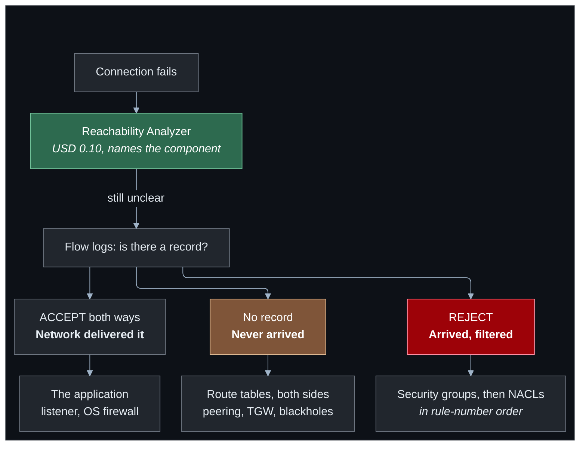
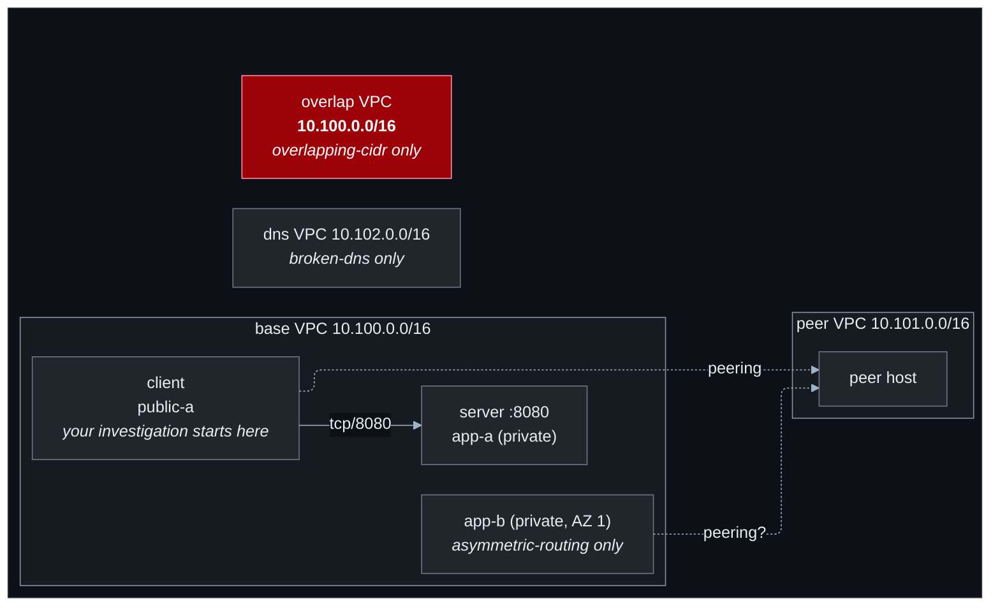

# Lab 10 — Troubleshooting challenges

**Difficulty:** Advanced · **Time:** 20–40 min per challenge · **Cost:** ~USD 0.016/hour

> ## ⚠️ This lab deploys deliberately broken infrastructure
>
> Every fault is real, is the kind that occurs in production, and fails the way
> the real thing fails: silently, with a timeout, and with every component
> reporting itself healthy.
>
> **Safety properties, all deliberate:** nothing is reachable from the internet
> except through Session Manager, no inbound port is opened to `0.0.0.0/0`,
> every scenario is confined to this lab's own VPCs, and every resource is
> tagged `Warning = intentionally-misconfigured`.

Nine scenarios. Enable one, diagnose it, destroy, repeat.

- 🚫 [HINTS.md](HINTS.md) — three hints per challenge, increasing in specificity
- 🚫 [SOLUTIONS.md](SOLUTIONS.md) — the answers. Last resort.

---

## Learning objectives

1. Distinguish "the packet was blocked" from "the packet never arrived", and use
   the right tool for each.
2. Apply a repeatable diagnostic order instead of guessing.
3. Recognise the specific failure signature of each common misconfiguration.
4. Use VPC Flow Logs, Reachability Analyzer and the AWS CLI as investigation
   tools rather than as things you have read about.
5. Explain, for each fault, why it is hard to spot — which is what makes it
   worth recognising on sight.

---

## The challenges

| Challenge | Symptom | Concept |
| --- | --- | --- |
| `missing-route` | Peering `active`, no traffic | Routes are needed on **both** sides |
| `overlapping-cidr` | Two VPCs that cannot be peered | The `local` route always wins |
| `security-group` | Timeout; a rule for the port exists | Group references name an identity |
| `nacl-ephemeral` | Outbound hangs; every rule allows it | Stateless filtering |
| `broken-dns` | Correct record, `NXDOMAIN` | VPC DNS attributes |
| `endpoint-policy` | `AccessDenied` with correct IAM | Endpoint policies deny by omission |
| `missing-association` | Endpoint `available`, S3 times out | A gateway endpoint is a **route** |
| `asymmetric-routing` | One subnet works, its twin does not | Per-AZ route tables diverge |
| `flow-log-rejects` | Traffic dropped; find the layer | Reading flow logs |

---

## The method

Before touching any specific challenge, internalise this order. It is cheaper at
every step than the one after it.



**Reachability Analyzer first.** Ten cents, no packet sent, and it names the
blocking component — the security group ID, the ACL rule number, the missing
route. After ten minutes of manual investigation it is unambiguously worth it.

Its limits, which matter: it evaluates **configuration**, not liveness. It knows
nothing about a crashed service, an OS firewall, DNS, or a blackhole route at a
Transit Gateway.

---

## Architecture

The topology varies by challenge. The base is constant:



**Note:** the server sits in a private subnet with no NAT gateway and no VPC
endpoints, so Session Manager cannot reach it. That is intentional — every
investigation is done **from the client**, toward the server, which is how you
would work against a host you cannot log into.

---

## Deploy

```bash
cd labs/10-troubleshooting-challenges
cp backend.hcl.example backend.hcl && $EDITOR backend.hcl
cp terraform.tfvars.example terraform.tfvars
```

Pick one:

```hcl
challenges = ["missing-route"]
```

```bash
terraform init -backend-config=backend.hcl
terraform apply
terraform output active_challenges
```

```
{
  "missing-route" = "From the client, ping the peer VPC's instance. It fails. The peering connection is 'active'. Find out why no packet gets through."
}
```

A `check` block warns if you enable more than two at once. Interacting faults
are realistic and a poor way to learn.

---

## Working a challenge

```bash
# The brief
terraform output active_challenges

# Get onto the client
terraform output -json session_manager_commands | jq -r .client
```

Reproduce the symptom, then investigate. `terraform output
investigation_starters` prints read-only commands that save typing — route
tables, security group rules, NACL entries, VPC DNS attributes, peering
connections, endpoints:

```bash
terraform output -json investigation_starters | jq -r .all_route_tables | bash
terraform output -json investigation_starters | jq -r .all_security_group_rules | bash
terraform output -json investigation_starters | jq -r .network_acls | bash
```

Reachability Analyzer, when you want the answer handed to you:

```bash
REGION=$(terraform output -raw aws_region)
SRC=$(aws ec2 describe-instances --region $REGION \
  --instance-ids $(terraform output -raw client_instance_id) \
  --query 'Reservations[0].Instances[0].NetworkInterfaces[0].NetworkInterfaceId' --output text)
DST=$(aws ec2 describe-instances --region $REGION \
  --filters Name=tag:Role,Values=server Name=instance-state-name,Values=running \
  --query 'Reservations[0].Instances[0].NetworkInterfaces[0].NetworkInterfaceId' --output text)

PATH_ID=$(aws ec2 create-network-insights-path --region $REGION \
  --source $SRC --destination $DST --protocol tcp --destination-port 8080 \
  --query 'NetworkInsightsPath.NetworkInsightsPathId' --output text)

ANALYSIS=$(aws ec2 start-network-insights-analysis --region $REGION \
  --network-insights-path-id $PATH_ID \
  --query 'NetworkInsightsAnalysis.NetworkInsightsAnalysisId' --output text)

sleep 30
aws ec2 describe-network-insights-analyses --region $REGION \
  --network-insights-analysis-ids $ANALYSIS \
  --query 'NetworkInsightsAnalyses[0].{Found:NetworkPathFound,Explanations:Explanations}' --output json
```

That costs USD 0.10 and, for most of these challenges, ends the investigation.
Clean up the path afterwards (`aws ec2 delete-network-insights-path`) or
Terraform will not care but your console will accumulate them.

---

## Suggested order

Work them in this order — each builds on the diagnostic habits of the last.

1. **`missing-route`** — the discipline of checking both sides
2. **`security-group`** — reading a rule properly rather than skimming it
3. **`nacl-ephemeral`** — statefulness, the concept most people half-know
4. **`flow-log-rejects`** — the tool that makes the rest tractable
5. **`missing-association`** — what a gateway endpoint actually is
6. **`endpoint-policy`** — two policies, both must allow
7. **`broken-dns`** — the fault is never where the symptom is
8. **`asymmetric-routing`** — intermittent failures and per-AZ divergence
9. **`overlapping-cidr`** — the one with no configuration fix

---

## After you solve one

Fix it in Terraform rather than only in the console, and confirm with
`terraform apply` that the symptom disappears. Then, for each, be able to answer:

1. What was the symptom, in one sentence?
2. What was the fault?
3. **Why was it hard to spot?** — the important one
4. What would have caught it in code review?
5. What monitoring would have caught it in production?

Question 3 is where the value is. Every one of these faults survives casual
inspection for a specific structural reason, and recognising that reason is what
makes you fast the next time.

---

## Cost

| Resource | Cost |
| --- | --- |
| VPCs, subnets, route tables, peering, endpoints | Free |
| EC2 `t4g.nano` × 2–3 + public IPs | ~USD 0.016–0.026/hour |
| VPC Flow Logs (`flow-log-rejects` only) | Cents |
| Reachability Analyzer | USD 0.10 per analysis you choose to run |

**~USD 0.40 for a full day.** Nothing here is expensive; destroy it anyway.

---

## Cleanup

```bash
terraform destroy
```

```bash
REGION=$(terraform output -raw aws_region 2>/dev/null || echo ap-southeast-1)

# Anything still tagged as intentionally broken is worth removing.
aws resourcegroupstaggingapi get-resources --region $REGION \
  --tag-filters Key=Warning,Values=intentionally-misconfigured \
  --query 'ResourceTagMappingList[].ResourceARN' --output text

# Network Insights paths are free but accumulate.
aws ec2 describe-network-insights-paths --region $REGION \
  --query 'NetworkInsightsPaths[].NetworkInsightsPathId' --output text
```

---

## Further reading

- [Reachability Analyzer](https://docs.aws.amazon.com/vpc/latest/reachability/what-is-reachability-analyzer.html) — AWS
- [Reachability Analyzer explanation codes](https://docs.aws.amazon.com/vpc/latest/reachability/explanation-codes.html) — AWS
- [VPC Flow Logs](https://docs.aws.amazon.com/vpc/latest/userguide/flow-logs.html) — AWS
- [Troubleshoot VPC connectivity](https://docs.aws.amazon.com/vpc/latest/userguide/vpc-troubleshooting.html) — AWS
- [Unsupported VPC peering configurations](https://docs.aws.amazon.com/vpc/latest/peering/invalid-peering-configurations.html) — AWS
- [Network ACL rule evaluation](https://docs.aws.amazon.com/vpc/latest/userguide/vpc-network-acls.html#nacl-rules) — AWS
- [`docs/troubleshooting.md`](../../docs/troubleshooting.md) — this repository's general troubleshooting guide

**Back to:** [the learning path](../../docs/learning-path.md)
