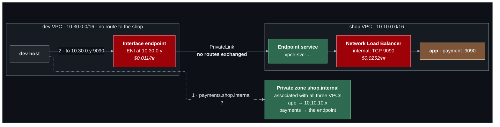

# Lab 11 — Private DNS and PrivateLink

**Difficulty:** Advanced · **Time:** 60 min · **Cost:** cents by default; **+USD 0.036/hour with PrivateLink**, **+USD 0.25/hour per Resolver endpoint** (both opt-in)

Two things are still done by hand. Every address inside the project is copied
from a Terraform output, and dev — deliberately cut off from the shop in lab
10 — has no way to call the one thing it legitimately needs: the payment
service. This lab gives the project names, and gives dev exactly one service
without giving it a network.

**Video:** extends section 2 (DNS) into private networks. PrivateLink is not
in the video.

**What changes from lab 10:** `private-dns.tf` and `privatelink.tf` are new.

---

## Learning objectives

1. Explain what a private hosted zone is and what "associated with a VPC"
   controls.
2. Find the VPC resolver and explain why it only answers from inside.
3. Keep **name resolution** and **reachability** separate: one does not imply
   the other.
4. Explain split-horizon DNS and which zone wins when two could answer.
5. Describe PrivateLink from both sides, and say why it works between VPCs
   with no route and even with overlapping ranges.
6. Explain what Route 53 Resolver endpoints are for.

## Concepts covered

Private hosted zones · zone–VPC association · the VPC resolver (base + 2) ·
split-horizon DNS · most-specific-zone matching · Network Load Balancers
(layer 4) · endpoint services · allowed principals · interface endpoints as
a consumer · unidirectional connectivity · Resolver inbound and outbound
endpoints · forwarding rules · DNS over UDP and TCP

---

## Architecture



## Traffic flow

**Private DNS: the web server resolves `app.shop.internal`.**

1. The host's resolver is `10.10.0.2` — the VPC range's base address plus
   two. Every VPC has one at that address, and it answers only queries that
   originate inside the VPC.
2. The resolver checks whether a private hosted zone associated with **this
   VPC** covers the name. `shop.internal` is. It answers `10.10.10.x`.
3. The same query from your laptop returns nothing: the zone does not exist
   on the internet.

**DNS is not connectivity: the dev host resolves the same name.**

1. The zone is associated with the dev VPC too, so dev's resolver answers
   `10.10.10.x`.
2. Dev sends to `10.10.10.x`. Dev's route table has no route there — with the
   Transit Gateway on, the packet reaches the gateway and the spoke table
   drops it. **The name resolved and the connection timed out.**

**PrivateLink: the dev host calls `payments.shop.internal:9090`.**

1. The name is a CNAME to the interface endpoint's own DNS name, which
   resolves to `10.30.0.y` — an address **inside dev's own VPC**.
2. `local` route. No route to the shop is involved, because the packet never
   leaves dev's address space as far as dev can tell.
3. The endpoint's security group allows 9090 from the dev VPC.
4. AWS carries the connection to the endpoint service in the shop VPC, where
   it emerges from the Network Load Balancer with a **source address in the
   app subnets**. The app host never sees dev's address.
5. The load balancer forwards to `app:9090`.

Connections can only be opened from consumer to provider. The shop cannot
reach anything in dev through this, and dev can reach nothing in the shop
except that one port on that one service.

---

## Resources created

| Resource | When | Cost |
| --- | --- | --- |
| Private hosted zone + 5 records | always | USD 0.50/month |
| Second private zone (split horizon) | `split_horizon_domain` | USD 0.50/month |
| Network Load Balancer | `enable_privatelink` | **~USD 0.0252/hour** |
| Endpoint service | `enable_privatelink` | Free |
| Interface endpoint in dev | `enable_privatelink` | **~USD 0.011/hour** + USD 0.01/GB |
| Resolver inbound endpoint (2 ENIs) | `enable_resolver_inbound_endpoint` | **USD 0.25/hour — USD 180/month** |
| Resolver outbound endpoint (2 ENIs) + rule | `enable_resolver_outbound_endpoint` | **USD 0.25/hour — USD 180/month** |

## Prerequisites

- Terraform `>= 1.11.0` and AWS credentials for a sandbox account
  (`aws sts get-caller-identity`).
- The state bucket from [`bootstrap/`](../../bootstrap/README.md).
- Lab 10 applied, or at least read: this lab changes what it built. See [`../10-transit-gateway/`](../10-transit-gateway/README.md).
- The [Session Manager plugin](https://docs.aws.amazon.com/systems-manager/latest/userguide/session-manager-working-with-install-plugin.html)
  for the AWS CLI, to open a shell on a host.

How the labs fit together, and what "one project, one state" means in
practice, is in [`docs/working-with-the-labs.md`](../../docs/working-with-the-labs.md).

## Deploy

Every lab uses the same state, so this lab **upgrades** what the previous one
built. Carry your settings forward and add the new ones:

```bash
cd labs/11-dns-and-privatelink

cp ../10-transit-gateway/backend.hcl .
cp ../10-transit-gateway/terraform.tfvars .
diff terraform.tfvars terraform.tfvars.example   # what this lab adds; copy across what you want

terraform init -backend-config=backend.hcl
terraform plan                                   # read it: this is the lab
terraform apply
```

To see exactly what changed in the code: `make lab-diff FROM=10-transit-gateway TO=11-dns-and-privatelink`
from the repository root.

The private zone is created by default. For PrivateLink:

```hcl
acknowledge_costs  = true
enable_privatelink = true
```

---

## Verification

`terraform output verify_private_dns` and `verify_privatelink` print these.

### 1. Names instead of addresses

From the web server:

```bash
cat /etc/resolv.conf                           # nameserver 10.10.0.2
dig +short app.shop.internal
curl -s http://app.shop.internal:9090/
```

From your own machine, `dig +short app.shop.internal` returns nothing.

### 2. Resolved, and unreachable

From the dev host:

```bash
dig +short app.shop.internal                   # the right answer
curl -s --max-time 5 http://app.shop.internal:9090/ || echo "resolved, then timed out"
```

### 3. One service, through PrivateLink

Still on the dev host:

```bash
dig +short payments.shop.internal              # 10.30.0.y -- dev's OWN range
curl -s http://payments.shop.internal:9090/
```

The answer's `client_seen` is a `10.10.10.x` or `10.10.11.x` address: the
load balancer, not dev.

### 4. Still no route

```bash
terraform output -json verify_privatelink | jq -r .dev_route_table_unchanged | sh
```

No entry for `10.10.0.0/16` was added. The app host's real address is still
unreachable from dev.

### 5. Zone associations

```bash
terraform output -json verify_private_dns | jq -r .zone_associations | sh
```

---

## Hands-on exercises

### 1. Split horizon

Set `split_horizon_domain = "example.com"` and apply. On the web server,
`dig +short example.com` returns the web server's private address; on your
laptop it returns the real one. Same name, two answers, decided by where you
ask from. This is how an internal version of a public site is served.

### 2. Most specific zone wins

Lab 06 created the Cloud Map namespace `svc.shop.internal`, which is itself a
private hosted zone. Both it and `shop.internal` could answer for
`payment.svc.shop.internal`. The longer zone name wins. List both:

```bash
aws route53 list-hosted-zones --query 'HostedZones[?Config.PrivateZone].Name'
```

(Lab 14 turns this rule into a fault.)

### 3. Disassociate

Remove dev from the zone (filter `local.vpc_ids` in the `dynamic "vpc"` block)
and plan. Dev would stop resolving every `shop.internal` name — including
`payments`, which would break PrivateLink for it without touching PrivateLink.

### 4. Resolver endpoints (about eight cents for twenty minutes)

Enable `enable_resolver_inbound_endpoint`. `terraform output
resolver_inbound_ip_addresses` gives two addresses. From the **dev** host,
ask one of them directly:

```bash
dig +short app.shop.internal @<inbound address>
```

With the Transit Gateway on, that works from the shared VPC and times out
from dev (no route to the shop). An inbound endpoint is a DNS server with an
ordinary VPC address, so it obeys ordinary routing — which is what lets an
on-premises DNS server forward to it over a VPN (lab 12). **Turn it off.**

---

## Troubleshooting exercises

### A. Which side of PrivateLink is broken?

`describe-vpc-endpoints` shows the endpoint's state. `pendingAcceptance`: the
provider has `acceptance_required`. `rejected` or a failed create: the
consumer's account is not an allowed principal. `available` and timeouts: a
security group — the endpoint's, or the app host not allowing the load
balancer's subnets.

### B. UDP only

DNS answers larger than one datagram are retried over TCP. A security group
that allows only UDP 53 works for months and fails on the first large answer.
The Resolver security group allows both.

---

## Cleanup

Moving on to the next lab? **Do not destroy** -- the next lab builds on this
one. Turn off any opt-in you no longer need (set its `enable_*` flag to `false`
and `terraform apply`) so it stops billing.

Finished for now? Destroy from **this** folder -- the folder you applied last:

```bash
terraform destroy
```

Then confirm nothing is left:

```bash
aws resourcegroupstaggingapi get-resources --tag-filters Key=Project,Values=shop \
  --query 'ResourceTagMappingList[].ResourceARN' --output text
```

Empty output means clean.

---

## Further reading

- [Private hosted zones](https://docs.aws.amazon.com/Route53/latest/DeveloperGuide/hosted-zones-private.html) — AWS
- [Amazon DNS server in a VPC](https://docs.aws.amazon.com/vpc/latest/userguide/AmazonDNS-concepts.html) — AWS
- [Split-view DNS](https://docs.aws.amazon.com/Route53/latest/DeveloperGuide/hosted-zone-private-considerations.html) — AWS
- [Share a service through PrivateLink](https://docs.aws.amazon.com/vpc/latest/privatelink/privatelink-share-your-services.html) — AWS
- [Route 53 Resolver endpoints](https://docs.aws.amazon.com/Route53/latest/DeveloperGuide/resolver.html) — AWS
- [Network Load Balancers](https://docs.aws.amazon.com/elasticloadbalancing/latest/network/introduction.html) — AWS

**Next:** [Lab 12](../12-hybrid-networking/README.md)
