# Lab 12 — Hybrid networking

**Difficulty:** Advanced · **Time:** 75 min · **Cost:** nothing by default; **about USD 0.076/hour with the VPN and simulated office** (opt-in)

The company has an office, on `192.168.0.0/16`, and its staff need the shop's
private addresses. This lab joins a network that is not in AWS to one that
is, with an encrypted tunnel over the internet.

There is no office. It is simulated by one more VPC, in an address range that
looks nothing like the rest of the project, containing one EC2 instance
running libreswan. To AWS it is indistinguishable from a real router.

**What changes from lab 11:** `hybrid.tf` and `templates/office-router.sh.tftpl`
are new.

---

## Learning objectives

1. Name the parts of a Site-to-Site VPN — customer gateway, virtual private
   gateway, connection, tunnels — and say which are free.
2. Explain why AWS gives every connection two tunnels.
3. Describe route **propagation** and how it differs from writing a route.
4. Explain why a router instance needs source/destination checking off.
5. Read tunnel state from both ends.
6. Say what Direct Connect changes and what it does not.

## Concepts covered

Customer gateways · virtual private gateways · Site-to-Site VPN · IKEv2 and
IPsec · pre-shared keys · NAT traversal (UDP 4500) · dead peer detection ·
redundant tunnels · static routes versus BGP · route propagation ·
source/destination checking · reverse-path filtering · Direct Connect
gateways

---

## Architecture

```mermaid
---
config:
  layout: elk
  theme: base
  themeVariables:
    lineColor: "#9fb3c8"
    textColor: "#e6edf3"
    primaryColor: "#21262d"
    primaryTextColor: "#e6edf3"
    primaryBorderColor: "#6e7681"
    edgeLabelBackground: "#0d1117"
    clusterBkg: "#161b22"
    clusterBorder: "#6e7681"
    titleColor: "#e6edf3"
  flowchart:
    curve: rounded
    wrappingWidth: 420
---
flowchart LR
    subgraph CANVAS[" "]
        subgraph OFFICE["simulated office · 192.168.0.0/16"]
            LAN["<b>Office route table</b><br/>10.10.0.0/16 → router"]
            RTR["<b>libreswan router</b><br/>t4g.small · Elastic IP<br/><i>source/dest check off</i>"]
        end

        CGW["<b>Customer gateway</b><br/><i>free — a record of the router's address</i>"]

        subgraph SHOP["shop VPC · 10.10.0.0/16"]
            VGW["<b>Virtual private gateway</b><br/><i>free</i>"]
            RT["<b>Route tables</b><br/>192.168.0.0/16 → vgw<br/><i>propagated</i>"]
            WEB["<b>web</b> · frontend :80"]
        end
    end

    LAN --- RTR
    RTR ---|"tunnel 1<br/>IKEv2 / ESP in UDP 4500"| VGW
    RTR ---|"tunnel 2<br/>standby"| VGW
    CGW -.->|"describes"| RTR
    VGW --- RT --- WEB

    classDef canvas fill:#0d1117,stroke:#30363d,color:#e6edf3
    classDef vpc fill:#161b22,stroke:#8b949e,color:#e6edf3
    classDef az fill:#1c2128,stroke:#6e7681,color:#c9d1d9,stroke-dasharray:6 4
    classDef free fill:#2d6a4f,stroke:#74c69d,color:#fff
    classDef private fill:#7f5539,stroke:#ddb892,color:#fff
    classDef gateway fill:#1d3557,stroke:#a8dadc,color:#fff
    classDef billed fill:#9d0208,stroke:#ff8fa3,color:#fff
    classDef costly fill:#6a040f,stroke:#ff8fa3,color:#fff

    class CANVAS canvas
    class OFFICE,SHOP vpc
    class VGW,CGW,RT free
    class RTR private
```



## Traffic flow

**Someone at the office opens `http://<web private IP>/`**

1. The office network's route table sends `10.10.0.0/16` to the router's
   network interface. On a real office network this is the default gateway.
2. The router is not the packet's destination. EC2 normally drops such
   packets; **source/destination checking is off** on this instance so that
   it can forward.
3. libreswan has an IPsec policy: traffic from `192.168.0.0/16` to
   `10.10.0.0/16` is encrypted and wrapped in a new packet addressed to the
   AWS tunnel endpoint. Because the router sits behind the internet gateway's
   address translation, the wrapped packet travels as UDP 4500 (NAT
   traversal) rather than raw ESP.
4. The AWS endpoint unwraps it and hands it to the **virtual private
   gateway**, which delivers it into the shop VPC.
5. The web security group allows TCP 80 from `192.168.0.0/16`.
6. **The reply.** The shop's route tables contain `192.168.0.0/16 → vgw`.
   Nobody wrote that route: the gateway **propagated** it from the static
   route on the VPN connection. Through the tunnel, unwrapped by the router,
   delivered.

Two tunnels terminate in two Availability Zones. With static routing one
carries traffic; AWS performs maintenance on them one at a time, which is the
reason there are two.

---

## Resources created

| Resource | When | Cost |
| --- | --- | --- |
| Virtual private gateway + route propagation | always | Free |
| Customer gateway | VPN enabled | Free |
| Site-to-Site VPN connection (2 tunnels) | `enable_site_to_site_vpn` | **USD 0.05/hour — USD 36/month** |
| Office VPC, router (`t4g.small`), Elastic IP | `enable_simulated_office` (default, with the VPN) | ~USD 0.026/hour |
| Direct Connect gateway | `enable_direct_connect_gateway` | Free |

## Prerequisites

- Terraform `>= 1.11.0` and AWS credentials for a sandbox account
  (`aws sts get-caller-identity`).
- The state bucket from [`bootstrap/`](../../bootstrap/README.md).
- Lab 11 applied, or at least read: this lab changes what it built. See [`../11-dns-and-privatelink/`](../11-dns-and-privatelink/README.md).
- The [Session Manager plugin](https://docs.aws.amazon.com/systems-manager/latest/userguide/session-manager-working-with-install-plugin.html)
  for the AWS CLI, to open a shell on a host.

How the labs fit together, and what "one project, one state" means in
practice, is in [`docs/working-with-the-labs.md`](../../docs/working-with-the-labs.md).

## Deploy

Every lab uses the same state, so this lab **upgrades** what the previous one
built. Carry your settings forward and add the new ones:

```bash
cd labs/12-hybrid-networking

cp ../11-dns-and-privatelink/backend.hcl .
cp ../11-dns-and-privatelink/terraform.tfvars .
diff terraform.tfvars terraform.tfvars.example   # what this lab adds; copy across what you want

terraform init -backend-config=backend.hcl
terraform plan                                   # read it: this is the lab
terraform apply
```

To see exactly what changed in the code: `make lab-diff FROM=11-dns-and-privatelink TO=12-hybrid-networking`
from the repository root.

With the defaults only the free virtual private gateway is created. To run
the lab:

```hcl
acknowledge_costs       = true
enable_site_to_site_vpn = true
```

The connection takes about five minutes to create, and the router another
two or three to install libreswan and bring the tunnels up.

---

## Verification

`terraform output verify_hybrid` prints these with your values.

### 1. Tunnel state, from AWS

```bash
terraform output -json verify_hybrid | jq -r .tunnel_status | sh
```

Expected, after a few minutes: one or both tunnels `UP`.

### 2. Tunnel state, from the office

Open a shell with `terraform output -raw ssm_office_router`:

```bash
sudo tunnel-status
```

Look for `IPsec SA established` on `aws-tunnel1` and `aws-tunnel2`.

### 3. Across the tunnel

On the office router:

```bash
ping -c 3 <web private ip>
curl -s http://<web private ip>/
curl -s --max-time 5 http://<db private ip>:3306/ || echo "timed out, as intended"
```

The frontend answers, and its `client_seen` is a `192.168.0.x` address — no
translation anywhere on the path. The database stays closed to the office.

### 4. The route nobody wrote

```bash
terraform output -json verify_hybrid | jq -r .propagated_routes | sh
```

`192.168.0.0/16` with `Origin: EnableVgwRoutePropagation`. Compare with the
routes whose origin is `CreateRoute`.

---

## Hands-on exercises

### 1. Lose a tunnel

On the router: `sudo ipsec auto --down aws-tunnel1`. Keep a ping running.
Traffic moves to tunnel 2 after a short gap. `tunnel-status` and the AWS
telemetry both show it. Bring it back with `--up`.

### 2. See the encryption

On the router, in two shells:

```bash
sudo tcpdump -ni any udp port 4500 -c 5      # outside: opaque UDP
sudo tcpdump -ni any icmp -c 5               # inside: the pings themselves
```

### 3. Office names for AWS hosts

With lab 11's inbound Resolver endpoint on, the office can resolve
`shop.internal`:

```bash
dig +short web.shop.internal @<inbound endpoint address>
```

`hybrid.tf` already opens the endpoint's security group to the office range.

### 4. Direct Connect, as far as it goes

Set `enable_direct_connect_gateway = true`. It creates and associates in
seconds and carries nothing: the circuit it would join does not exist. Read
[the Direct Connect section below](#what-direct-connect-changes).

---

## Troubleshooting exercises

### A. Tunnel up, no traffic

In `hybrid.tf`, set `source_dest_check = true` on the office router and
apply. The tunnels stay `UP`. Traffic the router should forward for another
office host is now dropped by EC2 before the router sees it. **Tunnel state
and reachability are different questions.** Set it back to `false`.

### B. Tunnel down

`sudo journalctl -u ipsec -n 100 --no-pager` on the router. The usual causes:
mismatched algorithms (both ends are pinned in `hybrid.tf` and the template),
a wrong pre-shared key, or UDP 500/4500 blocked by the router's security
group.

### C. One direction only

Remove the propagation for one shop route table. Requests from the office to
hosts using that table arrive; replies have no route back.

---

## What Direct Connect changes

A VPN is a tunnel over the internet: quick to create, encrypted, with the
internet's variable latency. **Direct Connect** is a dedicated physical
circuit from a colocation facility into AWS: consistent latency, higher
bandwidth, lower per-GB transfer cost, weeks of lead time, and not encrypted
unless you add encryption on top.

```mermaid
---
config:
  layout: elk
  theme: base
  themeVariables:
    lineColor: "#9fb3c8"
    textColor: "#e6edf3"
    primaryColor: "#21262d"
    primaryTextColor: "#e6edf3"
    primaryBorderColor: "#6e7681"
    edgeLabelBackground: "#0d1117"
    clusterBkg: "#161b22"
    clusterBorder: "#6e7681"
    titleColor: "#e6edf3"
  flowchart:
    curve: rounded
    wrappingWidth: 420
---
flowchart LR
    subgraph CANVAS[" "]
        DC["<b>Your router</b><br/>in a colocation facility"]
        XC["<b>Cross-connect</b><br/><i>physical fibre · weeks of lead time</i>"]
        CONN["<b>DX connection</b><br/>1 / 10 / 100 Gbps<br/><i>hourly port charge</i>"]
        VIF["<b>Virtual interface</b><br/>private / public / transit"]
        DXGW["<b>DX gateway</b><br/><i>free · created by this lab</i>"]
        VGW["<b>VGW or Transit Gateway</b>"]
    end

    DC --> XC --> CONN --> VIF --> DXGW --> VGW

    classDef canvas fill:#0d1117,stroke:#30363d,color:#e6edf3
    classDef vpc fill:#161b22,stroke:#8b949e,color:#e6edf3
    classDef az fill:#1c2128,stroke:#6e7681,color:#c9d1d9,stroke-dasharray:6 4
    classDef free fill:#2d6a4f,stroke:#74c69d,color:#fff
    classDef private fill:#7f5539,stroke:#ddb892,color:#fff
    classDef gateway fill:#1d3557,stroke:#a8dadc,color:#fff
    classDef billed fill:#9d0208,stroke:#ff8fa3,color:#fff
    classDef costly fill:#6a040f,stroke:#ff8fa3,color:#fff

    class CANVAS canvas
    class DXGW free
    class XC,CONN billed
```



Everything to the right of the DX gateway is what you already built. Routing
on the AWS side — propagation, route tables, security groups — is identical.
A common design uses Direct Connect as the primary path and a VPN as its
backup.

## Cleanup

Moving on to the next lab? **Do not destroy** -- the next lab builds on this
one. Turn off any opt-in you no longer need (set its `enable_*` flag to `false`
and `terraform apply`) so it stops billing.

Finished for now? Destroy from **this** folder -- the folder you applied last:

```bash
terraform destroy
```

Then confirm nothing is left:

```bash
aws resourcegroupstaggingapi get-resources --tag-filters Key=Project,Values=shop \
  --query 'ResourceTagMappingList[].ResourceARN' --output text
```

Empty output means clean.

The VPN connection bills from the moment it exists, tunnels up or not.

---

## Further reading

- [How Site-to-Site VPN works](https://docs.aws.amazon.com/vpn/latest/s2svpn/how_it_works.html) — AWS
- [Tunnel options](https://docs.aws.amazon.com/vpn/latest/s2svpn/VPNTunnels.html) — AWS
- [Static and dynamic routing](https://docs.aws.amazon.com/vpn/latest/s2svpn/VPNRoutingTypes.html) — AWS
- [Route propagation](https://docs.aws.amazon.com/vpc/latest/userguide/WorkWithRouteTables.html#EnableDisableRouteProp) — AWS
- [Direct Connect gateways](https://docs.aws.amazon.com/directconnect/latest/UserGuide/direct-connect-gateways-intro.html) — AWS
- [Site-to-Site VPN pricing](https://aws.amazon.com/vpn/pricing/) — AWS

**Next:** [Lab 13](../13-multi-region/README.md)
