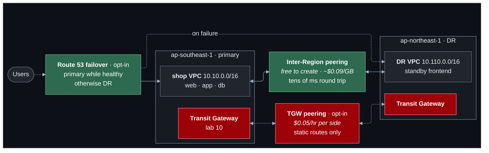

# Lab 13 — Multi-Region networking

**Difficulty:** Advanced · **Time:** 45–60 min · **Cost:** about +USD 0.01/hour; **+USD 0.10/hour with Transit Gateway peering** (opt-in)

Everything so far lives in one Region. If that Region has a bad day, so does
the shop. This lab adds a standby frontend in a second Region, connects the
two privately, and then deals with the part that connectivity alone does not
solve: sending users to the Region that is working.

**What changes from lab 12:** `multi-region.tf` is new; `providers.tf` gains
a second, aliased provider for the DR Region.

---

## Learning objectives

1. Explain what a Region boundary means for VPCs, subnets and security
   groups.
2. Peer two VPCs across Regions and say what differs from lab 09.
3. Explain which route wins when a VPC peering route and a Transit Gateway
   summary route both match.
4. Explain why Transit Gateway peering needs static routes.
5. Describe DNS failover: what is checked, what changes, and how long clients
   take to notice.
6. Account for inter-Region latency and data transfer cost.

## Concepts covered

Regions as boundaries · provider aliases · inter-Region VPC peering ·
requester and accepter across Regions · longest prefix match between
connection types · Transit Gateway peering attachments · static routes on
peering · Route 53 health checks · failover routing · TTL · inter-Region
latency and data transfer pricing · Global Accelerator and CloudFront
(concepts)

---

## Architecture



## Traffic flow

**The DR frontend calls the payment service in the primary Region.**

1. `curl http://<DR host public IP>/` reaches the standby frontend in the DR
   Region over the internet.
2. The frontend calls `10.10.10.x:9090` — the app host's **private** address,
   in another Region.
3. The DR VPC's route table has `10.10.0.0/16 → pcx-shop-dr`. The packet
   crosses the inter-Region peering connection on AWS's backbone, encrypted,
   never touching the internet.
4. The app security group allows 9090 from `10.110.0.0/16`. It has to be an
   address range: **a security group cannot reference a group in another
   Region.**
5. The reply follows the shop's `10.110.0.0/16 → pcx-shop-dr` route.

**Which route wins.** With lab 10's Transit Gateway on, the shop's route
tables hold both `10.0.0.0/8 → tgw` and `10.110.0.0/16 → pcx`. The `/16` is
more specific, so the peering connection carries the traffic. The order the
routes were created in is irrelevant.

**Failover.** Route 53 health checkers around the world request the primary
endpoint every 30 seconds. After three consecutive failures the primary
record is withdrawn and `global.shop.<zone>` answers with the DR host.
Clients move as their cached answer expires — the record's TTL is 30 seconds.
Nothing in either VPC changes; **failover is a DNS answer.**

---

## Resources created

| Resource | When | Cost |
| --- | --- | --- |
| DR VPC + host (`t4g.nano`) + public IPv4 | always | ~USD 0.01/hour |
| Inter-Region peering + routes | `enable_inter_region_peering` (default on) | Free; data ~USD 0.09/GB |
| DR Transit Gateway, VPC attachment, peering attachment | `enable_transit_gateway_peering` | **USD 0.10/hour** on top of lab 10 |
| Health check + failover records | `enable_dns_failover` | ~USD 0.50/month |

## Prerequisites

- Terraform `>= 1.11.0` and AWS credentials for a sandbox account
  (`aws sts get-caller-identity`).
- The state bucket from [`bootstrap/`](../../bootstrap/README.md).
- Lab 12 applied, or at least read: this lab changes what it built. See [`../12-hybrid-networking/`](../12-hybrid-networking/README.md).
- The [Session Manager plugin](https://docs.aws.amazon.com/systems-manager/latest/userguide/session-manager-working-with-install-plugin.html)
  for the AWS CLI, to open a shell on a host.

How the labs fit together, and what "one project, one state" means in
practice, is in [`docs/working-with-the-labs.md`](../../docs/working-with-the-labs.md).
- The second Region enabled in your account. `ap-northeast-1` is on by
  default.

## Deploy

Every lab uses the same state, so this lab **upgrades** what the previous one
built. Carry your settings forward and add the new ones:

```bash
cd labs/13-multi-region

cp ../12-hybrid-networking/backend.hcl .
cp ../12-hybrid-networking/terraform.tfvars .
diff terraform.tfvars terraform.tfvars.example   # what this lab adds; copy across what you want

terraform init -backend-config=backend.hcl
terraform plan                                   # read it: this is the lab
terraform apply
```

To see exactly what changed in the code: `make lab-diff FROM=12-hybrid-networking TO=13-multi-region`
from the repository root.

Resources are now created in **two Regions**. Commands in this lab that
inspect the DR side need `--region ap-northeast-1`.

---

## Verification

`terraform output verify_multi_region` prints these with your values.

### 1. A private call across Regions

```bash
curl -s "$(terraform output -raw dr_frontend_url)"
```

Expected:

```json
{"service": "frontend-dr", "host": "ip-10-110-0-…",
 "upstream": {"service": "payment", "client_seen": "10.110.0.23", …}}
```

The payment service saw a `10.110.x.x` address: the DR host, untranslated.

### 2. Distance

From the web server:

```bash
ping -c 5 <DR host private ip>
```

Singapore to Tokyo is roughly 70 ms round trip. Compare with a ping to the
app host. A chatty protocol that makes fifty round trips per request feels
this fifty times.

### 3. Requester and accepter

```bash
terraform output -json verify_multi_region | jq -r .peering_status | sh
```

`active`, with a different Region on each side.

### 4. Two routes, one winner

```bash
terraform output -json verify_multi_region | jq -r .from_web_route_to_dr | sh
```

With the Transit Gateway on, both `10.0.0.0/8` and `10.110.0.0/16` are
listed.

---

## Hands-on exercises

### 1. Break the accepter

In `multi-region.tf` the request and the acceptance are separate resources in
separate Regions. Comment out `aws_vpc_peering_connection_accepter.dr` and
plan: the connection would sit in `pending-acceptance`, and the routes that
reference it would fail. In one Region and one account, lab 09 skipped this
step with `auto_accept`.

### 2. Transit Gateway peering (about ten cents for half an hour)

```hcl
acknowledge_costs              = true
enable_transit_gateway         = true
enable_transit_gateway_peering = true
enable_inter_region_peering    = false    # so the gateway path is used
```

Then inspect the static routes on both gateways:

```bash
aws ec2 search-transit-gateway-routes --transit-gateway-route-table-id <spoke table> \
  --filters Name=type,Values=static --query 'Routes[].{Dest:DestinationCidrBlock,Type:Type}'
```

Peering attachments do not propagate. Every prefix that should cross was
written by hand, in both directions. Restore the settings afterwards.

### 3. Fail over

With `public_zone_name` and `enable_dns_failover` set:

```bash
watch -n 5 dig +short global.shop.<zone>
```

Stop the frontend on the web server (or, with the load balancer on, both of
its targets). After about ninety seconds the answer changes to the DR host.
Start it again and watch it return. Note what you did **not** have to do:
touch a route table.

### 4. Price a replication stream

Data leaving ap-southeast-1 for another Region costs about USD 0.09/GB. A
database replicating 50 GB a day to the DR Region is USD 135 a month in
transfer alone — before the instances.

---

## Troubleshooting exercises

### A. Works one way

Remove `aws_route.dr_to_shop`. The DR frontend's call to the payment service
times out; a ping from the shop to the DR host also fails, because the reply
has no route. Same lesson as labs 09 and 10, with a Region in the middle.

### B. DNS names across Regions

A private hosted zone can be associated with VPCs in any Region. Associate
`shop.internal` with the DR VPC (add it to the `dynamic "vpc"` block with
`vpc_region = var.dr_region`) so the DR frontend can use `app.shop.internal`
instead of an address.

---

## Beyond DNS failover

DNS failover is limited by caching: some clients ignore TTLs. Two services
avoid the problem by not changing the answer at all.

- **Global Accelerator** gives two static anycast addresses that enter AWS's
  network at the nearest edge and are steered to a healthy Region in seconds.
- **CloudFront** terminates connections at the edge and fails over between
  origins per request.

Both are billed monthly and are described here rather than deployed.

## Cleanup

Moving on to the next lab? **Do not destroy** -- the next lab builds on this
one. Turn off any opt-in you no longer need (set its `enable_*` flag to `false`
and `terraform apply`) so it stops billing.

Finished for now? Destroy from **this** folder -- the folder you applied last:

```bash
terraform destroy
```

Then confirm nothing is left:

```bash
aws resourcegroupstaggingapi get-resources --tag-filters Key=Project,Values=shop \
  --query 'ResourceTagMappingList[].ResourceARN' --output text
```

Empty output means clean.

`terraform destroy` removes resources in both Regions. It must be run from
this folder or a later one: earlier folders have no provider for the DR
Region.

---

## Further reading

- [Inter-Region VPC peering](https://docs.aws.amazon.com/vpc/latest/peering/create-vpc-peering-connection.html) — AWS
- [Transit gateway peering attachments](https://docs.aws.amazon.com/vpc/latest/tgw/tgw-peering.html) — AWS
- [Route 53 failover routing](https://docs.aws.amazon.com/Route53/latest/DeveloperGuide/dns-failover.html) — AWS
- [Route priority](https://docs.aws.amazon.com/vpc/latest/userguide/VPC_Route_Tables.html#route-tables-priority) — AWS
- [Data transfer pricing](https://aws.amazon.com/ec2/pricing/on-demand/#Data_Transfer) — AWS
- [AWS Global Accelerator](https://docs.aws.amazon.com/global-accelerator/latest/dg/what-is-global-accelerator.html) — AWS

**Next:** [Lab 14](../14-troubleshooting-challenges/README.md)
