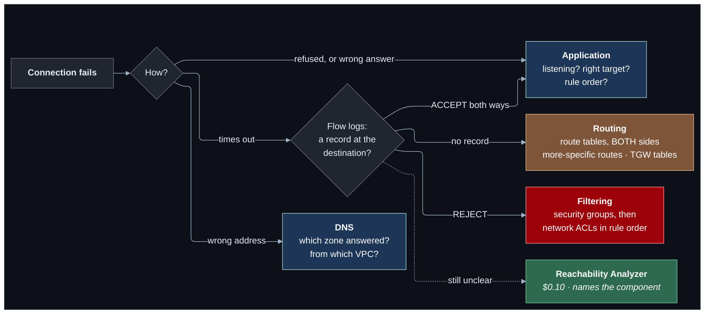

# Lab 14 — Troubleshooting challenges

**Difficulty:** Advanced · **Time:** 20–40 min per challenge · **Cost:** whatever you already have running, plus a `t4g.nano` for two of the challenges

The network is finished. This lab breaks it.

Each challenge injects **one** fault into the project you built over the last
thirteen labs. `terraform apply` succeeds, nothing reports an error, and
something stops working. You get a symptom. Find the cause.

**What changes from lab 13:** `challenges.tf`, [`HINTS.md`](HINTS.md) and
[`SOLUTIONS.md`](SOLUTIONS.md) are new. **Do not read `challenges.tf` below
its variable block** — the faults are written there in plain Terraform.

---

## Learning objectives

1. Classify a failure before reading any configuration: timeout, refusal,
   denial, or wrong answer.
2. Work a fault in a fixed order — route, filter, name, application — instead
   of reading every rule.
3. Use flow logs to decide between routing and filtering.
4. Use Reachability Analyzer when ten minutes of reading has not found it.
5. Recognise six faults that produce no error anywhere.

## Concepts covered

A troubleshooting method · timeout versus refusal · routing versus filtering ·
return paths · more-specific routes · stateless filtering · private zone
precedence · listener rule priority · flow logs and Reachability Analyzer in
anger

---

## The method



**A timeout means nothing answered. A refusal means something did.** Decide
which you have before opening a single route table.

## The challenges

| Challenge | Symptom | Needs |
| --- | --- | --- |
| `missing-route` | A peered partner VPC cannot be reached. The peering is active. | — |
| `security-group` | The partner VPC answers ping and nothing else. | — |
| `nacl-ephemeral` | The payment service can no longer use the database. | — |
| `wrong-next-hop` | The web server can no longer reach the payment service. | — |
| `broken-dns` | A name resolves, and the connection fails. By address it works. | — |
| `listener-rule-order` | `/pay` is answered by the wrong service. | `enable_load_balancer` |

The first two build a small **partner** VPC (`10.40.0.0/16`) with one host,
peered with the shop.

---

## Resources created

| Resource | When | Cost |
| --- | --- | --- |
| Partner VPC + host + peering | `missing-route`, `security-group` | ~USD 0.01/hour |
| One rule, route or zone | the other four | Free (a private zone is USD 0.50/month) |

Flow logs from lab 08 should be on. Reachability analyses are USD 0.10 each.

## Prerequisites

- Terraform `>= 1.11.0` and AWS credentials for a sandbox account
  (`aws sts get-caller-identity`).
- The state bucket from [`bootstrap/`](../../bootstrap/README.md).
- Lab 13 applied, or at least read: this lab changes what it built. See [`../13-multi-region/`](../13-multi-region/README.md).
- The [Session Manager plugin](https://docs.aws.amazon.com/systems-manager/latest/userguide/session-manager-working-with-install-plugin.html)
  for the AWS CLI, to open a shell on a host.

How the labs fit together, and what "one project, one state" means in
practice, is in [`docs/working-with-the-labs.md`](../../docs/working-with-the-labs.md).
- Labs 08 and 11 understood. You will need flow logs, and `shop.internal`.

## Deploy

Every lab uses the same state, so this lab **upgrades** what the previous one
built. Carry your settings forward and add the new ones:

```bash
cd labs/14-troubleshooting-challenges

cp ../13-multi-region/backend.hcl .
cp ../13-multi-region/terraform.tfvars .
diff terraform.tfvars terraform.tfvars.example   # what this lab adds; copy across what you want

terraform init -backend-config=backend.hcl
terraform plan                                   # read it: this is the lab
terraform apply
```

To see exactly what changed in the code: `make lab-diff FROM=13-multi-region TO=14-troubleshooting-challenges`
from the repository root.

Then, one challenge at a time:

```hcl
challenges = ["missing-route"]
```

```bash
terraform apply
terraform output challenge_briefs
```

The brief is everything you are told.

---

## How to work a challenge

1. **Reproduce the symptom** exactly as the brief describes it. Note whether
   it is a timeout, a refusal or a wrong answer.
2. **Investigate with read-only commands.** The `verify_*` outputs from every
   earlier lab still work. So do the flow-log queries from lab 08.
3. **Write down your diagnosis** — which component, which rule — before
   looking anything up.
4. Stuck for ten minutes? One hint from [`HINTS.md`](HINTS.md). There are
   three per challenge, each more specific than the last.
5. **Fix it in Terraform.** Now open `challenges.tf`, find the fault, correct
   it and apply. Confirm the symptom is gone.
6. Read the matching section of [`SOLUTIONS.md`](SOLUTIONS.md).
7. Restore the file — `git checkout challenges.tf` — set `challenges = []`
   and apply. Then pick the next one.

## Verification

For every challenge, "verified" means the command in the brief succeeds
after your fix and you can state the cause in one sentence. `SOLUTIONS.md`
gives the sentence.

---

## Hands-on exercises

### 1. Do them blind

Have someone else choose the challenge and apply it, so even the name is not
a clue.

### 2. Two at once

The `one_challenge_at_a_time` check warns if you enable more than one. Do it
anyway, once, with `nacl-ephemeral` and `wrong-next-hop`. The symptoms
overlap; fixing one reveals the other. This is what real incidents are like.

### 3. Write your own

Add a seventh challenge to `challenges.tf`: a fault, a brief that gives only
the symptom, three hints and a solution. Candidates: a Transit Gateway
blackhole route, an S3 endpoint policy that names the wrong bucket, a host
firewall rule, a missing return route to the DR Region.

## Troubleshooting exercises

This entire lab is the troubleshooting exercise. One more, about the method
itself:

### A. Time yourself with and without Reachability Analyzer

Solve `wrong-next-hop` by reading configuration. Then reset, re-apply and
solve it with one analysis. Note both times, and what USD 0.10 bought.

---

## Cleanup

Moving on to the next lab? **Do not destroy** -- the next lab builds on this
one. Turn off any opt-in you no longer need (set its `enable_*` flag to `false`
and `terraform apply`) so it stops billing.

Finished for now? Destroy from **this** folder -- the folder you applied last:

```bash
terraform destroy
```

Then confirm nothing is left:

```bash
aws resourcegroupstaggingapi get-resources --tag-filters Key=Project,Values=shop \
  --query 'ResourceTagMappingList[].ResourceARN' --output text
```

Empty output means clean.

---

## Further reading

- [`docs/troubleshooting.md`](../../docs/troubleshooting.md) — the full method
- [Troubleshoot reachability](https://docs.aws.amazon.com/vpc/latest/reachability/getting-started.html) — AWS
- [Flow log record examples](https://docs.aws.amazon.com/vpc/latest/userguide/flow-logs-records-examples.html) — AWS
- [Route priority](https://docs.aws.amazon.com/vpc/latest/userguide/VPC_Route_Tables.html#route-tables-priority) — AWS
- [Troubleshoot VPC peering](https://docs.aws.amazon.com/vpc/latest/peering/vpc-peering-troubleshooting.html) — AWS
- [Private hosted zone considerations](https://docs.aws.amazon.com/Route53/latest/DeveloperGuide/hosted-zone-private-considerations.html) — AWS

**That was the last lab.** Destroy everything, then see [`docs/learning-path.md`](../../docs/learning-path.md) for where to go from here.
